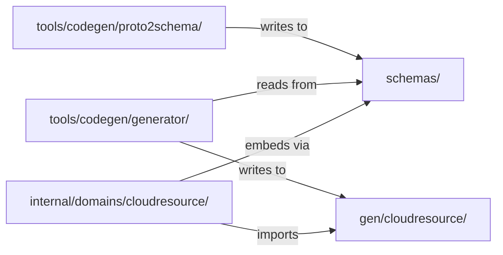
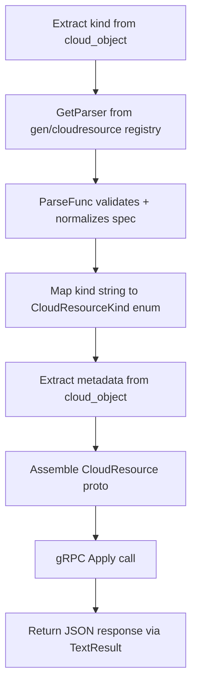

# Phase 3: apply_cloud_resource + MCP Resource Templates

## Prerequisite: Promote schemas to top-level package

The 362 JSON schemas are consumed by both the codegen pipeline (build-time) and the MCP resource template handler (runtime). They currently live under `tools/codegen/schemas/` which misclassifies them as build tooling. Promote to a top-level `schemas/` package.

**Changes:**

- Create [`schemas/embed.go`] -- new package with `//go:embed` directive exposing `var FS embed.FS`
- Move contents from `tools/codegen/schemas/providers/` and `tools/codegen/schemas/shared/` to `schemas/providers/` and `schemas/shared/`
- Update `[tools/codegen/proto2schema/main.go](tools/codegen/proto2schema/main.go)` line 28: change default `--output-dir` from `"tools/codegen/schemas"` to `"schemas"`
- Update `[tools/codegen/generator/main.go](tools/codegen/generator/main.go)` line 7: change default `--schemas-dir` from `tools/codegen/schemas` to `schemas`
- Update `[Makefile](Makefile)`: change `codegen-schemas` and `codegen-types` targets to reference `schemas/` instead of `tools/codegen/schemas/`
- Delete `tools/codegen/schemas/providers/` and `tools/codegen/schemas/shared/` (data moves, tool source stays)




## Stage 1: add_cloud_resource domain package

Create [`internal/domains/cloudresource/`] following the Stigmer pattern (separate files for tool definitions, domain functions, and resource handlers).

### 1A. Tool definition -- `internal/domains/cloudresource/tools.go`

- Define `ApplyCloudResourceInput` struct:

```go
type ApplyCloudResourceInput struct {
    CloudObject map[string]any `json:"cloud_object" jsonschema:"required,The full OpenMCF cloud resource object containing api_version, kind, metadata, and spec. Use the cloud-resource-schema resource template to discover the expected format for any kind."`
}
```

- `ApplyTool() *mcp.Tool` -- returns tool definition with name `apply_cloud_resource` and a concise description explaining the tool accepts a full OpenMCF cloud_object
- `ApplyHandler(serverAddress string)` -- typed handler factory following Stigmer pattern: extract kind from cloud_object, dispatch to generated parser, build CloudResource proto, call gRPC Apply, return result

**Handler flow:**




### 1B. Domain function -- `internal/domains/cloudresource/apply.go`

- `Apply(ctx, serverAddress string, cr *cloudresourcev1.CloudResource) (string, error)` -- creates gRPC connection via `domains.WithConnection`, calls `CloudResourceCommandController.Apply`, returns serialized response via `domains.MarshalJSON`
- `buildCloudResource(cloudObject map[string]any, kind string, normalizedObject *structpb.Struct) (*cloudresourcev1.CloudResource, error)` -- assembles the full proto:
  - `api_version`: `"infra-hub.planton.ai/v1"` (constant)
  - `kind`: `"CloudResource"` (constant)
  - `metadata`: extracted from `cloudObject["metadata"]` map -> `ApiResourceMetadata` proto (name, slug, org, env, labels, tags, version.message)
  - `spec.kind`: `CloudResourceKind` enum looked up from `cloudresourcekind.CloudResourceKind_value[kind]`
  - `spec.cloud_object`: the `*structpb.Struct` from the parser

### 1C. Kind mapping helper -- `internal/domains/cloudresource/kind.go`

- `resolveKind(kindStr string) (cloudresourcekind.CloudResourceKind, error)` -- uses the generated `CloudResourceKind_value` map from the openmcf proto stubs. Returns a clear error if the kind string is unknown.
- `extractKindFromCloudObject(co map[string]any) (string, error)` -- extracts and validates the `"kind"` field from a cloud_object map.

### 1D. Metadata extraction -- `internal/domains/cloudresource/metadata.go`

- `extractMetadata(cloudObject map[string]any) (*apiresource.ApiResourceMetadata, error)` -- maps `cloudObject["metadata"]` to the proto. Required fields: `name`, `org`, `env`. Optional: `slug`, `labels`, `tags`, `annotations`, `version.message`.

## Stage 2: MCP resource templates

### 2A. Resource template -- `internal/domains/cloudresource/resources.go`

- `SchemaTemplate() *mcp.ResourceTemplate`:

```go
&mcp.ResourceTemplate{
    URITemplate: "cloud-resource-schema://{kind}",
    Name:        "cloud_resource_schema",
    Title:       "Cloud Resource Schema",
    Description: "JSON schema for a specific cloud resource kind. Returns the full spec definition with field types, descriptions, validation rules, and defaults. Example: cloud-resource-schema://AwsEksCluster",
    MIMEType:    "application/json",
}
```

- `SchemaHandler()` -- parses `{kind}` from URI, loads the JSON schema from the embedded `schemas.FS`, returns it as resource content

### 2B. Schema lookup -- `internal/domains/cloudresource/schema.go`

- `loadProviderSchema(kind string) ([]byte, error)` -- reads `schemas.FS` using the registry.json to resolve kind to schema file path
- `loadRegistry() (map[string]RegistryEntry, error)` -- reads and parses `providers/registry.json` from the embedded FS (cached after first load)
- `parseSchemaURI(uri string) (kind string, err error)` -- extracts the kind parameter from a `cloud-resource-schema://` URI

## Stage 3: Server registration

Update `[internal/server/server.go](internal/server/server.go)`:

- Import `internal/domains/cloudresource`
- In `registerTools()`: `mcp.AddTool(srv, cloudresource.ApplyTool(), cloudresource.ApplyHandler(serverAddress))`
- In (new) `registerResources()`: `srv.AddResourceTemplate(cloudresource.SchemaTemplate(), cloudresource.SchemaHandler())`
- Log the registered tool and resource template

## Stage 4: Dependencies

- Add `github.com/plantonhq/planton/apis` to `go.mod` (provides `cloudresourcev1` gRPC stubs, `apiresource.ApiResourceMetadata`, `apiresource.ApiResourceDeleteInput`)
- This transitively brings `github.com/plantonhq/openmcf` (provides `cloudresourcekind.CloudResourceKind` enum)
- Run `go mod tidy`

## Stage 5: Build verification

- `go build ./...`
- `go vet ./...`
- `make codegen` (verify the schema move + codegen pipeline still works end-to-end)

## Decision points to pause on during implementation

- **Metadata field mapping edge cases**: If any metadata fields require special handling beyond simple string extraction (e.g., slug auto-generation, label format validation), pause and discuss
- **go.mod version resolution**: If `plantonhq/planton/apis` has version conflicts with existing dependencies, pause and discuss
- **Resource URI scheme**: Using `cloud-resource-schema://` as the scheme -- if the MCP SDK has constraints on custom schemes, pause and discuss
- **Error behavior**: When an agent provides an unknown kind, the tool should return a clear error suggesting they check available kinds. If there's a better UX pattern, pause and discuss

