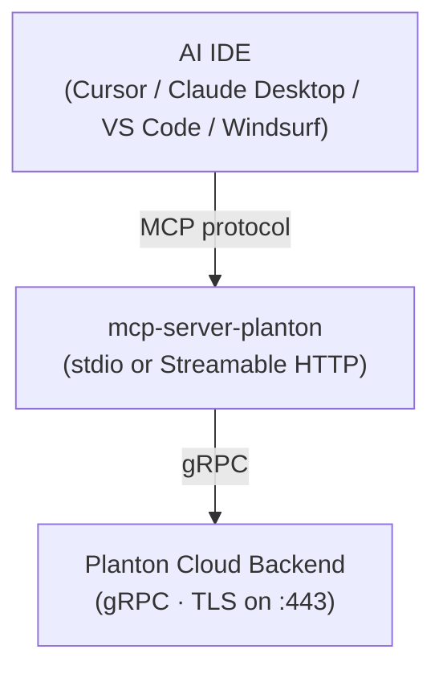

# README Restructure: From Reference Manual to Front Door

## Doc Blueprint

### Audience Audit


| Audience                             | Job To Be Done                                                                               |
| ------------------------------------ | -------------------------------------------------------------------------------------------- |
| New developer evaluating the project | Understand what it does, get it running in < 5 minutes                                       |
| Developer configuring an MCP client  | Find the right JSON snippet and env vars                                                     |
| AI agent reading the README          | Discover available tools and how to use them without wading through a parameter encyclopedia |
| Contributor / maintainer             | Understand the architecture and add new tools without breaking the README                    |


### Gap Analysis

**The core problem you identified is correct, but it runs deeper than length.**

Right now the README is playing two incompatible roles simultaneously:

- A **front door** (what is this, how do I install it, how do I connect it)
- A **full API reference** (every parameter, every error code, agent workflow guidance)

These two roles have opposite requirements. A front door must be scannable in 2 minutes. A reference manual must be exhaustive and linkable. When a project is small (3 tools), this tension is tolerable. As the tool surface grows toward dozens of tools, the README becomes a wall of parameter tables that serves neither audience well.

**What GitHub's MCP server does:** They embed tools in the README using HTML `<details>` collapsibles. Their README is 1,546 lines. It is the opposite of scannable. This is a well-known OSS debt pattern — you can see the seams where sections were bolted on as the tool count grew.

**What this project deserves:** A two-layer documentation model where the README is the authoritative "front door" and `docs/tools.md` is the authoritative tool reference. This is the same pattern used by Stripe, Tailscale, and other high-quality developer platforms.

### Proposed Structure

```
docs/
  configuration.md    (already exists, already linked)
  development.md      (already exists, already linked)
  tools.md            (new — moves all tool/resource reference content here)
README.md             (restructured — "front door" only)
```

---

## Changes to README.md

The README retains all existing sections but the **Tools** section is fundamentally redesigned.

**Replace** the current Tools section (lines 159–228, parameter tables + error table) with:

```markdown
## Tools

Three tools cover the full lifecycle of any cloud resource:

| Tool | What It Does |
|------|--------------|
| `apply_cloud_resource` | Create or update a resource (idempotent — same semantics as `kubectl apply`) |
| `get_cloud_resource` | Retrieve a resource by ID or by `(kind, org, env, slug)` |
| `delete_cloud_resource` | Delete a resource by ID or by `(kind, org, env, slug)` |

Two read-only MCP resources drive schema discovery:

| URI | What It Returns |
|-----|-----------------|
| `cloud-resource-kinds://catalog` | All 362 supported kinds grouped by cloud provider |
| `cloud-resource-schema://{kind}` | Full JSON schema for a specific kind |

For full parameter reference, agent workflow guidance, and error handling, see [docs/tools.md](docs/tools.md).
```

This is approximately 15 lines replacing 70 lines — and it stays this size regardless of how many tools are added. Each new tool gets one row in the table.

The Architecture section's plain-text diagram is converted to a Mermaid diagram for visual clarity:




---

## New docs/tools.md

This is a new file that receives all content removed from the README, plus a small amount of new material.

**Sections:**

1. **Overview** — same three-tool / two-resource summary table as README (the README links here, not the other way around)
2. **apply_cloud_resource** — full parameter table + agent workflow (3-step sequence currently in README)
3. **get_cloud_resource** — full parameter table
4. **delete_cloud_resource** — full parameter table
5. **MCP Resources** — full description of `cloud-resource-kinds://catalog` and `cloud-resource-schema://{kind}`
6. **Error Handling** — the gRPC status → message table currently in README
7. **Agent Cheat Sheet** — a concise decision tree for how an agent should sequence tool calls (new content, filling a real gap)

---

## Files Changed

- `[README.md](README.md)` — restructured (net reduction of ~55 lines)
- `[docs/tools.md](docs/tools.md)` — new file (all displaced content + agent cheat sheet)

No other files are touched.