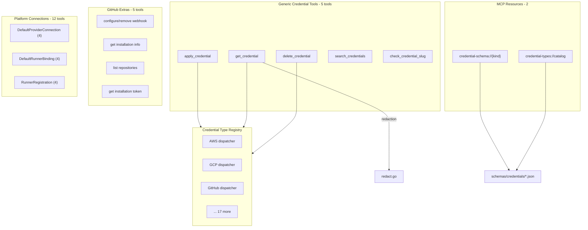

# T05: Connect Domain — Credential Management

## Scope

22 MCP tools + 2 MCP resources, organized into 5 sub-packages under `internal/domains/connect/`. This is the largest remaining gap in the MCP server.

## Resolved Decisions

- **ProviderConnectionAuthorization**: Deferred to T08 (IAM) — authorization concern, not credential CRUD
- **Schema sourcing**: Hand-crafted JSON from proto spec files — pragmatic for ~20 simple types
- **Extra controllers excluded**: GCP OAuth, Azure OAuth, AWS CloudFormation — browser/infra flows, not MCP-suitable
- **Docker/Maven/NPM credentials**: Validate existence during implementation; include if stubs compile

## Architecture (from DD-01)




## Phased Approach

### Phase 1: Credential Core (5 tools + 2 resources)

Validate the full architecture end-to-end with **5 representative credential types**: AWS, GCP, GitHub, Azure, Kubernetes. These cover:

- Inline auth (AWS, GCP, Cloudflare)
- Runner-based auth (AWS, GCP)
- App-based auth (GitHub)
- Certificate-based auth (Kubernetes)

**New files to create:**

```
schemas/credentials/
    registry.json                  -- kind-to-schema index
    awscredential.json             -- 5 initial schema files
    gcpcredential.json
    githubcredential.json
    azurecredential.json
    kubernetesclustercredential.json

internal/domains/connect/
    doc.go                         -- package-level documentation

    credential/
        doc.go                     -- sub-package documentation
        register.go                -- tool + resource registration
        tools.go                   -- 5 input structs, 5 tool defs, 5 handlers
        apply.go                   -- apply_credential domain function
        get.go                     -- get_credential domain function
        delete.go                  -- delete_credential domain function
        search.go                  -- search_credentials (ConnectSearchQueryController)
        slug.go                    -- check_credential_slug (ConnectSearchQueryController)
        registry.go                -- kind -> dispatcher map (5 initial types)
        redact.go                  -- sensitive field redaction
        resources.go               -- MCP resource defs (catalog + schema template)
        schema.go                  -- embedded schema loading + catalog builder
```

**Files to modify:**

- `[schemas/embed.go](schemas/embed.go)` — add `credentials` to embed directive
- `[internal/server/server.go](internal/server/server.go)` — register connect/credential domain

**Key implementation patterns:**

- **Dispatcher**: Uses `protojson` bridge — JSON-marshal the agent's input map, `protojson.Unmarshal` into the typed proto, call the typed gRPC client. ~10-15 lines per type, handles enums and nested messages correctly.
- **Redaction**: Explicit sensitive field list per type (from DD-01). Walks JSON response, replaces values at known paths with `"[REDACTED]"`. Unit-testable in isolation.
- **Schema embedding**: Mirrors the CloudResource pattern — `schemas/credentials/` embedded via `schemas.FS`, loaded by `schema.go`.
- **MCP resources**: Static `credential-types://catalog` + template `credential-schema://{kind}`, matching the CloudResource `cloud-resource-kinds://catalog` and `cloud-resource-schema://{kind}` patterns.

### Phase 2: Remaining Credential Types (~14 types)

Mechanical expansion — for each type:

1. Read its `spec.proto` for field names/types
2. Write a schema JSON file
3. Add a dispatcher entry in `registry.go`
4. Add sensitive fields list

Types to add: Auth0, Civo, Cloudflare, Confluent, DigitalOcean, GitLab, MongoDBAtlas, OpenFGA, PulumiBackend, Snowflake, TerraformBackend, and validated Docker/Maven/NPM.

### Phase 3: GitHub Extras (5 tools)

New sub-package `internal/domains/connect/github/` with dedicated tools:

- `configure_github_webhook`
- `remove_github_webhook`
- `get_github_installation_info`
- `list_github_repositories`
- `get_github_installation_token`

These use `GithubCommandController` and `GithubQueryController` from the `githubcredential/v1` proto package.

### Phase 4: Platform Connections (12 tools)

Three new sub-packages, each following standard CRUD patterns:

- `internal/domains/connect/defaultprovider/` — apply, get, resolve, delete
- `internal/domains/connect/defaultrunner/` — apply, get, resolve, delete
- `internal/domains/connect/runner/` — apply, get, delete, search

## Risk Mitigation

- **Phase 1 validates before Phase 2 expands**: If the dispatcher pattern has issues, we catch them with 5 types, not 20
- **Secret redaction is defense-in-depth**: Server may also strip secrets, but we don't rely on it
- **Each phase is independently shippable**: Phases 2-4 each add value without depending on each other

## Session Boundaries

Given the scope, I recommend executing Phase 1 as a single focused session. Phases 2-4 can each be separate sessions or combined based on velocity. Phase 1 is the critical path — it establishes patterns that Phase 2-4 follow mechanically.