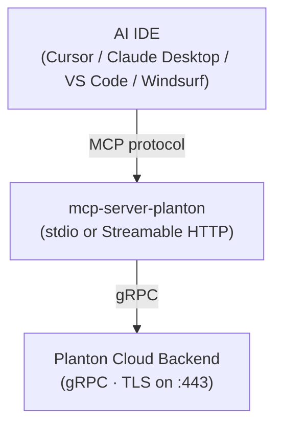

# Planton Cloud MCP Server

A stateless [MCP](https://modelcontextprotocol.io) server that connects
AI-powered IDEs to [Planton Cloud](https://planton.cloud). It translates
MCP tool calls and resource reads into gRPC requests against the Planton
backend, letting Cursor, Claude Desktop, VS Code, Windsurf, and any
MCP-compliant client manage cloud resources across 17 cloud providers without
leaving the editor — from discovering organizations and environments through
creating, listing, and destroying resources to observing provisioning outcomes
via stack jobs.



This server does not store state. It is a protocol bridge: every tool call
opens a short-lived gRPC connection, performs the RPC, and returns the result.
It can serve both STDIO and HTTP transports concurrently from a single process.

---

## Key Concepts

| Term | Definition |
|------|------------|
| **cloud resource** | Any infrastructure component managed by Planton Cloud (e.g. an EKS cluster, a GCP VPC, an Azure database). |
| **kind** | PascalCase type identifier for a cloud resource (e.g. `AwsEksCluster`, `GcpCloudSqlInstance`). |
| **org** | Organization identifier -- the tenant-level namespace that owns a resource. |
| **env** | Environment identifier (e.g. `production`, `staging`). |
| **slug** | URL-safe unique name for a resource within an (org, env, kind) scope. |
| **api_version** | Versioned API namespace for a cloud provider (e.g. `ai.planton.provider.aws.v1`). |
| **apply** | Idempotent create-or-update. Same semantics as `kubectl apply` -- if the resource exists it is updated, otherwise it is created. |

---

## Installation

### Prerequisites

1. A [Planton Cloud](https://planton.cloud) account
2. An API key (Console > Profile > **API Keys** > **Create Key**)
3. A compatible MCP host (Cursor, Claude Desktop, VS Code, Windsurf, or any
   MCP-compliant client)

### Go Install

```bash
go install github.com/plantonhq/mcp-server-planton/cmd/mcp-server-planton@latest
```

### Pre-built Binary

```bash
# macOS (ARM64)
curl -L https://github.com/plantonhq/mcp-server-planton/releases/latest/download/mcp-server-planton_Darwin_arm64.tar.gz | tar xz
sudo mv mcp-server-planton /usr/local/bin/

# macOS (Intel)
curl -L https://github.com/plantonhq/mcp-server-planton/releases/latest/download/mcp-server-planton_Darwin_x86_64.tar.gz | tar xz
sudo mv mcp-server-planton /usr/local/bin/

# Linux (AMD64)
curl -L https://github.com/plantonhq/mcp-server-planton/releases/latest/download/mcp-server-planton_Linux_x86_64.tar.gz | tar xz
sudo mv mcp-server-planton /usr/local/bin/
```

### Docker

```bash
docker run -i --rm \
  -e PLANTON_API_KEY=your-api-key \
  ghcr.io/plantonhq/mcp-server-planton
```

> **Docker networking:** `localhost` inside a container refers to the
> container's own loopback, not the host machine. To reach a custom endpoint
> running on the host, use `host.docker.internal` on Docker Desktop
> (macOS / Windows) or add `--network host` on Linux.

---

## MCP Client Configuration

All MCP clients use the same JSON structure. The differences are the config file
location and the top-level key.

### Using the standalone binary or Go install

```json
{
  "mcpServers": {
    "planton-cloud": {
      "command": "mcp-server-planton",
      "env": {
        "PLANTON_API_KEY": "YOUR_PLANTON_API_KEY"
      }
    }
  }
}
```

### Using Docker

```json
{
  "mcpServers": {
    "planton-cloud": {
      "command": "docker",
      "args": [
        "run", "-i", "--rm",
        "-e", "PLANTON_API_KEY",
        "ghcr.io/plantonhq/mcp-server-planton"
      ],
      "env": {
        "PLANTON_API_KEY": "YOUR_PLANTON_API_KEY"
      }
    }
  }
}
```

### Where to put the config

| Client | Config file | Top-level key |
|--------|-------------|---------------|
| Cursor | `.cursor/mcp.json` (workspace) or global settings | `mcpServers` |
| Claude Desktop / Claude Code | `claude_desktop_config.json` | `mcpServers` |
| VS Code / GitHub Copilot | `.vscode/mcp.json` (workspace) or user settings | `servers` |
| Windsurf | Windsurf MCP settings | `mcpServers` |
| LangGraph | `langgraph.json` | `mcp_servers` |

> VS Code uses `"servers"` instead of `"mcpServers"` as the top-level key.

---

## Configuration Reference

| Variable | Default | Description |
|----------|---------|-------------|
| `PLANTON_API_KEY` | *(required for stdio/both)* | API key for Planton Cloud. |
| `PLANTON_CLOUD_ENVIRONMENT` | `live` | Target environment: `live`, `test`, or `local`. |
| `PLANTON_APIS_GRPC_ENDPOINT` | *(from environment)* | Explicit gRPC endpoint override. |
| `PLANTON_MCP_TRANSPORT` | `stdio` | Transport mode: `stdio`, `http`, or `both`. |
| `PLANTON_MCP_HTTP_PORT` | `8080` | HTTP listen port. |
| `PLANTON_MCP_HTTP_AUTH_ENABLED` | `true` | Require Bearer token for HTTP requests. |
| `PLANTON_MCP_LOG_FORMAT` | `text` | Log encoding: `text` or `json`. |
| `PLANTON_MCP_LOG_LEVEL` | `info` | Minimum log level: `debug`, `info`, `warn`, `error`. |

See [docs/configuration.md](docs/configuration.md) for details.

**TLS:** Connections to endpoints on port `443` automatically use TLS with the
system root CA pool. All other ports use plaintext. There is no separate TLS
configuration flag.

---

## Tools & Resources

100 tools span the full Planton Cloud product surface:

**Cloud Resource Lifecycle** — create, update, delete, destroy, lock management, env var extraction (11 tools)

**Stack Jobs** — observe provisioning outcomes, retry failures, cancel or approve jobs, pre-validate prerequisites (7 tools)

**InfraChart Templates** — browse and preview reusable infrastructure chart templates (3 tools)

**InfraProject Lifecycle** — create and manage infrastructure projects sourced from charts or Git repos (6 tools)

**InfraPipeline Monitoring & Control** — track deployment pipelines, trigger runs, resolve manual gates (7 tools)

**Dependency Graph** — explore resource topology, trace dependencies and dependents, analyze blast radius (7 tools)

**Config Manager** — manage plaintext variables and encrypted secrets with full version history (11 tools)

**Audit & Version History** — paginated change history and unified diffs for any platform resource (3 tools)

**Context Discovery** — discover organizations and environments (2 tools)

**Presets** — find and retrieve pre-configured cloud resource templates (2 tools)

**Catalog** — browse deployable component types and the IaC modules that provision them (4 tools)

**Service Lifecycle** — search, create, update, and delete services; manage Git webhook connections (7 tools)

**Service CI/CD Pipelines** — observe build-and-deploy runs, trigger and cancel pipelines, resolve manual gates, read and write pipeline YAML files (9 tools)

**Service Variables Groups** — manage named collections of plaintext environment variables; upsert and delete individual entries; resolve values and batch-transform `$variables-group/` references (8 tools)

**Service Secrets Groups** — manage named collections of encrypted secrets; upsert and delete individual entries; resolve and batch-transform `$secrets-group/` references (8 tools)

**DNS Domains** — register and manage custom domain names for service ingress hostnames (3 tools)

**Tekton Pipelines** — manage reusable Tekton pipeline templates referenced by services (3 tools)

**Tekton Tasks** — manage reusable Tekton task step templates referenced by pipelines (3 tools)

Two read-only MCP resources drive schema discovery before any tool call:

| URI | What It Returns |
|-----|-----------------|
| `cloud-resource-kinds://catalog` | All 362 supported kinds grouped by 17 cloud providers |
| `cloud-resource-schema://{kind}` | Full JSON schema for a specific kind — field types, validation rules, and defaults |

For full parameter reference, agent workflow guidance, and error handling, see
[docs/tools.md](docs/tools.md).

---

## HTTP Mode

For shared or remote deployments, set the transport to `http`. This runs the
MCP Streamable HTTP transport -- not a REST API.

```bash
PLANTON_MCP_TRANSPORT=http \
PLANTON_API_KEY=your-api-key \
  mcp-server-planton
```

Or with Docker:

```bash
docker run --rm \
  -e PLANTON_MCP_TRANSPORT=http \
  -e PLANTON_MCP_HTTP_AUTH_ENABLED=true \
  -p 8080:8080 \
  ghcr.io/plantonhq/mcp-server-planton
```

Connect your MCP client to `http://host:8080` with an
`Authorization: Bearer <token>` header, where `<token>` is a valid Planton
API key. Each HTTP request carries its own API key, so multiple users can share
a single server instance.

**Auth:** HTTP auth is enabled by default. Set
`PLANTON_MCP_HTTP_AUTH_ENABLED=false` only for trusted internal networks where
all callers are already authenticated at the network level.

**Dual transport:** Set `PLANTON_MCP_TRANSPORT=both` to serve STDIO and HTTP
simultaneously from a single process. This is useful in development when you
want local IDE access (STDIO) and remote access (HTTP) at the same time.

**TLS:** The HTTP transport does not terminate TLS natively. For production
deployments, place a TLS-terminating reverse proxy (e.g. nginx, Envoy, or a
cloud load balancer) in front of the MCP server.

---

## Security

- **STDIO mode**: API key loaded once from `PLANTON_API_KEY` at startup
- **HTTP mode**: Each request carries its own key via `Authorization: Bearer` header -- true multi-tenant support
- Keys are held in memory only during request execution and never persisted
- All API calls are validated and logged with the caller's identity
- Fine-grained authorization is enforced by the Planton backend

---

## Supported Cloud Providers

AWS, GCP, Azure, Kubernetes, AliCloud, DigitalOcean, Civo, Cloudflare,
Confluent, Auth0, OpenFGA, Snowflake, MongoDB Atlas, Hetzner Cloud, OCI,
OpenStack, Scaleway -- 362 resource kinds total.

---

## Development

### Build and test

```bash
make build          # Build binary to bin/mcp-server-planton
make test           # Run tests with race detection
make lint           # Run golangci-lint (falls back to go vet)
make vet            # Run go vet (excludes gen/)
make fmt            # Format all Go source files
make tidy           # Run go mod tidy
```

### Code generation

MCP input types are auto-generated from OpenMCF protobuf definitions via a
two-stage pipeline:

```bash
make codegen-schemas   # Stage 1: Proto -> JSON schemas
make codegen-types     # Stage 2: JSON schemas -> Go input types in gen/
make codegen           # Both stages
```

The `gen/` directory is entirely machine-generated. **Never edit files in `gen/`
by hand** -- they will be overwritten on the next `make codegen` run.

See [docs/development.md](docs/development.md) for codegen details and project
structure.

---

## License

Apache License 2.0. See [LICENSE](LICENSE).
