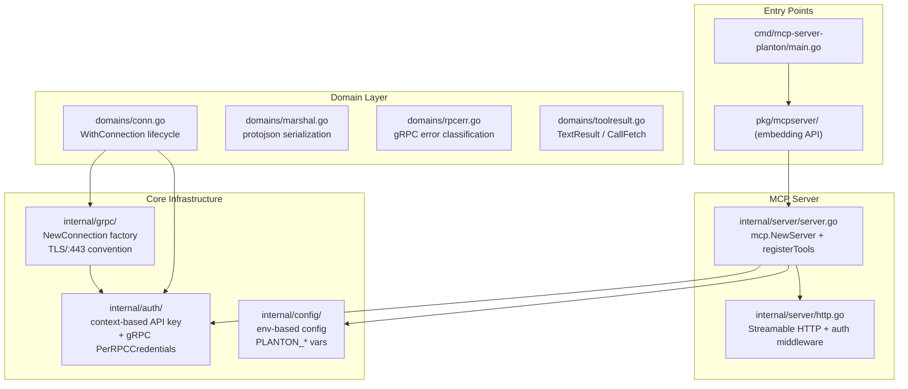
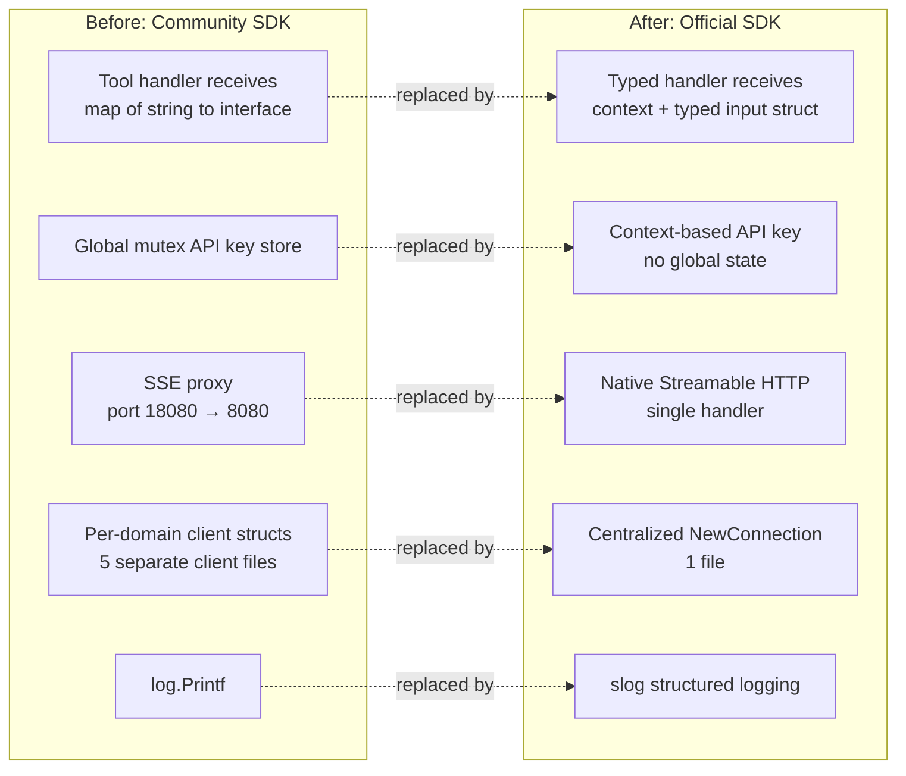

# Phase 1: Stigmer-Pattern Foundation Rebuild

**Date**: February 26, 2026

## Summary

Completely rebuilt the mcp-server-planton foundation by migrating from the community MCP SDK (`mark3labs/mcp-go`) to the official SDK (`modelcontextprotocol/go-sdk`), deleting all existing domain code (~9,400 lines), and laying down a 12-file Stigmer-pattern skeleton that serves as the foundation for all future tool implementations.

## Problem Statement

The existing mcp-server-planton codebase had accumulated significant technical debt through organic growth. It needed a clean architectural reset to match the proven patterns established in the Stigmer MCP server.

### Pain Points

- **Community SDK limitations**: `mark3labs/mcp-go v0.6.0` did not pass `context.Context` to tool handlers, forcing a global mutex-protected API key store — a race-condition-prone workaround
- **Untyped tool handlers**: All tools used `map[string]interface{}` for arguments, losing type safety and requiring manual parsing in every handler
- **SSE proxy hack**: HTTP transport required an internal reverse proxy (port 18080 → 8080) with URL rewriting because the community SDK lacked native Streamable HTTP
- **Inconsistent patterns**: Each domain (infrahub, servicehub, connect, resourcemanager) had slightly different client wiring, error handling, and registration patterns
- **No codegen path**: All input types were hand-written, making it expensive to add new domains

## Solution

A clean-slate rebuild following the Stigmer MCP server architecture: context-based auth, centralized gRPC connection management, shared domain utilities, and the official MCP SDK's typed handler system.

### Architecture

### Before vs After

## Implementation Details

### MCP SDK Migration

The single most impactful change. The official SDK (`modelcontextprotocol/go-sdk v1.3.0`) provides:

- **Typed tool handlers**: `func(ctx context.Context, req *mcp.CallToolRequest, input *TypedInput) (*mcp.CallToolResult, any, error)` — the SDK deserializes JSON input into the typed struct automatically
- **Context propagation**: `context.Context` flows from transport → server → tool handler, carrying the API key naturally
- **`mcp.NewStreamableHTTPHandler`**: Native HTTP transport that replaces the entire SSE proxy infrastructure

### Auth Simplification

The old auth had three layers of indirection:

1. `globalAPIKeyStore` with `sync.RWMutex` for HTTP mode
2. `SetCurrentAPIKey` / `getCurrentAPIKey` called during request proxying
3. `GetContextWithAPIKey` creating contexts from the global store

The new auth is two functions: `auth.WithAPIKey(ctx, key)` to store, `auth.APIKey(ctx)` to retrieve. The gRPC layer reads the key from context and attaches it as `PerRPCCredentials`.

### Config Preservation

All existing environment variables preserved with identical names and behavior:

| Variable | Default |
|----------|---------|
| `PLANTON_API_KEY` | (required for stdio) |
| `PLANTON_APIS_GRPC_ENDPOINT` | (override) |
| `PLANTON_CLOUD_ENVIRONMENT` | `live` |
| `PLANTON_MCP_TRANSPORT` | `stdio` |
| `PLANTON_MCP_HTTP_PORT` | `8080` |
| `PLANTON_MCP_HTTP_AUTH_ENABLED` | `true` |
| `PLANTON_MCP_LOG_FORMAT` | `text` (new) |
| `PLANTON_MCP_LOG_LEVEL` | `info` (new) |

### Shared Domain Utilities

Four utilities that eliminate per-domain boilerplate:

- **`WithConnection`**: Creates authenticated gRPC connection, applies 30s timeout, ensures cleanup in a single call
- **`MarshalJSON`**: Consistent protojson serialization (multiline, proto field names, no empty fields)
- **`RPCError`**: Maps gRPC status codes to AI-client-friendly messages; logs original error at WARN
- **`TextResult` / `CallFetch`**: Constructs `mcp.CallToolResult` from text or fetch functions

## Benefits

- **Type safety**: Tool handlers receive typed Go structs instead of `map[string]interface{}`
- **No global state**: Auth flows through context — safe for concurrent HTTP requests
- **Simpler HTTP**: One `mcp.NewStreamableHTTPHandler` call replaces 300+ lines of SSE proxy code
- **Structured logging**: `slog` enables JSON log output for production observability
- **Consistent patterns**: Every future domain tool follows the same WithConnection → RPC → MarshalJSON → TextResult flow
- **Embeddable**: `pkg/mcpserver` allows the MCP server to be embedded in CLIs or other Go programs

## Impact

- **~9,400 lines deleted** across 55 old Go files
- **~530 lines added** across 12 new Go files
- **Net reduction**: ~8,870 lines (the new code is denser and the old domain tools will be rebuilt in phases 3-4)
- **Zero tools currently registered** — this is intentional; the foundation is ready for Phase 2 (codegen) and Phase 3-4 (tool implementations)

## Related Work

- **T01 Plan**: `_projects/2026-02/20260226.01.refactor-mcp-server-stigmer-patterns/tasks/T01_0_plan.md`
- **Phase 1 Plan**: `_projects/2026-02/20260226.01.refactor-mcp-server-stigmer-patterns/plans/phase-1-foundation.plan.md`
- **Next**: Phase 2 — Codegen Pipeline (proto → JSON schemas → Go input types with `ToProto()`)

---

**Status**: ✅ Production Ready (zero-tool skeleton compiles and boots cleanly)
**Timeline**: Single session
