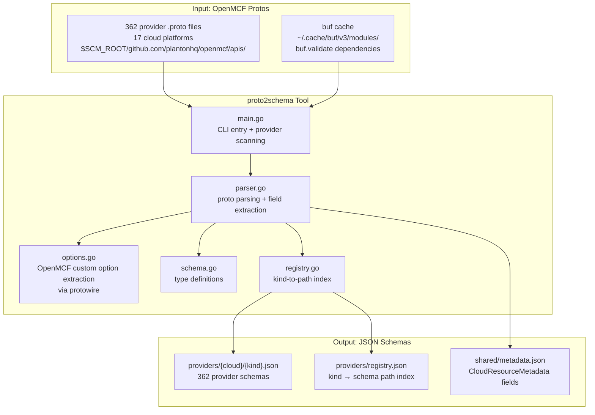
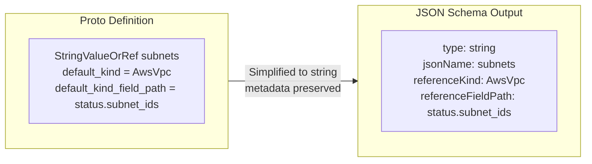

# Phase 2 Stage 1: proto2schema Codegen Tool

**Date**: February 26, 2026

## Summary

Built the `proto2schema` codegen tool that parses all 362 OpenMCF provider `.proto` files from the local filesystem and generates JSON schemas. These schemas serve as the intermediate representation for Stage 2 code generation (Go input types) and for MCP resource template discovery, enabling agents to fetch typed schemas per cloud resource kind.

## Problem Statement

The mcp-server-planton needs typed input validation for 362 cloud resource providers defined in the separate `openmcf` repository. Hand-writing Go types for this many providers is infeasible and would create a maintenance burden as new providers are added.

### Pain Points

- **362 providers across 17 cloud platforms** — manual type maintenance is not scalable
- **Cross-repository proto resolution** — OpenMCF protos live in `openmcf/`, not in `mcp-server-planton/`
- **OpenMCF-specific complexity** — `StringValueOrRef` oneofs, custom proto extensions (`default_kind`, `recommended_default`), and `buf.validate` rules all need extraction
- **No existing JSON schema representation** — the codegen pipeline needs an intermediate format between protos and Go code

## Solution

A 5-file Go CLI tool adapted from the Stigmer codegen pipeline, extended to handle OpenMCF's cross-repo proto resolution, `StringValueOrRef` simplification, and custom option extraction.

### Architecture

### StringValueOrRef Simplification

OpenMCF's `StringValueOrRef` is a protobuf `oneof` that represents either a literal value or a reference to another resource's output. At the MCP boundary, agents provide literal strings — reference resolution happens in the backend provisioning layer.

## Implementation Details

### Source Structure (1,042 lines across 5 files)

| File | Lines | Responsibility |
|------|-------|---------------|
| `parser.go` | 563 | Proto parsing, field extraction, `StringValueOrRef` simplification, nested type collection, `buf.validate` rule extraction |
| `main.go` | 212 | CLI entry point, `SCM_ROOT` resolution, provider directory scanning, buf cache detection |
| `options.go` | 104 | OpenMCF custom option extraction via `protowire` from unknown fields |
| `schema.go` | 102 | Schema type definitions (the JSON output data model) |
| `registry.go` | 61 | Registry generation and file writing |

### Proto File Resolution

OpenMCF protos live in a separate repository. The tool resolves proto include paths using:

1. **`SCM_ROOT`** environment variable (defaults to `$HOME/scm`)
2. **`--openmcf-apis-dir`** CLI flag (defaults to `$SCM_ROOT/github.com/plantonhq/openmcf/apis`)
3. **Buf cache auto-detection** from `~/.cache/buf/v3/modules/` for `buf.validate` dependencies

### Custom Option Extraction

Four OpenMCF custom proto extensions are extracted via `protowire` decoding of unknown fields in `FieldOptions`:

| Extension | Field # | Purpose |
|-----------|---------|---------|
| `default_kind` | 200001 | Which `CloudResourceKind` a `StringValueOrRef` references |
| `default_kind_field_path` | 200002 | Output field path for the reference |
| `default` | 60001 | Default value for a field |
| `recommended_default` | 60002 | Recommended default value |

### Validation Rule Extraction

`buf.validate` rules are extracted using `proto.GetExtension(validate.E_Field)` and mapped to schema validation properties: `required`, `minLength`, `maxLength`, `minItems`, `maxItems`, `pattern`, `const`, `unique`.

### Dependencies Added

- `github.com/jhump/protoreflect v1.18.0` — proto file parsing with full descriptor access
- `buf.build/gen/go/bufbuild/protovalidate/protocolbuffers/go v1.36.11-...` — `buf.validate` Go stubs for rule extraction

## Benefits

- **Automated schema generation** for 362 providers — running `make codegen-schemas` regenerates all schemas in seconds
- **Zero parse errors** across all 17 cloud platforms
- **Intermediate representation** decouples proto parsing from Go code generation, enabling independent iteration on either stage
- **MCP resource template ready** — the registry and per-kind schemas are directly consumable by MCP resource template handlers
- **Extensible** — new OpenMCF providers are automatically picked up on the next `make codegen-schemas` run

## Impact

- **362 provider schemas** generated across: AWS (68), GCP (62), Azure (48), Kubernetes (38), DigitalOcean (18), Civo (10), Cloudflare (8), Atlas (6), AliCloud (16+), HetznerCloud, OCI, OpenStack, Scaleway, Auth0, Confluent, OpenFGA, Snowflake
- **1 shared metadata schema** with `CloudResourceMetadata` and nested `CloudResourceRelationship`
- **1 provider registry** mapping all 362 kinds to their schema files
- **Unblocks Stage 2** — the generator can now consume these schemas to produce typed Go input structs with `ToProto()` methods

## Related Work

- **Phase 1 changelog**: `_changelog/2026-02/2026-02-26-192404-phase-1-stigmer-pattern-foundation.md`
- **T01 Plan**: `_projects/2026-02/20260226.01.refactor-mcp-server-stigmer-patterns/tasks/T01_0_plan.md`
- **Proto2schema plan**: `_projects/2026-02/20260226.01.refactor-mcp-server-stigmer-patterns/plans/proto2schema-codegen-tool.plan.md`
- **Next**: Phase 2 Stage 2 — `generator` tool (JSON schemas → Go input types with `ToProto()`)

---

**Status**: ✅ Production Ready (tool compiles, generates 362 schemas with zero errors)
**Timeline**: Single session
