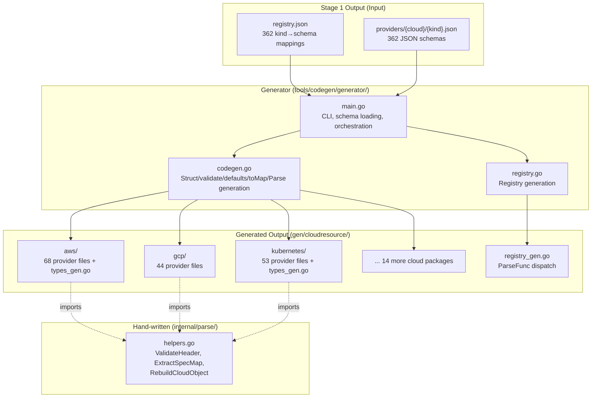
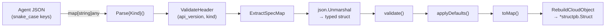

# Phase 2 Stage 2: schema2go Generator — Typed Go Input Structs for 362 Providers

**Date**: February 26, 2026

## Summary

Built the schema2go codegen generator that transforms the 362 JSON schemas produced by Stage 1 (proto2schema) into typed Go input structs with validation, default application, and `map[string]any` conversion. The generator produces 367 Go files organized across 17 cloud-provider packages, with a central registry enabling kind-based parser dispatch at runtime. This completes the full codegen pipeline (`make codegen`) from OpenMCF `.proto` files to ready-to-use Go types.

## Problem Statement

Phase 2 Stage 1 produced JSON schemas for all 362 OpenMCF providers. The MCP tool handler still needed a way to:

- Deserialize the opaque `cloud_object` map into a typed Go struct for each provider kind
- Validate required fields, enum constraints, and format patterns
- Apply default values from the schema
- Convert the validated struct back to `map[string]any` for `structpb.Struct` construction
- Dispatch to the correct parser based on the `kind` field

### Pain Points

- Hand-writing 362 provider input types would be error-prone and unmaintainable
- No type safety between what the agent sends and what the gRPC backend expects
- Field naming inconsistency risk between the MCP layer and the PlantON backend storage
- Nested types shared across providers within a cloud (e.g., `ContainerInput` used by Deployment, StatefulSet, DaemonSet) would be duplicated without deduplication logic

## Solution

A Go code generator (`tools/codegen/generator/`) that reads the JSON schema registry and per-provider schema files, then emits typed Go code organized by cloud provider.

### Architecture

### Data Flow per Provider

## Implementation Details

### Field Naming Decision: snake_case

A critical architectural decision was made based on investigation of the PlantON backend:

- **Java backend** uses `JsonFormat.printer().preservingProtoFieldNames()` when serializing to `structpb.Struct` for MongoDB storage
- **MongoDB** stores all `cloud_object` data with snake_case keys (confirmed via explicit comments in `ValueFromToValueResolver.java`)
- **Go runner** uses `protojson.Marshal`/`Unmarshal` which preserves existing map keys
- **Stigmer** generated code already uses snake_case JSON tags (`json:"idp_id"`, `json:"key_hash"`)

This eliminates any translation layer: agents send snake_case, the handler validates in snake_case, and the output to gRPC is snake_case — matching what the backend expects.

### Generator Components

**`main.go`** — CLI entry point that loads the provider registry and all JSON schemas, groups providers by cloud platform, and orchestrates per-cloud package generation plus the central registry.

**`codegen.go`** — Core generation logic handling:
- Struct emission with JSON tags and `jsonschema` tags (description, required, enum)
- `validate()` methods with required field checks, enum switch statements, min/max length
- `applyDefaults()` methods applying schema-defined default values
- `toMap()` methods building `map[string]any` with proper zero-value omission
- `Parse{Kind}()` top-level functions orchestrating the full validation pipeline
- Nested type deduplication within a cloud package by `protoType`

**`registry.go`** — Generates `registry_gen.go` with `ParseFunc` type, kind-to-function map (362 entries), `GetParser()` lookup, and `KnownKinds()` enumeration.

### Shared Parse Helpers

`internal/parse/helpers.go` is hand-written (not generated) to provide stable utilities:
- `ValidateHeader()` — validates `api_version` and `kind` fields match expectations
- `ExtractSpecMap()` — extracts the `spec` sub-map from the cloud object
- `RebuildCloudObject()` — reconstructs the full cloud object with normalized spec, returns `*structpb.Struct`

This avoids circular dependencies (generated cloud packages import `internal/parse`; `gen/cloudresource` imports cloud packages).

### Shared Type Deduplication

Multiple providers within a cloud reference the same proto types (e.g., `org.openmcf.provider.kubernetes.Container` is used by Deployment, StatefulSet, DaemonSet, Job, CronJob). The generator:

1. Collects all nested types from all providers in a cloud package
2. Groups by `protoType` — identical `protoType` means identical structure
3. Generates unique types once in `types_gen.go`
4. Per-provider files reference the shared type directly

### Generated Output Stats

| Metric | Count |
|--------|-------|
| Cloud packages | 17 |
| Per-provider files | 362 |
| Shared types files | 5 |
| Registry file | 1 |
| Total generated Go files | 367 |
| Generator source lines | ~850 |

## Benefits

- **Type safety**: Every provider kind has a concrete Go struct — no more raw `map[string]any` manipulation in handlers
- **Validation at the edge**: Required fields, enums, patterns validated before reaching the gRPC backend, providing clear error messages to agents
- **Default application**: Schema-defined defaults (e.g., `release_channel: "REGULAR"`) applied automatically, reducing agent burden
- **Zero maintenance**: Adding a new OpenMCF provider requires only `make codegen` — no hand-written Go code
- **Consistent naming**: snake_case throughout, matching PlantON backend storage conventions
- **Clean architecture**: 17 cloud packages with deduplication, central registry, no circular dependencies

## Impact

- **MCP tool handlers** can now use `cloudresource.GetParser(kind)` to dispatch to the correct typed parser for any of 362 providers
- **Agent experience** improves with validated defaults and clear error messages (e.g., "project_id is required" instead of a cryptic gRPC error)
- **Developer experience** improves — `make codegen` regenerates everything; no hand-maintained type files
- **Phase 3 unblocked** — the `apply_cloud_resource` tool handler can now use the registry and parse functions directly

## Related Work

- [Phase 1: Stigmer Pattern Foundation](2026-02-26-192404-phase-1-stigmer-pattern-foundation.md) — SDK migration and server skeleton
- [Phase 2 Stage 1: proto2schema](2026-02-26-210045-phase2-stage1-proto2schema-codegen.md) — JSON schema generation from OpenMCF protos
- Next: Phase 3 — `apply_cloud_resource` tool implementation using the generated types and registry

---

**Status**: ✅ Production Ready
**Timeline**: ~2 hours
