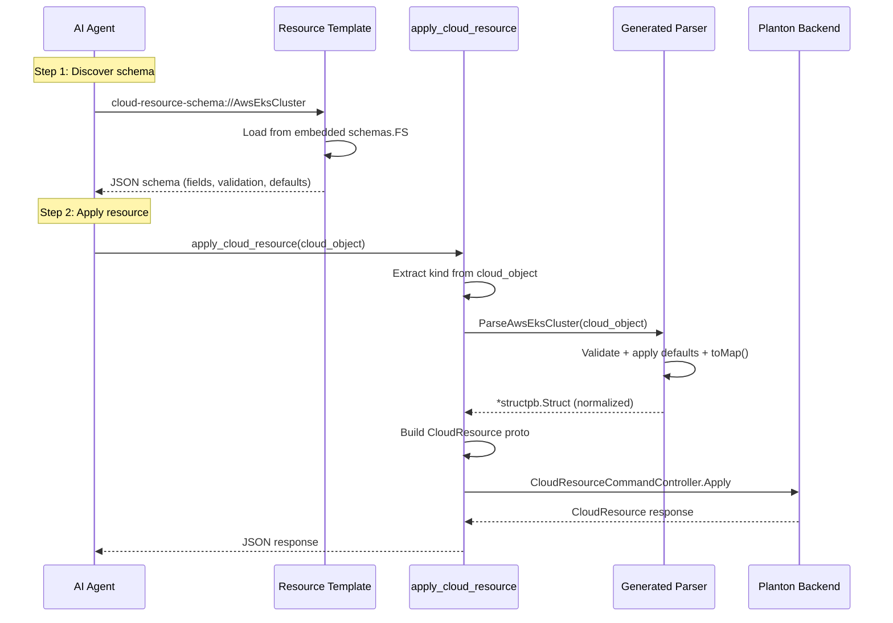
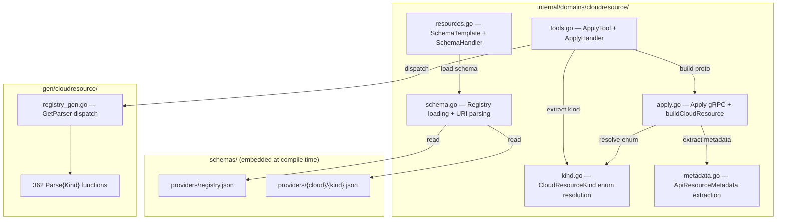

# Phase 3: apply_cloud_resource Tool + MCP Resource Templates

**Date**: February 26, 2026

## Summary

Implemented the first working MCP tool (`apply_cloud_resource`) and the first MCP resource template (`cloud-resource-schema://{kind}`) for the Planton MCP server. The tool accepts an opaque `cloud_object` map, validates it using the generated typed parsers from Phase 2, assembles the `CloudResource` proto, and calls the Planton backend via gRPC. The resource template serves per-kind JSON schemas from an embedded filesystem, enabling AI agents to discover the expected spec format before calling apply. As a prerequisite, 362 JSON schemas were promoted from `tools/codegen/schemas/` to a top-level `schemas/` package to cleanly separate build tooling from runtime data.

## Problem Statement

After Phase 2 completed the codegen pipeline (proto → JSON schemas → typed Go input structs), the MCP server still had zero registered tools. AI agents had no way to:

- Create or update cloud resources on the Planton platform
- Discover the expected `cloud_object` format for any of the 362 supported provider kinds
- Validate their input before sending it to the backend

### Pain Points

- The tool schema must stay small — expanding 362 provider specs inline would produce 50,000–100,000+ tokens, overwhelming MCP clients
- Schemas lived under `tools/codegen/schemas/`, misclassifying runtime data as build tooling
- No established pattern for MCP resource templates in this codebase
- The `CloudResource` proto uses `google.protobuf.Struct` for `cloud_object`, requiring careful assembly from typed Go structs back to `map[string]any`

## Solution

A layered architecture where the tool schema stays minimal (one opaque `cloud_object` field) while typed validation happens inside the handler, and a companion MCP resource template lets agents fetch rich schemas on demand.

### Architecture

### Key Components

## Implementation Details

### Schema Promotion (Prerequisite)

The 362 JSON schemas are consumed by both the codegen pipeline (build-time) and the MCP resource template handler (runtime). They previously lived under `tools/codegen/schemas/`, which misclassified them as build tooling. They were promoted to a top-level `schemas/` package:

- **`schemas/embed.go`** — New package with `//go:embed providers shared` directive exposing `var FS embed.FS`
- Updated `proto2schema` default `--output-dir` from `tools/codegen/schemas` to `schemas`
- Updated `generator` default `--schemas-dir` to `schemas`
- Updated Makefile `codegen-types` target to reference `schemas/`

This cleanly separates concerns: `tools/codegen/` contains the Go source for codegen tools; `schemas/` contains the generated data consumed at runtime.

### Tool Handler Pipeline

The `ApplyHandler` follows a strict pipeline:

1. **Extract kind** — Read `cloud_object["kind"]` string
2. **Get parser** — Look up `ParseFunc` from `gen/cloudresource.GetParser(kind)`
3. **Validate + normalize** — The generated `Parse{Kind}()` runs `validate()`, `applyDefaults()`, `toMap()`, returning `*structpb.Struct`
4. **Resolve enum** — Map PascalCase kind string to `CloudResourceKind` proto enum via `cloudresourcekind.CloudResourceKind_value`
5. **Extract metadata** — Map `cloud_object["metadata"]` to `ApiResourceMetadata` proto (required: name, org, env; optional: slug, id, labels, annotations, tags, version.message)
6. **Build proto** — Assemble `CloudResource{ApiVersion, Kind, Metadata, Spec{Kind, CloudObject}}`
7. **gRPC call** — `CloudResourceCommandController.Apply` via `domains.WithConnection`
8. **Return JSON** — Serialize response with `domains.MarshalJSON`

### MCP Resource Template

The `cloud-resource-schema://{kind}` template uses a standard URL scheme. The handler:

1. Parses the URI to extract the kind from the host component
2. Loads `providers/registry.json` from `schemas.FS` (cached with `sync.Once`)
3. Looks up the kind's schema file path in the registry
4. Reads the schema file from the embedded FS
5. Returns it as `application/json` content

### Shared Resource Result Helper

Added `domains.ResourceResult(uri, mimeType, text)` to `internal/domains/toolresult.go`, complementing the existing `TextResult` for tools. This provides a consistent pattern for building MCP resource responses across all future resource template handlers.

## Benefits

- **First working MCP tool**: AI agents can now create/update any of 362 cloud resource kinds via a single tool
- **Type-safe validation**: Every `cloud_object` passes through a generated parser with field-level validation, enum checks, and default application before reaching the backend
- **Small tool schema**: The tool accepts one opaque `cloud_object` field — agents fetch the per-kind schema separately via the resource template
- **Schema discovery**: `cloud-resource-schema://{kind}` provides rich JSON schemas with field descriptions, validation rules, and defaults — richer than what Go struct tags alone can express
- **Clean architecture**: Schemas promoted to a proper package boundary; build tooling and runtime data clearly separated

## Impact

- **AI agents**: Can now perform the full "discover schema → validate → apply" workflow for cloud resources
- **MCP clients**: Resource template enables schema-aware autocomplete and pre-call validation
- **Codebase**: Established patterns for `internal/domains/{domain}/` packages (tools, apply, resources, schema) that Phase 4 will follow for delete and get operations
- **Dependencies**: Added `plantonhq/planton/apis` and `plantonhq/openmcf` — required for `CloudResource` gRPC stubs and `CloudResourceKind` enum

## Files Changed

### Created (8 files)
| File | Purpose |
|------|---------|
| `schemas/embed.go` | `go:embed` package for runtime schema access |
| `internal/domains/cloudresource/tools.go` | Tool definition + typed handler |
| `internal/domains/cloudresource/apply.go` | gRPC Apply + CloudResource proto assembly |
| `internal/domains/cloudresource/kind.go` | CloudResourceKind enum resolution |
| `internal/domains/cloudresource/metadata.go` | ApiResourceMetadata extraction |
| `internal/domains/cloudresource/resources.go` | MCP resource template + handler |
| `internal/domains/cloudresource/schema.go` | Embedded FS schema lookup + URI parsing |
| `schemas/providers/` + `schemas/shared/` | 362 JSON schemas (moved from `tools/codegen/schemas/`) |

### Modified (6 files)
| File | Change |
|------|--------|
| `internal/server/server.go` | Added tool + resource template registration |
| `internal/domains/toolresult.go` | Added `ResourceResult()` helper |
| `tools/codegen/proto2schema/main.go` | Updated default `--output-dir` |
| `tools/codegen/generator/main.go` | Updated default `--schemas-dir` |
| `Makefile` | Updated codegen targets for new schema location |
| `go.mod` / `go.sum` | Added `plantonhq/planton/apis`, `plantonhq/openmcf` |

## Related Work

- **Phase 1**: [Clean Slate + Shared Utilities](2026-02-26-192404-phase-1-stigmer-pattern-foundation.md) — Foundation this phase builds on
- **Phase 2 Stage 1**: [proto2schema Codegen](2026-02-26-210045-phase2-stage1-proto2schema-codegen.md) — Produces the JSON schemas served by resource templates
- **Phase 2 Stage 2**: [schema2go Generator](2026-02-26-215408-phase2-stage2-schema2go-generator.md) — Produces the typed parsers used by the tool handler
- **Next**: Phase 4 will implement `delete_cloud_resource` and `get_cloud_resource` following the same domain patterns

---

**Status**: ✅ Production Ready (pending Phase 4 for full tool set)
**Timeline**: ~2 hours
