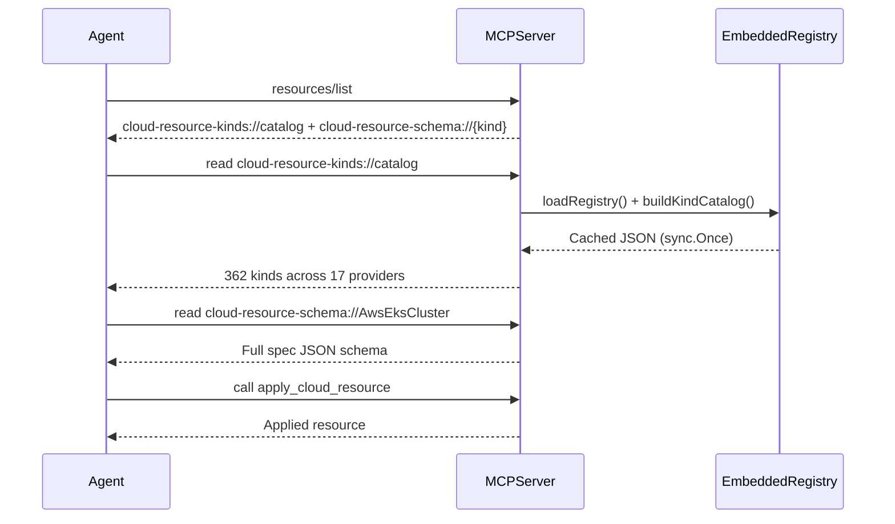

# Cloud Resource Kinds Catalog — Static MCP Resource for Kind Discovery

**Date**: February 26, 2026

## Summary

Added a static MCP resource (`cloud-resource-kinds://catalog`) that serves a complete catalog of all 362 supported cloud resource kinds grouped by 17 cloud providers. This closes the discovery gap where agents had a schema lookup template but no way to know what kind values were valid.

## Problem Statement

The MCP server exposed a resource template `cloud-resource-schema://{kind}` for agents to fetch per-kind JSON schemas, and the `apply_cloud_resource` tool accepted an opaque `cloud_object` with a `kind` field. But there was no discovery mechanism — agents had to already know the PascalCase kind string (e.g., `AwsEksCluster`) to use either of these. This created a dead end in the agent workflow.

### Pain Points

- Agents could not enumerate valid kind values without prior training data
- No programmatic way to discover which cloud providers are supported
- No way to look up the `api_version` string required in `cloud_object` without fetching a schema first
- Error messages said "use the cloud-resource-schema resource template to discover valid kinds" — but the template itself requires a kind value

## Solution

A static MCP resource registered via `srv.AddResource()` (distinct from the parameterized `srv.AddResourceTemplate()`) that serves a single cached JSON document containing all kinds grouped by cloud provider.

### Architecture



### Catalog JSON Structure

```json
{
  "schema_uri_template": "cloud-resource-schema://{kind}",
  "total_kinds": 362,
  "providers": {
    "aws": {
      "api_version": "aws.openmcf.org/v1",
      "kinds": ["AwsAlb", "AwsEksCluster", "AwsVpc", "..."]
    },
    "gcp": {
      "api_version": "gcp.openmcf.org/v1",
      "kinds": ["GcpGkeCluster", "GcpVpc", "..."]
    }
  }
}
```

Design choices:
- **Grouped by cloud provider** — agents narrow by provider first (e.g., user says "deploy to AWS")
- **`api_version` per provider group** — avoids a second lookup; agent has everything needed to assemble `cloud_object`
- **`schema_uri_template` at top level** — self-documenting; agent knows exactly how to fetch per-kind schema
- **Sorted kind lists** — deterministic output, easier for agents to scan
- **~12.7KB total** — well within MCP resource limits for 362 kinds across 17 providers

## Implementation Details

### Kind Case Analysis

A thorough cross-system audit was performed before implementation. The entire system consistently uses PascalCase for kind values:

| Layer | Format | Example |
|-------|--------|---------|
| Proto enum (`CloudResourceKind`) | PascalCase | `AwsVpc = 216` |
| Generated Go maps | PascalCase keys | `CloudResourceKind_value["AwsVpc"]` |
| Codegen registry (`registry_gen.go`) | PascalCase keys | `"AwsEksCluster": aws.ParseAwsEksCluster` |
| JSON schema registry (`registry.json`) | PascalCase keys | `"AliCloudVpc": {...}` |
| StringValueOrRef `default_kind` options | PascalCase | `(default_kind) = AwsVpc` |

All 362 production kinds in the codegen registry are a perfect subset of the proto enum. Only 3 test fixtures (`TestCloudResourceOne/Two/Three`) exist in the enum but not the registry. No case conversion needed at any boundary.

### Files Changed (5 modified, 0 new)

- **`internal/domains/cloudresource/schema.go`** — Added `buildKindCatalog()` with `sync.Once` caching, `kindCatalog` and `catalogProviderEntry` types. Reuses the existing `loadRegistry()` cache.
- **`internal/domains/cloudresource/resources.go`** — Added `KindCatalogResource()` returning `*mcp.Resource` and `KindCatalogHandler()` returning `mcp.ResourceHandler`. Placed before schema template functions to reflect discovery order.
- **`internal/server/server.go`** — Registered static resource via `srv.AddResource()` alongside existing `srv.AddResourceTemplate()`. Updated log message to distinguish static resources from templates.
- **`internal/domains/cloudresource/tools.go`** — Updated `apply_cloud_resource` tool description with 3-step workflow (catalog → schema → apply). Updated error messages.
- **`internal/domains/cloudresource/kind.go`** — Updated error message to direct agents to `cloud-resource-kinds://catalog`.

### Code Metrics

- +107 lines, -10 lines across 5 files
- Catalog JSON: 12,749 bytes covering 362 kinds, 17 providers
- Zero new dependencies
- `go build ./...` and `go vet ./...` pass cleanly

## Benefits

- **Complete discovery path** — agents can now enumerate all valid kinds without prior knowledge
- **Self-documenting** — catalog includes `schema_uri_template` and `api_version`, reducing round-trips
- **Zero runtime cost** — catalog built once via `sync.Once`, served from memory thereafter
- **Provider grouping** — agents can filter by cloud provider before choosing a specific kind

## Impact

- **Agent developers** — can now build flows that start with kind discovery instead of requiring hardcoded kind lists
- **Tool descriptions** — updated to guide agents through the 3-step workflow (catalog → schema → apply)
- **Error messages** — now direct agents to the catalog resource instead of vague instructions

## Related Work

- Phase 3: `apply_cloud_resource` tool + `cloud-resource-schema://{kind}` resource template
- Phase 2: Codegen pipeline producing the 362 provider schemas and registry that back both the catalog and schema template
- Phase 4 (upcoming): `delete_cloud_resource` + `get_cloud_resource` tools

---

**Status**: ✅ Production Ready
**Timeline**: ~30 minutes (including thorough kind case analysis across 4 repositories)
