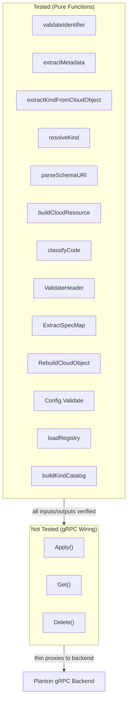

# Phase 5 Hardening: Dead Code, Unit Tests, Documentation

**Date**: February 27, 2026

## Summary

Completed the final phase of the mcp-server-planton Stigmer patterns refactoring by removing dead code, writing 50 unit tests across 8 test files covering all pure domain logic, and rewriting the README and documentation to reflect the new 3-tool architecture. The codebase now has zero stale documentation, zero dead code, and comprehensive test coverage for every validation and transformation function.

## Problem Statement

After Phases 1-4 delivered the complete tool set (apply, get, delete) with codegen pipeline and MCP resources, three categories of technical debt remained:

### Pain Points

- **Stale documentation**: The README and 5 docs/ files (62KB) still referenced ~20 deleted tools (Service Hub, Connect/Credentials, Environments) and old dependency names, actively misleading anyone reading the project
- **Dead code**: `FetchFunc` and `CallFetch` in `toolresult.go` implemented an `org + slug` pattern superseded by Phase 4's `ResourceIdentifier` dual-path pattern
- **Zero test coverage**: Not a single `_test.go` file existed despite 1,844 lines of hand-written Go across 22 source files

## Solution

Three-stage hardening approach: clean up dead code, test all pure functions, rewrite documentation.

### Architecture Decision: Test Pure Functions, Not gRPC Wiring

The tool handlers (Apply, Get, Delete) are thin gRPC proxies. The real risk is in validation, metadata extraction, identifier logic, URI parsing, and config validation. All of these are pure functions testable without mocks.

## Implementation Details

### Stage 1: Dead Code Removal

Removed `FetchFunc` type and `CallFetch` function from `internal/domains/toolresult.go`. These were from a pre-Phase-4 design that used `org + slug` as the identification pattern. Phase 4 replaced this with `ResourceIdentifier` supporting dual-path (ID or kind+org+env+slug).

### Stage 2: Unit Tests (8 files, 50 test cases)

| Test File | Functions Covered | Tests |
|-----------|-------------------|-------|
| `identifier_test.go` | `validateIdentifier`, `describeIdentifier` | 8 |
| `kind_test.go` | `extractKindFromCloudObject`, `resolveKind` | 6 |
| `metadata_test.go` | `extractMetadata`, `toStringMap`, `toStringSlice` | 10 |
| `schema_test.go` | `parseSchemaURI`, `loadRegistry`, `loadProviderSchema`, `buildKindCatalog` | 10 |
| `apply_test.go` | `buildCloudResource`, `describeResource` | 6 |
| `rpcerr_test.go` | `classifyCode` | 7 |
| `helpers_test.go` | `ValidateHeader`, `ExtractSpecMap`, `RebuildCloudObject` | 10 |
| `config_test.go` | `Config.Validate`, `ParseLogLevel` | 10 |

Test patterns used:
- Table-driven subtests for `validateIdentifier` partial-slug and `ParseLogLevel` cases
- Embedded FS integration tests for schema loading and catalog building
- Proto type verification with real `ApiResourceMetadata` and `CloudResource` types
- Error message content assertions (not just nil/non-nil) for user-facing error quality

### Stage 3: Documentation Rewrite

**Deleted** (62KB of misleading content):
- `docs/service-hub-tools.md` — 573 lines documenting a deleted domain
- `docs/installation.md` — referenced old tools
- `docs/http-transport.md` — partially stale
- `docs/development.md` — referenced old dependencies and Go versions
- `docs/configuration.md` — partially stale

**Rewritten**:
- `README.md` — Complete rewrite with 3-tool architecture, MCP resources, agent workflow, integration guides, architecture diagram, codegen pipeline
- `docs/configuration.md` — Current env var reference with transport security details
- `docs/development.md` — Build, test, codegen pipeline, project structure

## Benefits

- **From 0 to 50 tests**: Every pure validation and transformation function now has test coverage
- **Zero stale documentation**: README and docs accurately describe the current 3-tool architecture
- **Zero dead code**: Removed unused patterns that could mislead future contributors
- **All tests pass**: `go build ./...`, `go vet ./...`, and `go test ./internal/...` all clean

## Impact

- **Future contributors** can now understand the project from the README without encountering misleading tool names or deleted domains
- **Refactoring safety**: The 50 unit tests protect against regressions in validation logic, metadata extraction, identifier handling, URI parsing, and config validation
- **Project completion**: All 5 phases of the Stigmer patterns refactoring are now complete

## Related Work

- Phase 1: Clean Slate + Shared Utilities (2026-02-26)
- Phase 2: Codegen Pipeline — proto2schema + schema2go (2026-02-26)
- Phase 3: apply_cloud_resource + MCP Resource Templates (2026-02-26)
- Kind Catalog Resource (2026-02-26)
- Phase 4: delete_cloud_resource + get_cloud_resource (2026-02-27)

---

**Status**: ✅ Production Ready
**Timeline**: Single session
