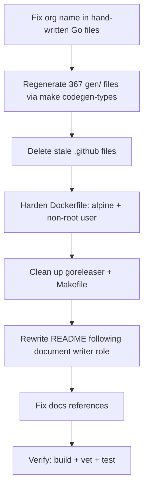

# Pre-PR Cleanup: Org Rename, Dockerfile Hardening, and README Rewrite

**Date**: February 27, 2026

## Summary

Cleaned up mcp-server-planton before merging the `feat/refactor-using-codegen` branch. Unified three different GitHub org names (`plantoncloud`, `plantoncloud-inc`, `plantonhq`) to the canonical `plantonhq` across the entire codebase, hardened the Dockerfile and build tooling to match stigmer MCP server patterns, and rewrote the README as a user-first document.

## Problem Statement

The codebase carried debt from its original creation under a different GitHub org:

### Pain Points

- **Three org names in production code**: `go.mod` said `plantoncloud`, the Makefile GHCR image said `plantoncloud-inc`, and the git remote pointed to `plantonhq`. Go tooling would fail to resolve imports if the module were ever published.
- **Stale .github files**: CODEOWNERS referenced deleted paths (`/internal/mcp/`), issue templates and PR template were premature for a project this early, and workflows pinned Go 1.24 while `go.mod` required 1.25.
- **Dockerfile ran as root**: The runtime container used `debian:bookworm-slim` without a non-root user, violating container security best practices.
- **README was developer-centric**: Jumped straight into MCP client JSON configs before explaining what Planton Cloud is, duplicated identical config blocks four times, and omitted Docker networking guidance.

## Solution

Systematic cleanup across 396 files, organized into 7 tasks executed sequentially with full verification after each.

## Implementation Details

### 1. Go Module Path Rename

Changed `github.com/plantoncloud/mcp-server-planton` to `github.com/plantonhq/mcp-server-planton` in:

- `go.mod` (module declaration)
- `tools/codegen/generator/main.go` (default `--module` flag)
- 16 hand-written Go source files (imports)
- `docs/configuration.md`, `CONTRIBUTING.md`
- Regenerated all 367 files in `gen/cloudresource/` via `make codegen-types`

### 2. .github Cleanup

**Deleted**: `CODEOWNERS`, `ISSUE_TEMPLATE/` (3 files), `pull_request_template.md`

**Updated**: `ci.yml` and `release.yml` -- Go version 1.24 to 1.25, stripped trailing whitespace from release.yml.

### 3. Dockerfile Hardening

| Aspect | Before | After |
|--------|--------|-------|
| Runtime base | `debian:bookworm-slim` | `alpine:3.19` |
| User | root | `planton` (UID 1000) |
| Go version | 1.24 | 1.25 |
| Binary size | No strip | `-ldflags="-s -w"` |
| Extras copied | README.md + LICENSE | None |

### 4. .goreleaser.yaml

- Fixed `release.github.owner` from `plantoncloud` to `plantonhq`
- Migrated to goreleaser v2 `formats:` array syntax
- Simplified archive `name_template` to `{{ .ProjectName }}_{{ .Os }}_{{ .Arch }}`
- Removed `before.hooks`, changelog groups, and 30+ trailing blank lines

### 5. Makefile

- Added `VERSION` from `git describe`, build version ldflags
- Added `vet` target excluding `gen/` (false struct tag positives)
- Added `-race -timeout 30s` to test target
- Added `tidy` target
- Fixed GHCR image to `ghcr.io/plantonhq/mcp-server-planton`

### 6. README Rewrite

Restructured following the Lead Technical Document Writer role and stigmer README as structural reference:

- ASCII architecture diagram showing the protocol bridge pattern
- Key Concepts table defining `kind`, `org`, `env`, `slug`, `apply`, `api_version`
- Consolidated 4 duplicate MCP client config blocks into 2 (binary + Docker) with a per-client location table
- Full parameter tables for all 3 tools
- gRPC error handling table
- Dedicated HTTP Mode section with Docker networking note, dual transport, and TLS guidance

## Benefits

- **Correct module path**: `go install github.com/plantonhq/mcp-server-planton/cmd/mcp-server-planton@latest` will work when published
- **Smaller, safer Docker image**: Alpine-based, non-root user, stripped binary
- **User-friendly README**: A new user can install, configure, and start using the server by reading the README top-to-bottom without prior Planton knowledge
- **Clean CI**: Workflows match `go.mod` Go version, no stale config files

## Impact

- 396 files changed (1,133 insertions, 1,405 deletions)
- 367 generated files regenerated with correct module path
- 5 stale .github files removed
- All 50 unit tests pass with race detection
- `go build`, `go vet`, and `go test` clean

## Related Work

- Follows the Phase 1-5 refactoring completed in `20260226.01.refactor-mcp-server-stigmer-patterns`
- Dockerfile and Makefile patterns aligned with `stigmer/mcp-server/`
- README structure modeled after `stigmer/mcp-server/README.md`

---

**Status**: ✅ Production Ready
**Timeline**: Single session
