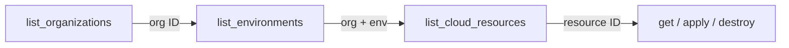

# Phase 6C: Context Discovery Tools

**Date**: February 27, 2026

## Summary

Added two context-discovery tools — `list_organizations` and `list_environments` — in two new domain packages (`organization/` and `environment/`), expanding the MCP server from 8 to 10 tools. These tools give agents the ability to discover their operating context before working with cloud resources, closing the "how do I know which org and env to use?" gap.

## Problem Statement

After Phases 6A and 6B, agents could manage cloud resources and observe stack jobs — but every operation required knowing an organization identifier upfront. There was no way for an agent to discover what organizations the user belongs to or what environments are available within an organization.

### Pain Points

- Agents had to receive org/env identifiers from the user or hardcode them
- No programmatic way to discover the caller's organizational membership
- No permission-aware environment listing (agents couldn't know which environments the user can actually access)
- The "first step" in any cloud resource workflow was missing from the tool surface

## Solution

Two new tools that serve as the entry point for any agent workflow:

| Tool | Domain | RPC | Input | Auth |
|------|--------|-----|-------|------|
| `list_organizations` | `organization/` | `FindOrganizations` | none | membership-scoped |
| `list_environments` | `environment/` | `FindAuthorized` | org (required) | FGA-filtered |

### Key RPC choices

- **`FindOrganizations`** (not `find`): Returns only orgs the caller is a member of. The `find` RPC is platform-operator-only with pagination — wrong layer for agent context discovery.
- **`FindAuthorized`** (not `findByOrg`): Returns only environments where the caller has at least `get` permission via OpenFGA. `findByOrg` returns ALL environments regardless of permission, which would leak context the agent shouldn't see.

## Implementation Details

### New package: `internal/domains/organization/`

- **`tools.go`** — Package doc comment mapping to `ai.planton.resourcemanager.organization.v1`, empty `ListOrganizationsInput` struct (no parameters), `ListTool()` definition, `ListHandler()` that delegates directly to `List()`
- **`list.go`** — `List()` domain function: creates `OrganizationQueryControllerClient`, calls `FindOrganizations` with `CustomEmpty{}`, marshals the response

### New package: `internal/domains/environment/`

- **`tools.go`** — Package doc comment mapping to `ai.planton.resourcemanager.environment.v1`, `ListEnvironmentsInput` with required `org` field, `ListTool()` definition, `ListHandler()` with org validation
- **`list.go`** — `List()` domain function: creates `EnvironmentQueryControllerClient`, calls `FindAuthorized` with `OrganizationId{Value: org}`, marshals the response

### Modified: `internal/server/server.go`

Imported both new packages, registered both tools, updated tool count from 8 to 10.

### Architecture decision: flat domain packages

Evaluated whether to mirror the proto hierarchy (`infrahub/cloudresource/`, `resourcemanager/organization/`) in the MCP server's `internal/domains/` layout. Decided to keep it flat:

- Only 5-6 domain packages at full expansion — trivially navigable
- Go idiom favors flat packages; deep nesting is an anti-pattern
- The MCP server is an adapter layer; duplicating proto hierarchy creates unnecessary coupling
- No shared code within groupings that doesn't already live in `internal/domains/` shared utilities
- Provenance documented via package doc comments instead of directory structure

## Benefits

- Agents can now self-bootstrap: discover orgs, then environments, then resources — no user prompting required for context
- Permission-aware: environment list respects FGA permissions, so agents only see what the user can access
- Consistent patterns: both packages follow the established `tools.go` + domain function pattern from `cloudresource` and `stackjob`

## Impact

- **Tool count**: 8 → 10
- **New packages**: 2 (`organization/`, `environment/`)
- **New files**: 4
- **Modified files**: 1 (`server.go`)
- **Tests**: `go build ./...` and `go test ./...` pass cleanly

## Related Work

- Phase 6A: `list_cloud_resources`, `destroy_cloud_resource` (changelog: `2026-02-27-004244`)
- Phase 6B: Stack job observability (changelog: `2026-02-27-180905`)
- Next: Phase 6D — Agent Quality-of-Life (`check_slug_availability`, `search_cloud_object_presets`, `get_cloud_object_preset`)

---

**Status**: ✅ Production Ready
