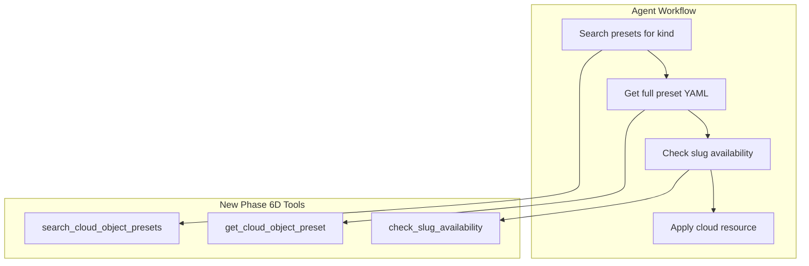
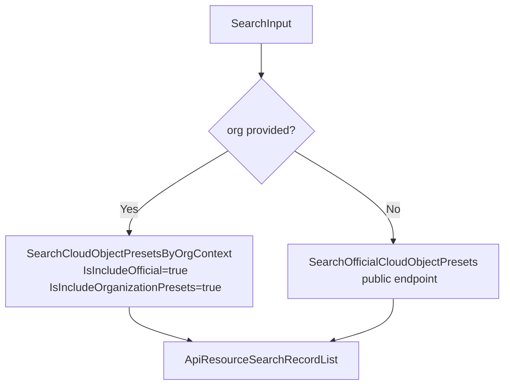

# Phase 6D: Agent Quality-of-Life Tools and resolveKind Extraction

**Date**: February 27, 2026

## Summary

Expanded the MCP server from 10 to 13 tools by adding slug validation (`check_slug_availability`) and cloud object preset discovery (`search_cloud_object_presets`, `get_cloud_object_preset`). Also extracted the `resolveKind` utility from three domain packages into a single shared function in the `domains` package, eliminating a growing duplication problem before it became technical debt.

## Problem Statement

AI agents operating on the Planton platform lacked two important capabilities:

1. **Slug validation before apply** — agents had no way to check if a slug was already taken before calling `apply_cloud_resource`, leading to wasted round-trips and confusing error messages from the backend.

2. **Preset discovery** — agents had no way to browse or retrieve pre-configured cloud resource templates (presets). Without presets, agents had to construct cloud resource manifests from scratch using only the JSON schema, making the `apply_cloud_resource` workflow significantly harder.

### Pain Points

- Agents couldn't validate slugs proactively, leading to unnecessary apply failures
- No path from "I want to create an AWS EKS cluster" to a working manifest template
- The `resolveKind` function was duplicated across `cloudresource/`, `stackjob/`, and about to be copied a third time into `preset/`

## Solution

Three new tools and a cross-cutting refactor, following the established domain package patterns:



### Architecture

- **`check_slug_availability`** — added to existing `cloudresource/` domain as `slug.go`. Calls `CloudResourceQueryController.CheckSlugAvailability` with the composite key (org, env, kind, slug). Returns `{is_available: bool}`.

- **`search_cloud_object_presets`** — new `preset/` domain package. Implements branching logic: when `org` is provided, calls `SearchCloudObjectPresetsByOrgContext` (includes both official and org-specific presets); otherwise calls `SearchOfficialCloudObjectPresets` (public endpoint). Optional `kind` and `search_text` filters.

- **`get_cloud_object_preset`** — same `preset/` domain. Simple ID-to-RPC proxy via `CloudObjectPresetQueryController.Get`. Returns full preset including YAML manifest content, markdown documentation, and provider metadata.

- **`domains.ResolveKind` extraction** — moved the `resolveKind` function from `cloudresource/kind.go` and `stackjob/enum.go` into the shared `domains` package as an exported `ResolveKind`. Updated all callers across both packages (6 call sites in `cloudresource/`, 1 in `stackjob/`). Tests moved to `domains/kind_test.go`.

## Implementation Details

### New Domain Package: `preset/`

```
internal/domains/preset/
├── tools.go    — SearchCloudObjectPresetsInput, GetCloudObjectPresetInput,
│                 SearchTool(), SearchHandler(), GetTool(), GetHandler()
├── search.go   — Search() with org/official branching, kind resolution
└── get.go      — Get() via CloudObjectPresetQueryController
```

The search function handles two different gRPC services behind a single MCP tool:



### resolveKind Extraction

The shared function lives in `internal/domains/kind.go`:

```go
func ResolveKind(kindStr string) (cloudresourcekind.CloudResourceKind, error)
```

This depends only on the `cloudresourcekind` proto package (a leaf dependency from openmcf), not on any domain package. All domain packages already import `domains` for `WithConnection`, `RPCError`, etc., so no new dependency edges are introduced.

### Files Changed

| Action | File | What |
|--------|------|------|
| Create | `internal/domains/kind.go` | Shared `ResolveKind` |
| Create | `internal/domains/kind_test.go` | Tests (known, unknown, empty) |
| Create | `internal/domains/cloudresource/slug.go` | `CheckSlugAvailability` |
| Create | `internal/domains/preset/tools.go` | Tool defs + handlers |
| Create | `internal/domains/preset/search.go` | Search with branching |
| Create | `internal/domains/preset/get.go` | Get by ID |
| Modify | `internal/domains/cloudresource/tools.go` | Add slug check tool |
| Modify | `internal/domains/cloudresource/kind.go` | Remove local `resolveKind` |
| Modify | `internal/domains/cloudresource/apply.go` | Use `domains.ResolveKind` |
| Modify | `internal/domains/cloudresource/get.go` | Use `domains.ResolveKind` |
| Modify | `internal/domains/cloudresource/identifier.go` | Use `domains.ResolveKind` |
| Modify | `internal/domains/stackjob/enum.go` | Remove local `resolveKind` |
| Modify | `internal/domains/stackjob/list.go` | Use `domains.ResolveKind` |
| Modify | `internal/server/server.go` | Register 3 new tools |

## Design Decisions

1. **`resolveKind` in `domains` vs domain-local duplication** — With three copies needed, the duplication threshold was crossed. Since `resolveKind` depends only on a leaf proto package (not on any domain), placing it in `domains` doesn't create cross-domain coupling. This also sets the precedent for future shared enum resolvers (e.g., `resolveProvider`).

2. **Preset search flags hardcoded** — When `org` is provided, both `IsIncludeOfficial` and `IsIncludeOrganizationPresets` are set to `true`. Exposing these as MCP tool inputs would add cognitive load for agents with no practical benefit.

3. **No `providers` filter** — The `kind` filter already implies a provider. Adding `providers` would require a new enum resolver with no clear agent value.

4. **No pagination on preset search** — Preset datasets are small (typically 1-5 per kind). Pagination would add tool complexity without benefit.

5. **Proto surprise corrected** — The revised plan claimed `CloudResourceSlugAvailabilityCheckResponse` includes an existing resource ID. The actual proto only has `is_available: bool`. This is sufficient for the agent's use case.

## Benefits

- **Agents can now discover presets** — the search-then-get workflow gives agents ready-made templates for any cloud resource kind
- **Slug validation prevents wasted applies** — agents can check availability before constructing and submitting a full manifest
- **Eliminated 3-way code duplication** — `resolveKind` now has a single source of truth
- **Server expanded to 13 tools** — 72% of the planned 18-tool surface is now implemented

## Impact

- **MCP server**: 10 → 13 tools, 6 domain packages
- **New domain**: `preset/` with 3 files
- **Refactored**: `domains.ResolveKind` replaces 2 duplicates, updated 7 callers
- **All tests pass**, zero linter errors, clean build

## Related Work

- Phase 6A: `list_cloud_resources`, `destroy_cloud_resource` (3 → 5 tools)
- Phase 6B: `get_stack_job`, `get_latest_stack_job`, `list_stack_jobs` (5 → 8 tools)
- Phase 6C: `list_organizations`, `list_environments` (8 → 10 tools)
- Next: Phase 6E — Advanced Operations (locks, rename, envvarmap, references)

---

**Status**: ✅ Production Ready
**Timeline**: Phase 6D, Session 4 of expand-cloud-resource-tools project
