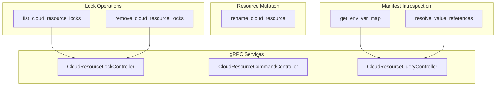

# Phase 6E: Advanced Operations — Locks, Rename, Env Var Map, and Value References

**Date**: February 27, 2026

## Summary

Completed the final feature phase of the cloud resource tool expansion by adding 5 advanced operations tools (`list_cloud_resource_locks`, `remove_cloud_resource_locks`, `rename_cloud_resource`, `get_env_var_map`, `resolve_value_references`), bringing the MCP server from 13 to 18 tools. This completes the full planned tool surface across all 5 feature phases (6A–6E). Two proto-vs-plan discrepancies were discovered and resolved during implementation.

## Problem Statement

After Phases 6A–6D, the MCP server covered the core resource lifecycle (CRUD, list, destroy), observability (stack jobs), context discovery (orgs, environments), and quality-of-life (slugs, presets). However, agents still lacked tools for several operational concerns:

### Pain Points

- **Lock visibility** — agents couldn't check if a resource was locked before attempting operations, leading to opaque failures
- **Lock recovery** — stuck locks from failed workflows required manual intervention with no agent-accessible remedy
- **Renaming** — changing a resource's display name required direct API knowledge
- **Environment variable discovery** — agents couldn't extract the env var map that a cloud resource manifest would produce
- **Cross-resource references** — agents couldn't resolve valueFrom references to see the concrete values a resource would receive at deployment time

## Solution

Five new tools in the existing `cloudresource/` domain package, each following the established thin-RPC-wrapper pattern:

### Tool Details

| Tool | RPC | Input | Key Design Point |
|------|-----|-------|-----------------|
| `list_cloud_resource_locks` | `LockController.ListLocks` | ResourceIdentifier dual-path | First use of `CloudResourceLockControllerClient` |
| `remove_cloud_resource_locks` | `LockController.RemoveLocks` | ResourceIdentifier dual-path | Includes state corruption warning |
| `rename_cloud_resource` | `CommandController.Rename` | Dual-path + `new_name` | MCP field `new_name` maps to proto field `name` |
| `get_env_var_map` | `QueryController.GetEnvVarMap` | `yaml_content` (raw YAML) | No resource identifier — server extracts from YAML |
| `resolve_value_references` | `QueryController.ResolveValueFromReferences` | `kind` (always required) + dual-path | Custom validation — `kind` always needed by RPC |

## Proto Surprises

Two significant discrepancies between the revised plan and the actual proto definitions were discovered during implementation:

### Surprise 1: `get_env_var_map` — YAML input, not ID + manifest

The plan assumed `id` (required) + `manifest` (as map). The actual `GetEnvVarMapRequest` proto has a single field: `yaml_content` (raw YAML string). The server internally parses the YAML to extract the resource identity for authorization, identify the resource kind, and resolve valueFrom references.

**Decision**: Implemented as-is, matching the proto. No wrapper layer. The agent provides raw YAML (from a file, a preset, or a prior `get_cloud_resource` response converted to YAML).

### Surprise 2: `resolve_value_references` — resolves ALL references, not specific ones

The plan assumed `cloud_resource_id` + `references` (a list). The actual `ResolveValueFromReferencesRequest` has `cloud_resource_kind` (enum) + `cloud_resource_id` (string) — no `references` field. The server loads the full resource and resolves ALL valueFrom references, returning the transformed YAML.

**Decision**: Implemented with `kind` always required (unlike other tools where kind is only needed for slug path). Custom handler validation instead of `validateIdentifier` to support the `id` + `kind` combination that the standard validator rejects.

## Implementation Details

### Files Created

| File | Content |
|------|---------|
| `internal/domains/cloudresource/locks.go` | `ListLocks` + `RemoveLocks` — both use `resolveResourceID` for dual-path, then call `CloudResourceLockControllerClient` |
| `internal/domains/cloudresource/rename.go` | `Rename` — uses `resolveResourceID` for dual-path, then calls `CommandController.Rename` with `RenameCloudResourceRequest` |
| `internal/domains/cloudresource/envvarmap.go` | `GetEnvVarMap` — passes `yaml_content` directly to `QueryController.GetEnvVarMap` |
| `internal/domains/cloudresource/references.go` | `ResolveValueReferences` — takes pre-resolved kind enum + `ResourceIdentifier`, uses `resolveResourceID` for dual-path |

### Files Modified

| File | Changes |
|------|---------|
| `internal/domains/cloudresource/tools.go` | 5 input structs, 5 tool definitions, 5 handlers added; package doc updated (6 → 11 tools); +278 lines |
| `internal/server/server.go` | 5 new `mcp.AddTool` registrations; tool count 13 → 18; +11 lines |

### Design Decisions

1. **Dual-path for lock and rename tools** — all cloudresource tools that identify a resource support `id` alone or `kind + org + env + slug`. Lock and rename follow this convention even though the RPCs only take `CloudResourceId`. The extra `resolveResourceID` call on the slug path is worth the agent ergonomics.

2. **Custom validation for `resolve_value_references`** — the standard `validateIdentifier` rejects `id + kind` together (it treats kind as slug-path-only). Since this tool's RPC always needs `kind`, the handler uses inline validation that allows `kind` to coexist with `id`.

3. **No new shared code needed** — all 5 tools reuse existing infrastructure: `WithConnection`, `RPCError`, `MarshalJSON`, `TextResult`, `ResolveKind`, `resolveResourceID`, `validateIdentifier`, `describeIdentifier`.

## Benefits

- **Full planned tool surface delivered** — 18 tools across 6 domain packages, covering the complete cloud resource lifecycle
- **Agents can now manage locks** — check lock status, identify stuck locks, and force-remove them
- **Agents can rename resources** — without needing to know the gRPC API directly
- **Manifest introspection** — agents can extract env var maps and resolve cross-resource references to understand what a deployment will produce
- **Consistent patterns throughout** — all 18 tools follow the same thin-handler + domain-function architecture

## Impact

- **MCP server**: 13 → 18 tools (100% of planned surface)
- **New gRPC client**: `CloudResourceLockControllerClient` (first use in this codebase)
- **cloudresource domain**: 6 → 11 tools (largest domain, now covers locks, rename, env vars, references)
- **All tests pass**, zero linter errors, clean build

## Related Work

- Phase 6A: `list_cloud_resources`, `destroy_cloud_resource` (3 → 5 tools)
- Phase 6B: `get_stack_job`, `get_latest_stack_job`, `list_stack_jobs` (5 → 8 tools)
- Phase 6C: `list_organizations`, `list_environments` (8 → 10 tools)
- Phase 6D: `check_slug_availability`, `search_cloud_object_presets`, `get_cloud_object_preset` (10 → 13 tools)
- Next: Hardening — unit tests, README update, docs, potential `get.go` refactor

---

**Status**: ✅ Production Ready
**Timeline**: Phase 6E, Session 5 of expand-cloud-resource-tools project
