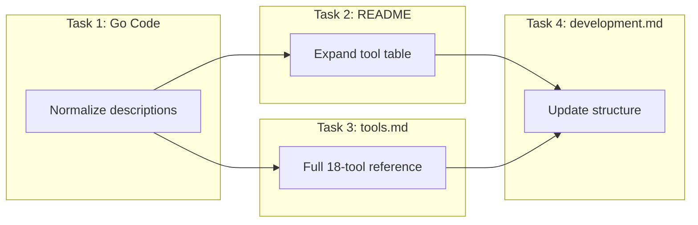

# Hardening: Documentation and Tool Description Review

**Date**: February 27, 2026

## Summary

Updated all documentation from the 3-tool era to reflect the full 18-tool surface delivered across Phases 6A–6E. Normalized tool descriptions in Go code for naming consistency and cross-tool references, expanded the README tool table, rewrote `docs/tools.md` from 229 to ~470 lines covering all 18 tools, and updated `docs/development.md` with the new domain package structure.

## Problem Statement

All 5 feature phases (6A–6E) were complete with 18 tools implemented across 5 domain packages, but the documentation was frozen at the 3-tool era:

### Pain Points

- **README.md** said "Three tools cover the full lifecycle" and listed only apply, get, delete
- **docs/tools.md** documented only 3 tools with parameter tables, agent workflows, and error handling — the primary reference for both agents and developers
- **docs/development.md** listed only `cloudresource/` in the project structure, missing `stackjob/`, `organization/`, `environment/`, `preset/`, and the shared `kind.go`
- Tool descriptions in Go code used "Planton platform" inconsistently (README/docs used "Planton Cloud")
- Cross-tool references were uneven — some tools mentioned related tools, others with similar patterns didn't

## Solution

A four-task hardening pass covering Go code, README, tools reference, and development guide:

Task 1 (Go code) was executed first because description string changes affect what gets documented downstream.

## Implementation Details

### Task 1: Tool Description Normalization (Go Code)

**Files modified**: `cloudresource/tools.go`, `stackjob/tools.go`

Changes to description strings and jsonschema tags only — no logic changes:

- **Naming**: "on the Planton platform" / "from the Planton platform" → "on Planton Cloud" / "from Planton Cloud" across 9 tool descriptions
- **Cross-tool references added**:
  - `delete_cloud_resource` → clarifies destroy vs delete distinction
  - `destroy_cloud_resource` → points to `get_latest_stack_job` for monitoring
  - `list_cloud_resources` → points to `list_organizations` for org discovery
  - `list_cloud_resource_locks` → points to `remove_cloud_resource_locks`
  - `remove_cloud_resource_locks` → points to `list_cloud_resource_locks` and `get_latest_stack_job`
  - `get_latest_stack_job` → names `apply_cloud_resource` and `destroy_cloud_resource` explicitly
- **Org discovery hints**: Added "Use list_organizations to discover available organizations" to `org` jsonschema tags on `list_cloud_resources` and `list_stack_jobs`

### Task 2: README Update

- Intro paragraph: "create, read, and delete" → full lifecycle description covering discovery through observability
- Tools & Resources section: Expanded from single 3-row table to 4 grouped tables (Cloud Resource Lifecycle: 11, Stack Job Observability: 3, Context Discovery: 2, Presets: 2)

### Task 3: docs/tools.md Rewrite

The largest task — expanded from 229 lines / 3 tools to ~470 lines / 18 tools:

- **Resource Identification Pattern**: New shared section documenting the dual-path (ID vs coordinates) pattern once, referenced by 6 tool sections — eliminates repetitive parameter tables
- **18 tool sections**: Each with description, parameter table, and contextual notes
- **4 domain groupings**: Cloud Resource Lifecycle, Stack Job Observability, Context Discovery, Presets — each with an intro paragraph
- **Agent Cheat Sheet**: Expanded from 2 decision guides to 6: getting started, creating a resource, reading/modifying, destroy vs delete, monitoring operations, troubleshooting locks

### Task 4: docs/development.md Update

- **Project Structure**: Added `kind.go`, `stackjob/`, `organization/`, `environment/`, `preset/` with tool counts
- **Test Files table**: Added `kind_test.go`, `list_test.go`, `enum_test.go` (3 new entries)

## Surprise Discovery

`docs/tools.md` was the most important documentation artifact but wasn't explicitly called out in the original Hardening plan (which mentioned README and development.md). It was the deep reference agents rely on for parameter tables, workflows, and error handling, and it only covered 3 of 18 tools. Added to scope during planning.

## Benefits

- **Agents get complete documentation** — all 18 tools documented with parameter tables, usage notes, and cross-references
- **Consistent naming** — "Planton Cloud" used uniformly across Go code and docs
- **Agent workflow guidance** — tools reference related tools (destroy → delete, locks → latest stack job), reducing agent trial-and-error
- **DRY documentation** — Resource Identification Pattern section eliminates 6 duplicate parameter tables
- **Expanded cheat sheet** — agents can quickly navigate the full tool surface through decision guides

## Impact

- **5 files changed**: 499 insertions, 46 deletions
- **docs/tools.md**: 229 → ~470 lines (doubled+ with 15 new tool sections)
- **README.md**: Tool table expanded from 3 rows to 18 rows across 4 groups
- **Zero code logic changes** — only description strings and documentation files
- **Build and tests pass** — verified with `go build ./...` and `go test ./...`

## Related Work

- Phase 6A–6E changelogs: The feature implementation sessions this hardening pass documents
- Next: H4 (`get.go` refactor to use `resolveResource`) — deferred from this session as a code-quality improvement

---

**Status**: ✅ Production Ready
**Timeline**: Hardening session, Session 6 of expand-cloud-resource-tools project
