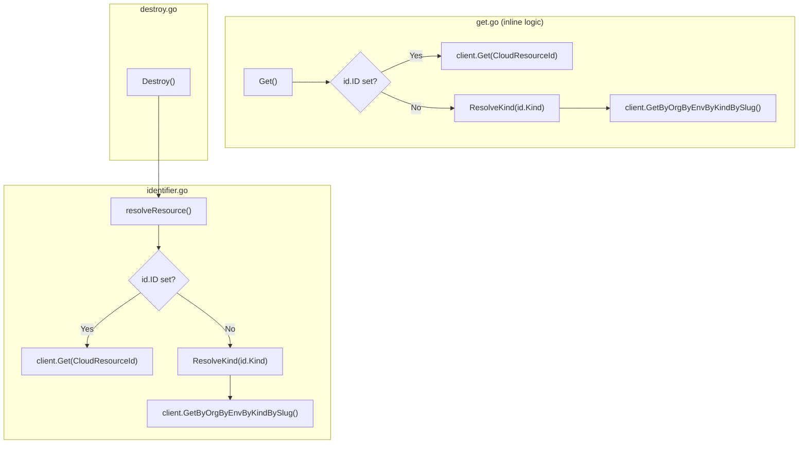
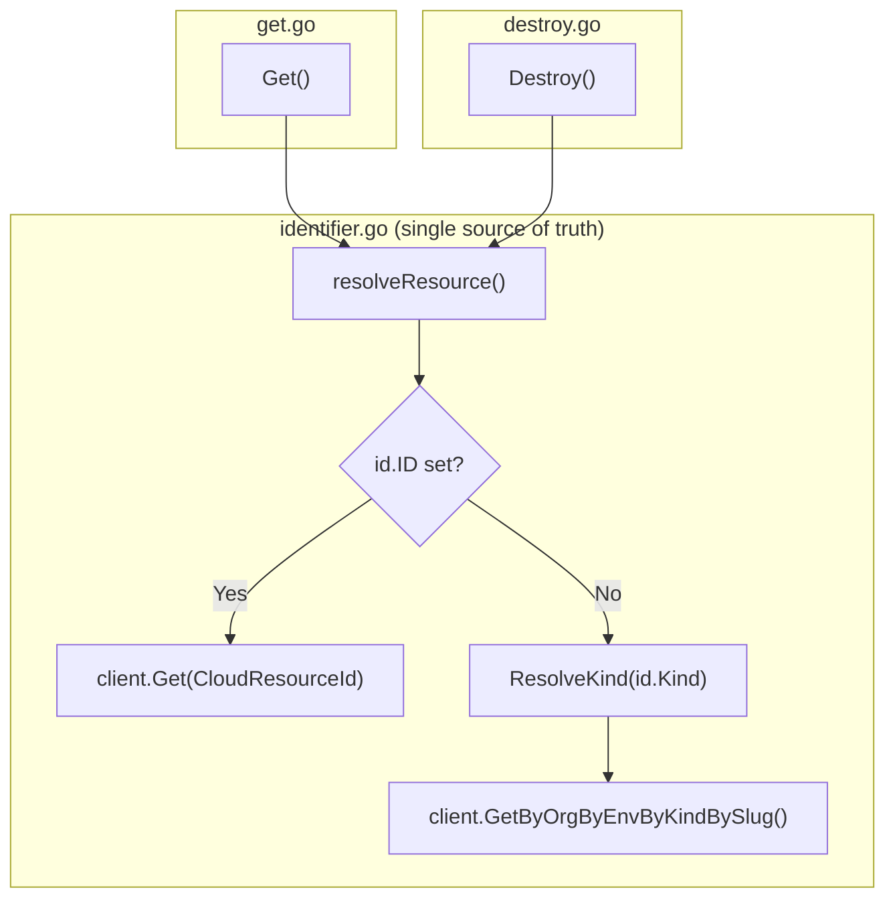

# H4: `get.go` Refactor and Project Close-Out

**Date**: February 27, 2026

## Summary

Refactored `get.go` to eliminate the last instance of duplicated dual-path resource resolution logic in the `cloudresource` package, then formally closed out the **20260227.01.expand-cloud-resource-tools** project. This was the final hardening item (H4) deferred since Phase 6A. The MCP server is now structurally consistent across all 18 tools with zero technical debt carried forward.

## Problem Statement

When `resolveResource` was introduced in Phase 6A to support the `destroy_cloud_resource` tool, `get.go` was intentionally left untouched to minimize blast radius. This meant the package had two implementations of the same dual-path resolution logic:

### Pain Points

- `get.go` contained 25 lines of inline ID-vs-slug resolution that duplicated `resolveResource` in `identifier.go`
- If the resolution logic ever changed (new identification path, different error handling), `get.go` would silently drift from the canonical implementation
- Every other domain function that needs the full resource proto (`Destroy`) already delegated to `resolveResource` — `Get` was the sole inconsistency

## Solution

Replaced the inline dual-path logic in `Get()` with a call to `resolveResource`, matching the pattern already established by `Destroy()`.

### Before



### After



## Implementation Details

The change was surgical — a single file modified:

**`internal/domains/cloudresource/get.go`** (49 → 28 lines):
- Removed inline `if id.ID != ""` branching, `ResolveKind` call, and both RPC call sites
- Replaced with `resolveResource(ctx, conn, id)` + `domains.MarshalJSON(cr)`
- Removed unused imports: `cloudresourcev1` proto alias, `domains.ResolveKind`
- Updated doc comment to reference `resolveResource` delegation

The function body went from:

```go
desc := describeIdentifier(id)
client := cloudresourcev1.NewCloudResourceQueryControllerClient(conn)
if id.ID != "" {
    cr, err := client.Get(ctx, &cloudresourcev1.CloudResourceId{Value: id.ID})
    // ...
}
kind, err := domains.ResolveKind(id.Kind)
// ...
cr, err := client.GetByOrgByEnvByKindBySlug(ctx, &cloudresourcev1.CloudResourceByOrgByEnvByKindBySlugRequest{...})
```

To:

```go
cr, err := resolveResource(ctx, conn, id)
if err != nil {
    return "", err
}
return domains.MarshalJSON(cr)
```

## Benefits

- **Single source of truth**: All dual-path resolution (ID vs slug) now flows through exactly two shared functions — `resolveResource` (full proto) and `resolveResourceID` (ID string)
- **Drift-proof**: Future changes to resolution logic (new identification path, error enrichment) propagate to all consumers automatically
- **Consistent patterns**: All 10 domain functions in `cloudresource/` now follow the same structural pattern — no outliers

## Impact

### Code Quality

| Metric | Before | After |
|--------|--------|-------|
| `get.go` lines | 49 | 28 |
| Dual-path implementations | 2 (inline + resolveResource) | 1 (resolveResource only) |
| Structural outliers in package | 1 | 0 |

### Project Completion

This was the final item in the **20260227.01.expand-cloud-resource-tools** project:

| Phase | Status | Tools |
|-------|--------|-------|
| 6A: Resource Lifecycle | ✅ | 2 (list, destroy) |
| 6B: Stack Job Observability | ✅ | 3 (get, get latest, list) |
| 6C: Context Discovery | ✅ | 2 (list orgs, list envs) |
| 6D: Agent Quality-of-Life | ✅ | 3 (slug check, preset search, preset get) |
| 6E: Advanced Operations | ✅ | 5 (locks, remove locks, rename, env var map, resolve refs) |
| Hardening: Docs | ✅ | — (descriptions, README, tools.md, development.md) |
| Hardening H4: Code | ✅ | — (get.go refactor) |

**Final tool count**: 18 tools across 5 domain packages, up from 3 tools in 1 package.

## Related Work

- [Phase 6A: Resource Lifecycle](2026-02-27-010334-pre-pr-cleanup-org-rename-and-hardening.md) — where `resolveResource` was created and H4 was deferred
- [Phase 6E: Advanced Operations](2026-02-27-202432-phase-6e-advanced-operations.md) — completed the 18-tool surface
- [Hardening: Docs and Tool Descriptions](2026-02-27-205828-hardening-docs-and-tool-descriptions.md) — documentation pass

---

**Status**: ✅ Production Ready
**Timeline**: 1 session (Session 7 of 7)
