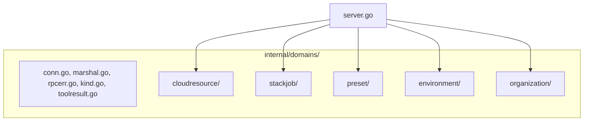
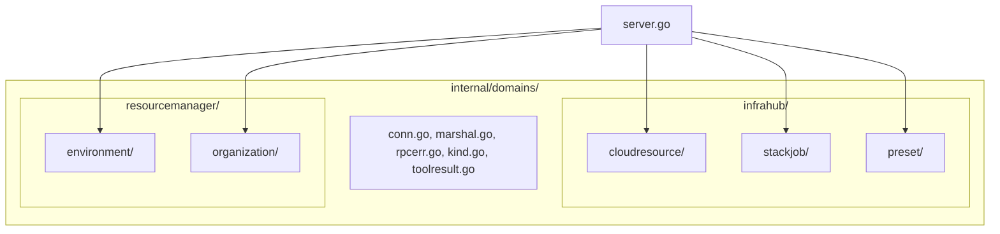

# Domain Bounded-Context Refactor

**Date**: February 27, 2026

## Summary

Restructured the MCP server's `internal/domains/` from a flat layout to one level of bounded-context grouping that mirrors the Planton API's top-level domain taxonomy. The 5 domain packages now live under `infrahub/` and `resourcemanager/` parent directories, aligning the codebase with the platform's ubiquitous language and preparing it for scalable expansion.

## Problem Statement

The MCP server had 5 domain packages (`cloudresource`, `stackjob`, `preset`, `environment`, `organization`) as flat siblings under `internal/domains/`. Meanwhile, the canonical Planton API (`apis/ai/planton/`) organizes these same concepts into distinct bounded contexts with 18 top-level domain groupings.

### Pain Points

- **Ubiquitous language drift**: The Planton platform speaks in terms of "infrahub", "resourcemanager", "connect", "cloudops", etc. The flat MCP layout erased this taxonomy from the codebase.
- **Scalability cliff**: With 18 API-level domains (many with multiple sub-resources), continued flat expansion would produce 30–50 sibling directories — unnavigable.
- **Missing bounded context signals**: `cloudresource`, `stackjob`, and `preset` are siblings even though they all belong to `infrahub`. No natural home existed for future shared infrahub-specific helpers.
- **Cognitive overhead**: A developer familiar with the Planton API structure couldn't use that knowledge to navigate the MCP server.

## Solution

Introduce **one intermediate directory level** matching the API's top-level bounded contexts. Not deeper — the API's sub-levels (versioning, provider nesting, assets) are proto/gRPC organizational overhead that doesn't belong in the MCP server.

### Architecture

#### Before: Flat Domains

#### After: Bounded-Context Grouping

## Implementation Details

### What Moved

| Domain Package | Before | After |
|---|---|---|
| cloudresource (22 files) | `internal/domains/cloudresource/` | `internal/domains/infrahub/cloudresource/` |
| stackjob (6 files) | `internal/domains/stackjob/` | `internal/domains/infrahub/stackjob/` |
| preset (3 files) | `internal/domains/preset/` | `internal/domains/infrahub/preset/` |
| environment (2 files) | `internal/domains/environment/` | `internal/domains/resourcemanager/environment/` |
| organization (2 files) | `internal/domains/organization/` | `internal/domains/resourcemanager/organization/` |

### What Was Created

- `internal/domains/infrahub/doc.go` — Package documentation mapping to `apis/ai/planton/infrahub`
- `internal/domains/resourcemanager/doc.go` — Package documentation mapping to `apis/ai/planton/resourcemanager`

### What Was Edited

- `internal/server/server.go` — 5 import paths updated (the only consumer of domain package symbols)
- `docs/development.md` — Test file table and project structure diagram updated

### What Did NOT Change

- Root shared utilities (`conn.go`, `marshal.go`, `rpcerr.go`, `toolresult.go`, `kind.go`) — import path unchanged
- All 26 domain implementation files — they import `internal/domains` (root), not sibling domains
- Generated code (`gen/cloudresource/`) — no dependency on `internal/domains/`
- `go.mod`, `Makefile`, CI workflows, Dockerfile — all use `./...` patterns
- Tool names, handler signatures, gRPC calls, MCP resources — zero functional change

### Technique

All moves used `git mv` to preserve rename tracking. `git log --follow` continues to work for all moved files.

## Benefits

- **Ubiquitous language alignment**: The codebase now speaks the same bounded-context vocabulary as the Planton API
- **Scalable structure**: Future domains (`connect/`, `cloudops/`, `iam/`, `servicehub/`, `configmanager/`, `agentfleet/`, `search/`) have an obvious, unambiguous home
- **Bounded context cohesion**: Infrahub-specific shared helpers can live at `internal/domains/infrahub/` without polluting the cross-cutting root
- **Zero blast radius**: No functional changes. All 18 tools, all handlers, all gRPC calls remain identical. Build, vet, and tests pass clean.

## Impact

- **Developers**: Faster navigation — the domain structure now mirrors what they already know from the API
- **Future contributors**: Clear placement rules for new domains
- **CI/CD**: Unaffected — no path changes in build tooling or workflows

## Design Decisions

- **One level only**: The API goes 5–6 levels deep for proto organizational reasons. The MCP server is a thin adapter layer; one level of bounded-context grouping captures 90% of organizational value at 10% of structural cost.
- **Shared utilities stay at root**: `conn.go`, `marshal.go`, etc. are cross-cutting infrastructure used by all domains. Moving them into a bounded context would misrepresent their purpose.
- **Historical docs untouched**: Changelogs, project plans, and checkpoints that reference old paths were left as-is — they are accurate records of what paths were at the time of writing.

## Related Work

- [Phase 6C: Context Discovery](2026-02-27-190034-phase-6c-context-discovery.md) — Created the `organization/` and `environment/` packages that are now under `resourcemanager/`
- [Phase 6D: Agent Quality-of-Life](2026-02-27-192229-phase-6d-agent-quality-of-life.md) — Created the `preset/` package that is now under `infrahub/`
- [Phase 6B: Stack Job Observability](2026-02-27-180905-phase-6b-stack-job-observability.md) — Created the `stackjob/` package that is now under `infrahub/`

## Code Metrics

- **Files moved**: 35 (via `git mv`)
- **Files created**: 2 (`doc.go` files)
- **Files edited**: 2 (`server.go`, `development.md`)
- **Import paths changed**: 5
- **Lines of domain code changed**: 0 (only import paths in the server wiring)
- **Tests**: All passing, zero errors

---

**Status**: ✅ Production Ready
**Timeline**: Single session
