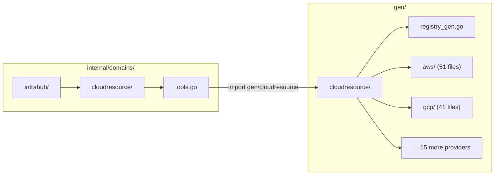
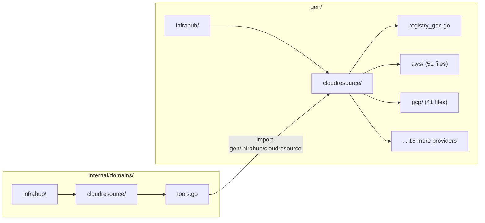

# Phase 0: Generated Code Directory Restructure

**Date**: February 27, 2026

## Summary

Relocated the entire generated code tree from flat `gen/cloudresource/` to domain-scoped `gen/infrahub/cloudresource/`, mirroring the hand-written `internal/domains/infrahub/cloudresource/` hierarchy. This is a pure path/import restructuring with zero logic changes — the prerequisite step before adding new domain tools in the InfraHub MCP expansion.

## Problem Statement

The generated code directory structure was out of alignment with the hand-written domain code. After the bounded-context refactor moved domain packages under `internal/domains/infrahub/`, the generated code at `gen/cloudresource/` became the odd one out.

### Pain Points

- **Structural inconsistency**: `internal/domains/infrahub/cloudresource/` vs `gen/cloudresource/` — two halves of the same domain living at different depths
- **Future scaling risk**: As new domains (infrachart, infraproject, graph, configmanager, audit) are added in later phases, a flat `gen/` directory would accumulate unrelated domain directories at the same level
- **Navigability**: A developer looking at `gen/cloudresource/` couldn't immediately tell this belongs to the InfraHub bounded context

## Solution

Move `gen/cloudresource/` to `gen/infrahub/cloudresource/` by updating the code generator's output path, the Makefile target, and the single consumer import. Then regenerate all files at the new location.

### Architecture

#### Before

#### After

## Implementation Details

### Hand-Written Changes (4 files, 8 lines changed)

| File | Change |
|------|--------|
| `tools/codegen/generator/main.go` | Default `--output-dir` flag: `gen/cloudresource` -> `gen/infrahub/cloudresource`; updated doc comment |
| `Makefile` | `codegen-types` target: updated rm and output paths |
| `internal/domains/infrahub/cloudresource/tools.go` | Import path: `gen/cloudresource` -> `gen/infrahub/cloudresource` |
| `tools/codegen/generator/codegen.go` | Updated doc comment path reference |
| `tools/codegen/generator/registry.go` | Updated doc comment path reference |

### What Did NOT Change

- **Package names**: All generated packages retain their names (`cloudresource`, `aws`, `gcp`, etc.) since Go derives package names from the last path segment
- **Consumer logic**: `tools.go` still calls `cloudresource.GetParser(kindStr)` — same alias, different import path
- **`make vet`**: The `grep -v '/gen/'` filter still correctly excludes `gen/infrahub/...`
- **Registry semantics**: The 362 provider parse functions, `GetParser()`, and `KnownKinds()` work identically

### Regeneration

Ran `make codegen-types` which:
1. Deleted old `gen/cloudresource/` (now empty — was already removed manually)
2. Generated 362 provider input types + registry at `gen/infrahub/cloudresource/`
3. All 17 cloud provider packages recreated under the new path

## Benefits

- **Structural symmetry**: `gen/` now mirrors `internal/domains/` — both organized by bounded context
- **Ready for expansion**: New domain tools (Phase 1+) can add their generated code under `gen/infrahub/infrachart/`, `gen/graph/`, etc. without polluting a flat directory
- **Design decision AD-02 implemented**: Fulfills the accepted architectural decision to restructure gen code under domain directories

## Impact

- **372 files in commit** (367 renames detected by Git at 95-99% similarity + 4 hand-written edits + 1 doc comment)
- **Zero runtime impact**: No logic, behavior, or API changes
- **Verification**: `go build ./...`, `go test ./...`, and `make vet` all pass clean

## Related Work

- **Preceded by**: [Domain Bounded-Context Refactor](2026-02-27-214239-domain-bounded-context-refactor.md) — moved hand-written code to `internal/domains/infrahub/`
- **Design decision**: `AD-02: Restructure Generated Code Under Domain Directories`
- **Part of**: InfraHub MCP Tools Expansion project (Phase 0 of 3)
- **Followed by**: Phase 1A (InfraChart tools), Phase 1B (InfraProject tools), Phase 1C (InfraPipeline tools)

---

**Status**: ✅ Production Ready
**Timeline**: Single session (~15 minutes)
