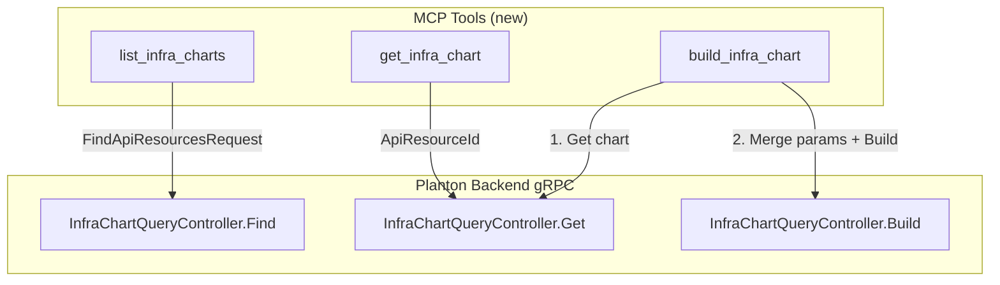
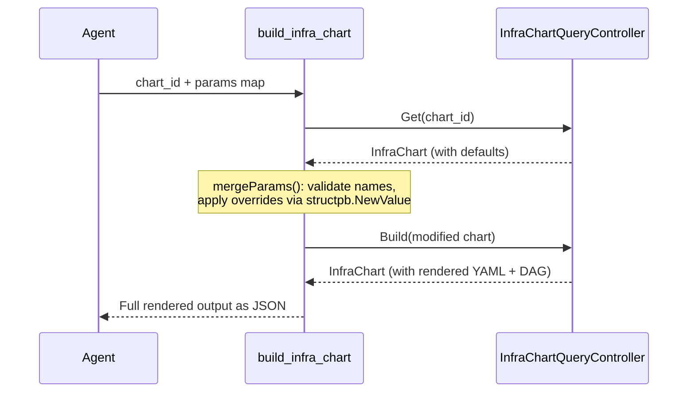

# Phase 1A: InfraChart MCP Tools

**Date**: February 27, 2026

## Summary

Added 3 new MCP tools for the InfraChart domain — `list_infra_charts`, `get_infra_chart`, and `build_infra_chart` — expanding the server from 18 to 21 tools. These tools let AI agents discover infrastructure chart templates, inspect their full definitions, and preview rendered output with custom parameters before creating projects. This is the first batch of new domain tools in the InfraHub MCP expansion project.

## Problem Statement

The MCP server could manage cloud resources but had no visibility into the infra chart catalog. Agents couldn't discover available chart templates, inspect their parameter definitions, or preview what a chart would render to before committing to a project.

### Pain Points

- **No chart discovery**: Agents had no way to list available infra charts or filter by org/environment
- **No chart inspection**: Without seeing a chart's templates, values.yaml, and parameter schema, agents couldn't make informed choices
- **No dry-run**: Agents had to create an infra project to see what a chart renders — no safe preview mechanism

## Solution

Implemented the `internal/domains/infrahub/infrachart/` package with 3 tools following the established domain patterns, backed by the `InfraChartQueryController` gRPC service.

### Architecture



### Build Tool: Two-Step Pattern

The `build_infra_chart` tool introduces a new pattern not seen elsewhere in the codebase — a simplified input that hides multi-RPC orchestration from the agent:



The agent only needs to supply a chart ID and a flat `{name: value}` params map. The tool handles fetching the chart, validating parameter names, converting values, and calling Build — all within a single gRPC connection.

## Implementation Details

### Package Structure

```
internal/domains/infrahub/infrachart/
├── tools.go   — Tool definitions, input structs, typed handlers
├── get.go     — Get by ID (standard pattern from preset/)
├── list.go    — Paginated Find with org/env filters
└── build.go   — Two-step Get + merge + Build
```

### Tool Definitions

| Tool | Input | Backing RPC |
|------|-------|-------------|
| `list_infra_charts` | org?, env?, page_num?, page_size? | `InfraChartQueryController.Find` |
| `get_infra_chart` | id (required) | `InfraChartQueryController.Get` |
| `build_infra_chart` | chart_id (required), params? | `Get` then `Build` |

### Key Design Decisions

**`list_` naming over `search_`**: The backing `Find` RPC accepts only org/env/pagination filters — no free-text search. Naming it `search_` would create a false promise. In the codebase, `list_*` is used for filter-only tools (`list_stack_jobs`, `list_cloud_resources`) while `search_*` is reserved for text-search endpoints (`search_cloud_object_presets`).

**Simplified build input**: Rather than requiring agents to pass a full `InfraChart` protobuf JSON blob (complex nested structure with templates, values.yaml, metadata), the tool accepts just `chart_id` + `params` map. The extra Get RPC adds ~100ms but eliminates the risk of agents mangling a complex proto structure.

**1-based pagination**: The tool API uses 1-based page numbers (consistent with `list_stack_jobs` and human convention) and converts to 0-based internally for the `FindApiResourcesRequest` proto which uses 0-indexed pages.

**Hard-coded `ApiResourceKind`**: The Find request's `kind` field is set to `ApiResourceKind_infra_chart` (enum value 31) rather than being user-supplied, since this tool is exclusively for infra chart discovery.

### Parameter Merge Validation

The `mergeParams()` function in `build.go` validates every parameter override:
- Unknown parameter names produce a clear error listing all available params
- Value conversion failures from `structpb.NewValue()` report the specific param name and value
- Charts with no parameters reject any override attempt

## Benefits

- **Agent-friendly chart discovery**: List, filter, and paginate through infra chart templates
- **Safe preview mechanism**: Build renders templates without creating any resources
- **Simplified API surface**: Build tool hides two-step RPC orchestration behind a flat input
- **Pattern consistency**: Follows established conventions from preset/ and stackjob/ packages
- **Server growth**: 18 → 21 tools, first expansion since the initial 18-tool release

## Impact

- **4 new files** created in `internal/domains/infrahub/infrachart/`
- **2 files modified**: `server.go` (registration) and `infrahub/doc.go` (subpackage list)
- **New pattern established**: The two-step build pattern (fetch → mutate → call) can be reused for future tools that need multi-RPC orchestration with simplified agent input
- **Verification**: `go build ./...`, `go vet ./...`, `go test ./...` all pass clean

## Related Work

- **Preceded by**: [Phase 0: Gen Directory Restructure](2026-02-27-225144-phase0-gen-directory-restructure.md) — prerequisite that organized gen code under domain directories
- **Part of**: InfraHub MCP Tools Expansion project (Phase 1A of 9 phases)
- **Followed by**: Phase 1B (InfraProject tools — 6 tools for full project lifecycle)

---

**Status**: ✅ Production Ready
**Timeline**: Single session
