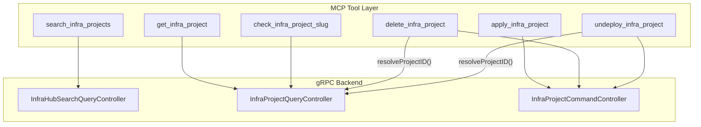

# InfraProject Lifecycle Management Tools

**Date**: February 27, 2026

## Summary

Added 6 MCP tools for InfraProject lifecycle management — search, get, apply, delete, slug check, and undeploy — expanding the MCP server from 21 to 27 tools. InfraProject is the unit of infrastructure deployment on Planton, and these tools give AI agents full project lifecycle control: from discovering projects, to creating them from charts or Git repos, to tearing down their infrastructure.

## Problem Statement

The MCP server had tools for low-level cloud resource CRUD (11 tools) and chart template discovery (3 tools), but no way to manage InfraProjects — the higher-level deployment unit that composes cloud resources from charts or Git repositories. An AI agent could browse charts and manage individual resources, but couldn't create, search, or control the projects that tie them together.

### Pain Points

- Agents couldn't search for existing infra projects within an organization
- No way to create or update infra projects (the primary deployment primitive)
- No way to check slug availability before creating a project
- No way to tear down a project's infrastructure without deleting the record
- The gap between "browse chart templates" and "manage deployed resources" was unbridged

## Solution

Created a new `internal/domains/infrahub/infraproject/` package with 7 files implementing 6 MCP tools, following the established domain patterns but with domain-appropriate simplifications.

### Architecture



### Key Design Decisions

**Simpler identification pattern**: CloudResource uses a 4-field slug path (kind, org, env, slug) because slugs are scoped to (org, env, kind). InfraProject slugs are scoped to org only, so identification needs just ID or org+slug. This avoided importing the heavyweight `ResourceIdentifier` from cloudresource.

**Full JSON passthrough for apply**: Rather than creating a simplified input abstraction (like infrachart's build tool), the apply tool accepts the full InfraProject JSON object and uses `protojson.Unmarshal` to deserialize it. This supports both source types (infra_chart and git_repo), makes get output directly usable as apply input, and avoids leaky abstractions that would break when new source types are added.

**Purge intentionally excluded**: The backend has a `Purge` RPC (undeploy + delete atomically), but we excluded it because it's a destructive compound operation. Agents can achieve the same result via `undeploy_infra_project` followed by `delete_infra_project`, giving humans a review checkpoint between steps.

**Search over Find**: The query controller has both `Find` (pagination-only) and the search controller has `SearchInfraProjects` (org + env + free-text + pagination). We expose search because it's strictly more powerful.

## Implementation Details

### File Structure

```
internal/domains/infrahub/infraproject/
├── tools.go      # Package doc, 6 input structs, 6 Tool/Handler pairs, validateIdentification()
├── get.go        # Get() with dual ID/slug lookup, resolveProject(), resolveProjectID()
├── search.go     # Search() via InfraHubSearchQueryController.SearchInfraProjects
├── apply.go      # Apply() with protojson.Unmarshal deserialization
├── delete.go     # Delete() resolving ID then calling command controller
├── slug.go       # CheckSlugAvailability() scoped to org only
└── undeploy.go   # Undeploy() resolving ID then calling command controller
```

### Shared Helpers in get.go

The `get.go` file contains three helpers reused across delete and undeploy:

- `resolveProject()` — fetches the full InfraProject proto by ID or org+slug
- `resolveProjectID()` — resolves to just the system-assigned ID string
- `describeProject()` — human-readable description for error messages

### Apply's protojson Passthrough

This is a new pattern in the codebase. CloudResource's apply takes a `cloud_object` map and runs it through generated parsers (because it's polymorphic across 362 kinds). InfraProject is a single typed proto, so the tool accepts the JSON map, marshals it to bytes, and uses `protojson.Unmarshal` to create the typed proto:

```go
jsonBytes, err := json.Marshal(raw)
project := &infraprojectv1.InfraProject{}
err = protojson.Unmarshal(jsonBytes, project)
```

This preserves proto field-name conventions, handles enums correctly, and makes the tool transparent — what you get from `get_infra_project` is what you can pass to `apply_infra_project`.

## Benefits

- **Complete project lifecycle**: Agents can now search, create, read, update, delete, and undeploy infra projects
- **Two-step safety**: Undeploy and delete are separate operations, preventing accidental data loss
- **Dual identification**: Every operation supports both system IDs and human-friendly org+slug paths
- **Pattern consistency**: Follows established domain conventions (WithConnection, RPCError, MarshalJSON, TextResult)
- **Clean build**: `go build`, `go vet`, and `go test` all pass clean

## Impact

- Server expanded from 21 to 27 registered MCP tools
- New `internal/domains/infrahub/infraproject/` package (7 files, ~550 lines)
- Modified `internal/server/server.go` (6 new tool registrations)
- Modified `internal/domains/infrahub/doc.go` (subpackage list)
- Phase 1 is now 2/3 complete (Chart + Project done, Pipeline remaining)

## Related Work

- **Phase 0**: Gen code restructure (`gen/infrahub/cloudresource/`) — prerequisite
- **Phase 1A**: InfraChart tools (list, get, build) — sibling domain
- **Phase 1C**: InfraPipeline tools (next) — completes the composition-to-deployment observability chain

---

**Status**: ✅ Production Ready
**Timeline**: Single session
