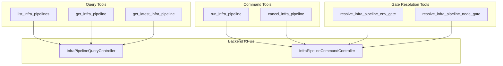
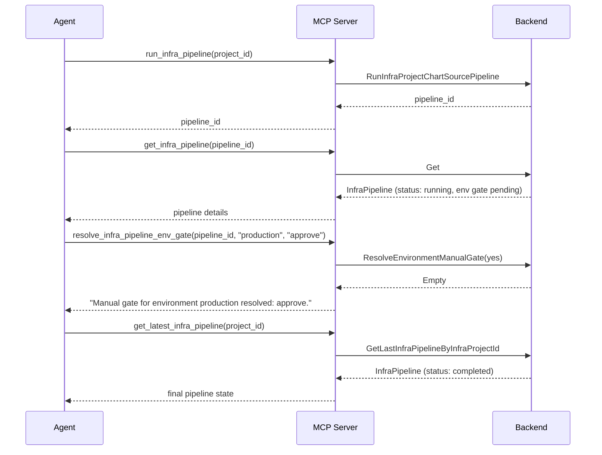

# Phase 1C: InfraPipeline MCP Tools — Pipeline Observability, Execution Control & Gate Resolution

**Date**: February 28, 2026

## Summary

Added 7 MCP tools for InfraPipeline observability and control, expanding the server from 27 to 34 tools. This completes the Phase 1 trifecta (Chart + Project + Pipeline), giving AI agents full composition-to-deployment workflow control — from browsing charts, to creating projects, to running and monitoring pipelines, to approving manual deployment gates.

## Problem Statement

After Phases 1A and 1B, agents could discover infra charts, compose projects, and trigger deployments — but had zero visibility into what happened after a deployment was triggered. The pipeline was a black box: no way to list pipeline runs, check status, monitor progress, cancel stuck pipelines, or approve manual gates.

### Pain Points

- Agents trigger `apply_infra_project` but cannot check if the resulting pipeline succeeded or failed
- No way to list historical pipeline runs for a project (debugging deployment failures)
- Git-sourced projects have no way to deploy specific commits
- Production deployment workflows with manual approval gates become dead ends — the agent pauses at a gate with no way to resolve it
- No way to cancel a stuck or erroneous pipeline run

## Solution

Seven new tools in a new `internal/domains/infrahub/infrapipeline/` package covering the full pipeline lifecycle:

### Architecture

### Typical Agent Workflow

## Implementation Details

### Tool Inventory (7 tools)

| Tool | RPC | Purpose |
|------|-----|---------|
| `list_infra_pipelines` | `QueryController.ListByFilters` | Paginated listing by org + optional project |
| `get_infra_pipeline` | `QueryController.Get` | Full pipeline by ID |
| `get_latest_infra_pipeline` | `QueryController.GetLastInfraPipelineByInfraProjectId` | Most recent for a project |
| `run_infra_pipeline` | `CommandController.RunInfraProjectChartSourcePipeline` / `RunGitCommit` | Unified trigger |
| `cancel_infra_pipeline` | `CommandController.Cancel` | Stop a running pipeline |
| `resolve_infra_pipeline_env_gate` | `CommandController.ResolveEnvironmentManualGate` | Approve/reject env gate |
| `resolve_infra_pipeline_node_gate` | `CommandController.ResolveNodeManualGate` | Approve/reject node gate |

### Key Design Decisions

**Unified run tool**: The proto exposes two separate RPCs — `RunInfraProjectChartSourcePipeline` (chart-sourced) and `RunGitCommit` (git-sourced). Rather than exposing two confusing tools, we created a single `run_infra_pipeline` that accepts an optional `commit_sha`. Presence of `commit_sha` routes to the git-commit RPC; absence routes to the chart-source RPC. The agent doesn't need to know about project source types.

**Manual gate tools (2 additions beyond original plan)**: The original plan had 5 tools. During proto exploration, we discovered `ResolveEnvironmentManualGate` and `ResolveNodeManualGate` RPCs. Without these, agents would hit dead ends when pipelines pause at manual approval gates — a critical production workflow pattern. Added both, expanding to 7 tools.

**User-friendly gate decisions**: The proto enum uses `"yes"` / `"no"` for gate decisions, which is poor UX for an agent. The tools accept `"approve"` / `"reject"` and translate internally via a `resolveDecision()` helper.

**Streaming RPCs excluded**: `GetStatusStream` and `GetLogStream` are server-streaming RPCs incompatible with MCP's request-response model. The `get_infra_pipeline` snapshot covers the status-check use case adequately.

**Pipeline CRUD excluded**: The CommandController also exposes Apply/Create/Update/Delete, but these are internal platform operations. Agents run and cancel pipelines; they don't create pipeline records manually.

### Files Created (7)

All under `internal/domains/infrahub/infrapipeline/`:

- `tools.go` — 7 input structs, 7 tool definitions (`*mcp.Tool`), 7 typed handlers
- `list.go` — `List()` with org + optional project ID + 0-based pagination
- `get.go` — `Get()` by pipeline ID
- `latest.go` — `GetLatest()` by infra project ID
- `run.go` — `Run()` with unified dispatch (chart-source or git-commit)
- `cancel.go` — `Cancel()` by pipeline ID
- `gate.go` — `ResolveEnvGate()`, `ResolveNodeGate()`, `resolveDecision()` enum helper

### Files Modified (2)

- `internal/server/server.go` — Added import, 7 `mcp.AddTool` calls, count 27 → 34
- `internal/domains/infrahub/doc.go` — Added `infrapipeline` to subpackage list

## Benefits

- **Full deployment lifecycle visibility**: Agents can now trace work from chart selection through project creation to pipeline execution and completion
- **Production workflow support**: Manual gate resolution means agents can participate in production deployment approval workflows
- **Both source types supported**: Chart-sourced and git-repo-sourced projects both have first-class pipeline trigger support
- **Consistent patterns**: All 7 tools follow the same established conventions (WithConnection, RPCError, MarshalJSON, TextResult)

## Impact

- **Server tool count**: 27 → 34 (26% increase)
- **Phase 1 complete**: The Chart + Project + Pipeline trifecta gives agents full InfraHub composition and deployment control
- **New domain package**: `internal/domains/infrahub/infrapipeline/` (7 files)
- **Zero regressions**: `go build`, `go vet`, `go test` all pass clean

## Related Work

- [Phase 0: Gen Directory Restructure](2026-02-27-225144-phase0-gen-directory-restructure.md) — Prerequisite path reorganization
- [Phase 1A: InfraChart MCP Tools](2026-02-27-234203-phase1a-infrachart-mcp-tools.md) — Chart discovery and rendering (3 tools)
- [Phase 1B: InfraProject Lifecycle Tools](2026-02-28-000603-infraproject-lifecycle-tools.md) — Project management (6 tools)
- Next: Phase 2A — Graph / Dependency Intelligence (4 tools)

---

**Status**: ✅ Production Ready
**Timeline**: Single session
