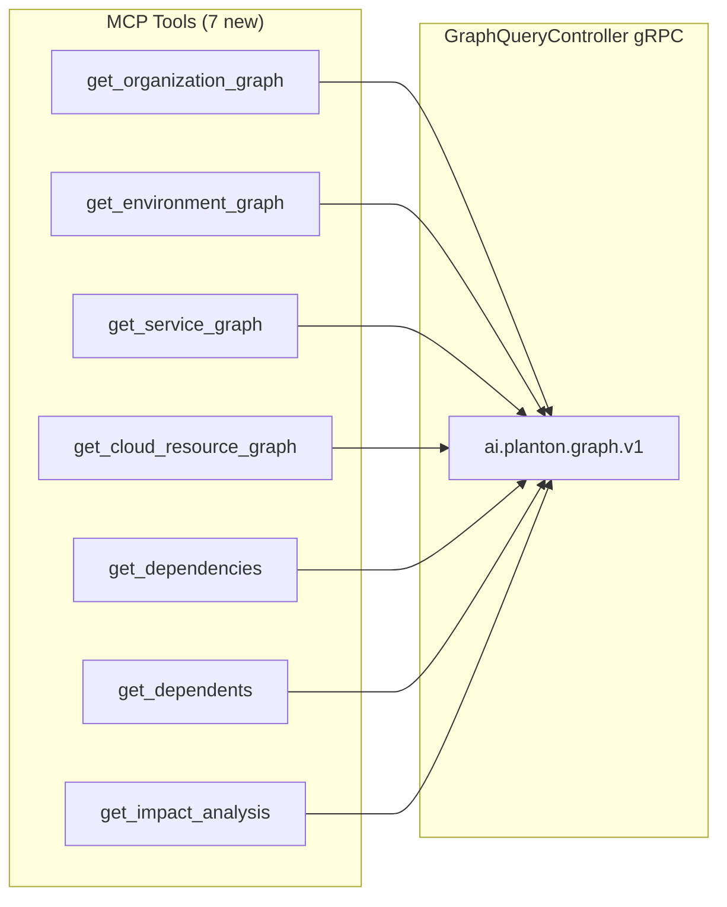

# Phase 2A: Graph / Dependency Intelligence Tools

**Date**: February 28, 2026

## Summary

Added 7 MCP tools for dependency intelligence and impact analysis, expanding the server from 34 to 41 tools. This is the first domain outside the `infrahub` bounded context, establishing `internal/domains/graph/` as a new top-level domain backed by the `ai.planton.graph.v1.GraphQueryController` gRPC service. Agents can now query full organization topologies, environment-scoped resource views, upstream/downstream dependencies, and pre-deletion impact analysis.

## Problem Statement

The MCP server had 34 tools covering resource lifecycle (CRUD), pipeline operations, and chart management — but no visibility into **how resources relate to each other**. AI agents could create and manage individual resources but couldn't answer fundamental questions like:

### Pain Points

- "Show me everything deployed in production" — no environment-scoped view
- "What does this EKS cluster depend on?" — no dependency traversal
- "If I delete this VPC, what breaks?" — no impact analysis
- "What is the overall infrastructure topology?" — no org-wide graph
- "What services run on this cloud resource?" — no reverse relationship queries

Without dependency intelligence, agents were operating blind — managing resources in isolation without understanding the broader infrastructure graph.

## Solution

Exposed all 7 read-only RPCs from the `GraphQueryController` as MCP tools, organized into three categories:

### Architecture



### Tool Categories

**Topology Views (4 tools)** — Scope-based graph queries

| Tool | Purpose |
|------|---------|
| `get_organization_graph` | Full resource topology for an org — the big-picture view |
| `get_environment_graph` | Everything deployed in a specific environment |
| `get_service_graph` | Service-centric view with per-env deployments |
| `get_cloud_resource_graph` | Resource-centric view with services, credentials, neighbors |

**Dependency Queries (2 tools)** — Directional relationship traversal

| Tool | Purpose |
|------|---------|
| `get_dependencies` | Upstream — "What does this resource depend on?" |
| `get_dependents` | Downstream — "What depends on this resource?" |

**Analysis (1 tool)** — Computed insights

| Tool | Purpose |
|------|---------|
| `get_impact_analysis` | "If I change/delete this, what breaks?" with counts by type |

## Implementation Details

### Bounded Context Decision

The Graph domain (`ai.planton.graph.v1`) is architecturally distinct from InfraHub (`ai.planton.infrahub`). Rather than nesting it under `internal/domains/infrahub/graph/`, it gets its own top-level directory:

```
internal/domains/
├── infrahub/           (existing — 32 tools)
├── resourcemanager/    (existing — 2 tools)
└── graph/              (NEW — 7 tools)
```

This validates the domain structure's scalability and keeps bounded context boundaries clean.

### Enum Handling

Three enum resolvers in `enum.go` following the established `stackjob/enum.go` pattern:

- **`resolveNodeTypes`**: Maps strings like `"cloud_resource"`, `"credential"` to `GraphNode_Type` enum
- **`resolveRelationshipTypes`**: Maps strings like `"depends_on"`, `"uses_credential"` to `GraphRelationship_Type` enum
- **`resolveChangeType`**: Maps `"delete"` / `"update"` to `GetImpactAnalysisInput_ChangeType` enum

All produce user-friendly error messages listing valid values on mismatch.

### Shared DependencyInput

`get_dependencies` and `get_dependents` share a `DependencyInput` struct since they have identical parameter shapes (resource_id, max_depth, relationship_types) and the same response type (`DependencyListResponse`). Two functions, one input type — DRY without being clever.

### Scope Expansion (4 → 7 tools)

During proto analysis, 3 additional RPCs were discovered beyond the original plan:

| RPC | Why included |
|-----|-------------|
| `getEnvironmentGraph` | "Show me everything in staging" is the most common agent workflow |
| `getDependents` | Asymmetric without it — can ask "what do I depend on" but not "what depends on me" |
| `getServiceGraph` | Service IDs appear in org graph nodes; enables drill-down |

Each tool is ~25 lines of Go (thin RPC wrapper), all read-only — minimal marginal cost, high functional value.

### Files Created

```
internal/domains/graph/
├── doc.go              — Package documentation
├── enum.go             — 3 enum resolvers + joinEnumValues helper
├── tools.go            — 7 input structs, 7 tool definitions, 7 handlers
├── organization.go     — GetOrganizationGraph RPC wrapper
├── environment.go      — GetEnvironmentGraph RPC wrapper
├── service.go          — GetServiceGraph RPC wrapper
├── cloudresource.go    — GetCloudResourceGraph RPC wrapper
├── dependency.go       — GetDependencies + GetDependents RPC wrappers
└── impact.go           — GetImpactAnalysis RPC wrapper
```

### Files Modified

- `internal/server/server.go` — Added graph import, 7 tool registrations, updated count 34 → 41

## Benefits

- **Infrastructure visibility**: Agents can now see the full picture before making changes
- **Safety net for destructive operations**: `get_impact_analysis` shows blast radius before delete/destroy
- **Environment scoping**: `get_environment_graph` answers "what's in production?" instantly
- **Bidirectional dependency traversal**: Both "what do I depend on?" and "what depends on me?"
- **Deployment ordering**: Topological sort in org/env graphs reveals correct deployment sequence
- **Zero new dependencies**: Graph proto stubs already present in the existing planton module

## Impact

- **Server tool count**: 34 → 41 (21% increase)
- **New bounded context**: First domain outside `infrahub/`, proving the architecture scales
- **Agent capabilities**: Transforms agents from "resource managers" into "infrastructure analysts"
- **All verification passes**: `go build` ✅ | `go vet` ✅ | `go test` ✅

## Related Work

- Phase 0: Gen code restructure (`refactor(codegen)`) — domain directory foundation
- Phase 1A: InfraChart tools (18 → 21)
- Phase 1B: InfraProject tools (21 → 27)
- Phase 1C: InfraPipeline tools (27 → 34)
- **This phase**: Phase 2A Graph tools (34 → 41)
- Next: Phase 2B ConfigManager (variables & secrets) or Phase 3 (audit, stackjob commands, catalog)

---

**Status**: ✅ Production Ready
**Timeline**: Single session
