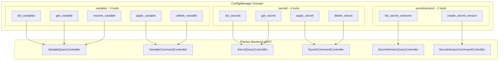
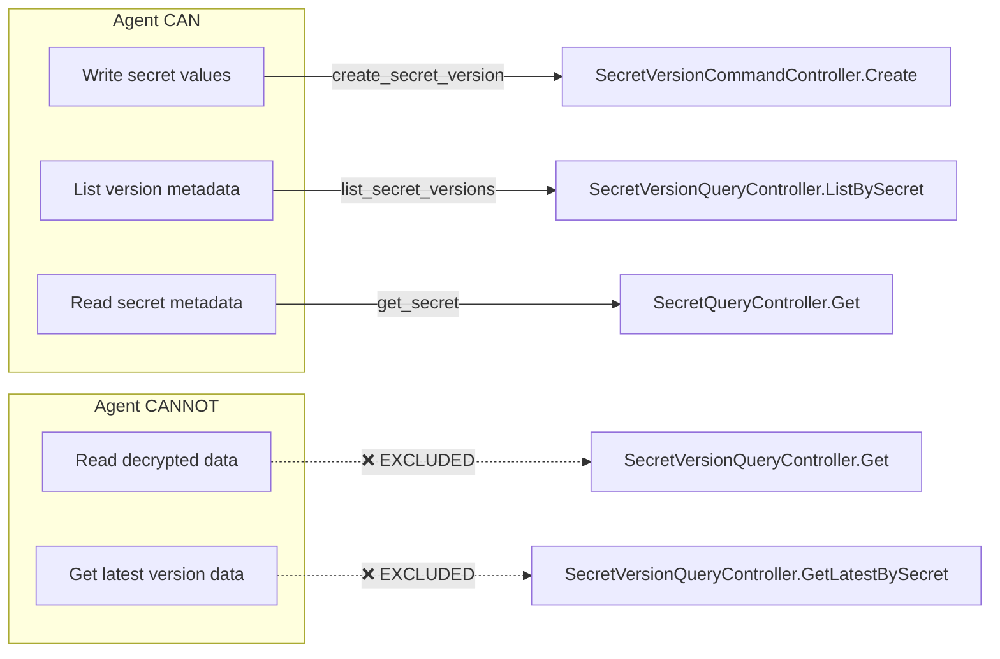

# Phase 2B: ConfigManager — Variables & Secrets MCP Tools

**Date**: February 28, 2026

## Summary

Added 11 MCP tools for configuration lifecycle management (variables, secrets, and secret versions) to the Planton MCP server, expanding from 41 to 52 tools. This is the second domain outside the infrahub bounded context, completing the Phase 2 pair (Graph + ConfigManager). The implementation includes a deliberate security boundary: agents can write secret values but cannot read decrypted data back.

## Problem Statement

The MCP server had no configuration management surface. Agents could deploy cloud resources and manage pipelines but could not:
- Discover or manage plaintext configuration variables
- Create or inspect secret metadata
- Store new secret values for use by deployed resources

Configuration management is a prerequisite for autonomous infrastructure workflows — agents need to set database passwords, API keys, and environment-specific config values as part of deployment pipelines.

### Pain Points

- Agents had to ask users to manually set variables and secrets through the UI
- No programmatic way to inspect what configuration exists in an organization
- Secret metadata (names, scopes, descriptions) was invisible to agent tooling
- No way to create new secret versions as part of automated deployment flows

## Solution

Three new sub-packages under `internal/domains/configmanager/` exposing 11 tools across the variable, secret, and secret version domains. The implementation follows established codebase patterns while introducing a novel three-field identification scheme (org + scope + slug) that reflects how ConfigManager resources are uniquely keyed.

### Architecture



### Security Boundary



This follows the same principle as AD-01 (credential exclusion) — reading secrets is a human trust boundary. Agents can create secrets as part of automation workflows but cannot exfiltrate existing values.

## Implementation Details

### Scope-Aware Identification (New Pattern)

Unlike InfraProject's simpler `(org, slug)` uniqueness, variables and secrets are unique within `(org, scope, slug)`. The `scope` is an enum: `organization` (shared across all environments) or `environment` (scoped to a specific env). This required a three-field identification scheme in the tool input:

```
Identify by ID alone:        { "id": "abc123" }
Identify by org+scope+slug:  { "org": "acme", "scope": "environment", "slug": "db-password" }
```

The `validateIdentification` function enforces that exactly one path is provided and gives specific error messages when fields are missing.

### Explicit Parameters for Apply (Design Decision DD-3)

Unlike `apply_cloud_resource` (JSON passthrough for 362+ resource kinds) or `apply_infra_project` (JSON passthrough for polymorphic sources), the Variable and Secret apply tools use explicit parameters:

```
apply_variable: name, org, scope, env, description, value
apply_secret:   name, org, scope, env, description, backend
```

This was chosen because the schemas are simple, stable, and well-known — explicit params provide better agent UX, validation, and discoverability compared to requiring agents to construct full proto JSON structures.

### Tool Count Expansion

The original plan specified 5 tools. Proto analysis during planning revealed 6 gRPC services with ~20 RPCs. After careful evaluation of agent workflows, 11 tools were selected to cover the complete lifecycle:

| Sub-domain | Planned | Delivered | Reason |
|------------|---------|-----------|--------|
| Variable | 2 | 5 | Added get, delete, resolve for complete lifecycle |
| Secret | 2 | 4 | Added list, delete for discovery and cleanup |
| SecretVersion | 1 | 2 | Added list for version history audit |

### Package Structure

```
internal/domains/configmanager/
├── doc.go                          17 new files created
├── variable/
│   ├── tools.go                    5 input structs, 5 tool defs, 5 handlers
│   ├── enum.go                     resolveScope for VariableSpec_Scope
│   ├── list.go                     Find RPC with ApiResourceKind_variable (130)
│   ├── get.go                      Get + GetByOrgByScopeBySlug + resolve helpers
│   ├── apply.go                    Explicit param → proto construction
│   ├── delete.go                   Resolve ID then Delete
│   └── resolve.go                  Plain string value lookup
├── secret/
│   ├── tools.go                    4 input structs, 4 tool defs, 4 handlers
│   ├── enum.go                     resolveScope for SecretSpec_Scope
│   ├── list.go                     Find RPC with ApiResourceKind_secret (38)
│   ├── get.go                      Get + GetByOrgByScopeBySlug + resolve helpers
│   ├── apply.go                    Explicit param → proto construction
│   └── delete.go                   Destructive: removes secret + all versions
└── secretversion/
    ├── tools.go                    2 input structs, 2 tool defs, 2 handlers
    ├── create.go                   Envelope encryption write
    └── list.go                     Metadata-only version listing
```

## Benefits

- **Complete configuration lifecycle**: Agents can now discover, create, update, and delete variables and secrets without human intervention
- **Security by design**: Write-only secret values prevent data exfiltration through the MCP surface
- **Agent-friendly apply**: Explicit parameters eliminate the need for agents to construct complex proto JSON
- **Scope-aware identification**: Three-field slug path correctly models the domain's uniqueness constraints
- **Consistent patterns**: All tools follow the established `WithConnection` → RPC → `MarshalJSON` → `TextResult` pattern

## Impact

- **Server tool count**: 41 → 52 (26% increase)
- **New files**: 17 created, 1 modified
- **New bounded context**: `internal/domains/configmanager/` (third top-level domain after `infrahub/` and `graph/`)
- **Agent capabilities**: Agents can now manage the full configuration surface alongside infrastructure deployment

## Related Work

- Phase 2A: Graph / Dependency Intelligence (2026-02-28) — first non-infrahub bounded context
- AD-01: Exclude credential management — same security boundary principle applied to secret version reads
- Phase 1B: InfraProject tools — dual identification pattern adapted with scope dimension

---

**Status**: ✅ Production Ready
**Timeline**: Single session
