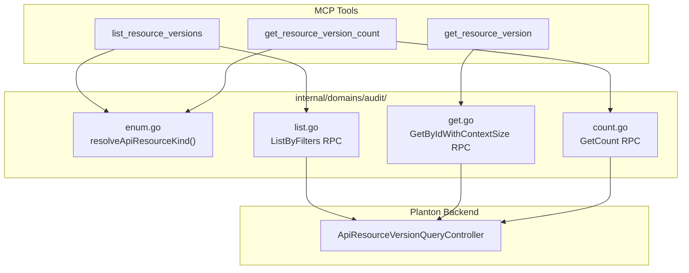
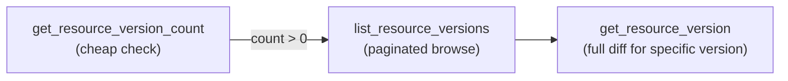

# Phase 3A: Audit / Version History MCP Tools

**Date**: February 28, 2026

## Summary

Added 3 MCP tools for resource version history and change tracking under a new `internal/domains/audit/` bounded context, expanding the server from 52 to 55 tools. This is the third domain outside the infrahub bounded context and the first cross-resource-type domain — it queries version history across all platform resource types using a dynamic `ApiResourceKind` enum resolver.

## Problem Statement

The MCP server had no way for AI agents to answer "what changed?" questions. When investigating deployment issues, debugging configuration drift, or auditing resource modifications, agents had to work blind — they could see current state but not how it got there.

### Pain Points

- No visibility into resource change history from the MCP tool surface
- Agents couldn't determine what was modified, when, or by whom
- No diff capability to compare resource states across versions
- No lightweight way to check if a resource has been modified at all

## Solution

Three read-only query tools backed by the `ApiResourceVersionQueryController` gRPC service, organized as a new bounded context that operates across all platform resource types.

### Architecture



### What Makes Audit Different

Unlike every prior domain package (infrachart, variable, secret, etc.) that hard-codes its own `ApiResourceKind`, audit is the first **cross-resource-type domain**. It accepts the kind from the caller because it's a cross-cutting concern that queries version history for any resource type:

```
cloud_resource, infra_project, infra_chart, infra_pipeline,
variable, secret, environment, organization, service, stack_job, ...
```

This required a dynamic `resolveApiResourceKind()` enum resolver — a new pattern for the codebase.

## Implementation Details

### Tools Delivered

| Tool | RPC | Parameters | Purpose |
|------|-----|------------|---------|
| `list_resource_versions` | `ListByFilters` | `resource_id` (required), `kind` (required), `page_num`, `page_size` | Paginated change history for a specific resource |
| `get_resource_version` | `GetByIdWithContextSize` | `version_id` (required), `context_size` (default 3) | Full version with YAML states, unified diff, event type |
| `get_resource_version_count` | `GetCount` | `resource_id` (required), `kind` (required) | Lightweight count — "has anything changed?" |

### Key Design Decisions

1. **Merged `Get` + `GetByIdWithContextSize` into single tool** — The `GetByIdWithContextSize` RPC is strictly more useful than plain `Get` (adds configurable diff context). Exposing both would confuse agents with no benefit.

2. **Default `context_size` to 3** — Matches the standard unified diff convention (`git diff -U3`). Agents can request more context when needed.

3. **Both `resource_id` and `kind` required for list/count** — The backend needs both to scope the query. We don't try to infer kind from the ID.

4. **`joinEnumValues` duplicated locally** — The helper is already duplicated across `stackjob/enum.go`, `graph/enum.go`, `variable/enum.go`, and `secret/enum.go`. Adding another copy follows the existing pattern (Option A from the plan). Cleanup refactor deferred to avoid touching unrelated packages.

### File Structure

```
internal/domains/audit/
├── doc.go        Package documentation
├── enum.go       resolveApiResourceKind() — dynamic cross-type enum resolver
├── tools.go      3 input structs, 3 tool defs, 3 typed handlers
├── list.go       ListByFilters RPC with 1-based-to-0-based pagination
├── get.go        GetByIdWithContextSize RPC with default context_size=3
└── count.go      GetCount RPC — lightweight version count
```

### Proto Surface

- **Service**: `ai.planton.audit.apiresourceversion.v1.ApiResourceVersionQueryController`
- **RPCs used**: 3 of 4 (plain `Get` excluded — superseded by `GetByIdWithContextSize`)
- **Response types**: `ApiResourceVersionList`, `ApiResourceVersion`, `ApiResourceVersionCount`

### Typical Agent Workflow



## Benefits

- **Change visibility**: Agents can now answer "what changed on this resource?" with full diff context
- **Lightweight auditing**: Count tool provides instant "has anything changed?" without data transfer
- **Configurable diff context**: Agents can request more or fewer context lines depending on the use case
- **Universal coverage**: Works across all platform resource types — not limited to a single domain

## Impact

- Server expanded from 52 to 55 registered MCP tools
- New bounded context: `internal/domains/audit/` (third domain outside infrahub)
- New pattern: dynamic `ApiResourceKind` enum resolver for cross-resource-type tools
- All tools are read-only — no write operations, no destructive capabilities

## Related Work

- **Phase 0–2B**: Prior phases that built up to 52 tools across infrahub, graph, and configmanager domains
- **AD-01**: Credential exclusion decision — audit respects the same security boundaries (versions don't expose credential secrets)
- **Phase 3B (next)**: StackJob commands (rerun, cancel, essentials check) — operational control for failed deployments

---

**Status**: ✅ Production Ready
**Verification**: `go build ./...` ✅ | `go vet ./...` ✅ | `go test ./...` ✅
