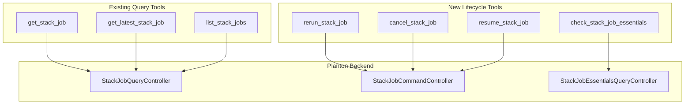
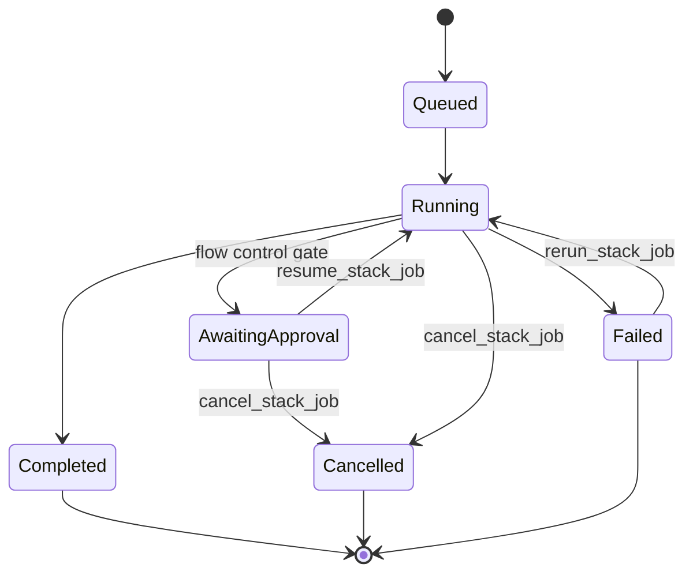

# Phase 3B: StackJob Lifecycle Control MCP Tools

**Date**: February 28, 2026

## Summary

Added 4 MCP tools for stack job lifecycle control (`rerun_stack_job`, `cancel_stack_job`, `resume_stack_job`, `check_stack_job_essentials`), expanding the server from 55 to 59 tools. This completes the operational control surface for stack jobs — agents can now observe existing jobs (Phase 6B), retry failures, cancel stuck runs, approve blocked jobs, and pre-validate deployment prerequisites before attempting provisioning.

## Problem Statement

The MCP server had 3 read-only stack job tools (`get_stack_job`, `get_latest_stack_job`, `list_stack_jobs`) that gave agents visibility into deployment status but no ability to act on what they observed. This created dead ends in common operational workflows.

### Pain Points

- Failed deployments required manual intervention — agents could see failures but not retry them
- Stuck or runaway stack jobs couldn't be stopped by agents
- Stack jobs awaiting approval (flow control policy gates) blocked indefinitely with no agent path to unblock
- Agents couldn't pre-validate whether prerequisites (IaC modules, credentials, policies) were in place before triggering deployments, leading to avoidable failures

## Solution

Four tools backed by two gRPC services — `StackJobCommandController` for write operations and `StackJobEssentialsQueryController` for preflight validation — extending the existing `internal/domains/infrahub/stackjob/` package from query-only to full lifecycle control.

### Architecture



### Agent Approval Surface

The `resume` tool was discovered during proto analysis (not in the original plan). Combined with `cancel`, it gives agents a complete approval surface for stack jobs blocked by flow control policies:



## Implementation Details

### Tools Delivered

| Tool | RPC Service | RPC Method | Parameters | Purpose |
|------|-------------|------------|------------|---------|
| `rerun_stack_job` | CommandController | `Rerun` | `id` (required) | Retry a failed deployment |
| `cancel_stack_job` | CommandController | `Cancel` | `id` (required) | Gracefully cancel a running job |
| `resume_stack_job` | CommandController | `Resume` | `id` (required) | Approve and resume an awaiting-approval job |
| `check_stack_job_essentials` | EssentialsQueryController | `Check` | `cloud_resource_kind` (required), `org` (required), `env` (optional) | Pre-validate all 4 deployment prerequisites |

### Cancellation Semantics

The `cancel_stack_job` tool description captures the graceful cancellation behavior documented in the proto:

- Cancellation is signal-based (Temporal signals), not immediate workflow termination
- The currently executing IaC operation (e.g., `pulumi up`) completes fully
- Remaining operations are skipped and marked as cancelled
- Infrastructure created by completed operations remains (no automatic rollback)
- The resource lock is released, allowing queued stack jobs to proceed

### Essentials Preflight Check

The `check_stack_job_essentials` tool validates 4 prerequisites before a stack job can run:

1. **iac_module** — Is an IaC module resolved for this resource kind?
2. **backend_credential** — Is a state backend (Pulumi/Terraform) configured?
3. **flow_control** — Is a flow control policy resolved?
4. **provider_credential** — Are cloud provider credentials available?

Each check returns a `passed` boolean and an `errors` list. This uses the existing `domains.ResolveKind()` helper for PascalCase kind resolution.

### Key Design Decisions

1. **Added `resume_stack_job`** (not in original plan) — The `resume` RPC was discovered during proto analysis. Without it, agents hit dead ends at approval gates — the same argument that justified adding `resolve_infra_pipeline_env_gate` and `resolve_infra_pipeline_node_gate` in Phase 1C.

2. **Expanded from planned 3 to 4 tools** — The `resume` addition is the right call for operational completeness.

3. **Deferred `which*` RPCs** — The essentials controller has 5 granular lookup RPCs (`whichIacRunner`, `whichIacModule`, `whichBackendCredential`, `whichFlowControlPolicy`, `whichProviderCredential`). The combined `check` RPC covers the preflight surface. Granular lookups can be added later if agents need to debug specific failures.

4. **`pipelineCancel` excluded** — Internal RPC for pipeline-to-stackjob cancellation chain. Not an agent-facing operation.

### File Structure

```
internal/domains/infrahub/stackjob/
├── tools.go       7 tools (3 existing + 4 new): input structs, tool defs, handlers
├── get.go         Get RPC (existing)
├── latest.go      GetLatest RPC (existing)
├── list.go        ListByFilters RPC (existing)
├── rerun.go       Rerun RPC (new) — StackJobCommandController
├── cancel.go      Cancel RPC (new) — StackJobCommandController
├── resume.go      Resume RPC (new) — StackJobCommandController
├── essentials.go  Check RPC (new) — StackJobEssentialsQueryController
├── enum.go        Enum resolvers (existing)
└── enum_test.go   Enum tests (existing)
```

## Benefits

- **Failure recovery**: Agents can retry failed deployments without manual intervention
- **Operational safety**: Graceful cancellation prevents infrastructure damage from abrupt stops
- **Approval workflow**: Complete approve/reject surface for flow control gates
- **Preflight validation**: Catch missing configuration before triggering deployments
- **Closed operational loop**: Agents can now observe, diagnose, and act on stack job issues end-to-end

## Impact

- Server expanded from 55 to 59 registered MCP tools
- Stackjob domain expanded from query-only (3 tools) to full lifecycle control (7 tools)
- Two new gRPC service clients: `StackJobCommandControllerClient`, `StackJobEssentialsQueryControllerClient`
- Package doc updated to reflect expanded scope

## Related Work

- **Phase 6B** (earlier): Added the 3 original query-only stack job tools (get, list, latest)
- **Phase 1C**: InfraPipeline gate tools — same "approval dead-end" argument motivated `resume_stack_job`
- **AD-01**: Credential exclusion — `check_stack_job_essentials` surfaces credential issues without exposing secrets
- **Phase 3C (next)**: Deployment Component & IaC Module Catalog — last phase in the master plan

---

**Status**: ✅ Production Ready
**Verification**: `go build ./...` ✅ | `go vet ./...` ✅ | `go test ./...` ✅
