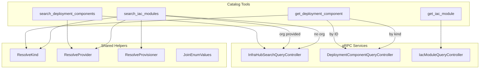

# Phase 3C: Deployment Component & IaC Module Catalog Tools

**Date**: February 28, 2026

## Summary

Added 4 MCP tools for deployment component and IaC module catalog discovery, expanding the server from 59 to 63 tools. This phase also reduced tech debt by lifting the `joinEnumValues` helper and adding shared provider/provisioner enum resolvers. This is the **final phase** of the InfraHub MCP Tools Expansion project, completing the journey from 18 to 63 tools across 10 phases.

## Problem Statement

The MCP server had no way for AI agents to discover what types of cloud resources the platform supports or which IaC modules can provision them. Agents could create and manage cloud resources, but had no catalog browsing capability to answer "what can I deploy?" or "which Terraform/Pulumi modules are available for EKS clusters?"

### Pain Points

- Agents had no discoverability path from "I want to deploy X" to finding the right IaC module
- The `cloud-resource-kinds://catalog` resource listed kinds but couldn't link to provisioning modules
- Organization-specific modules were invisible to agents without org-context search
- The `joinEnumValues` helper was duplicated identically in 3 packages (audit, graph, stackjob)

## Solution

Two new domain packages under `internal/domains/infrahub/` expose the full catalog surface through 4 tools, backed by 3 gRPC services and 5 RPCs. Shared enum helpers were consolidated in the `internal/domains/` package to eliminate duplication.

### Architecture

### Agent Discovery Flow

## Implementation Details

### Deployment Component Package (`internal/domains/infrahub/deploymentcomponent/`)

| File | Purpose |
|---|---|
| `tools.go` | 2 input structs, 2 tool definitions, 2 typed handlers |
| `search.go` | `SearchDeploymentComponentsByFilter` RPC (public, optional provider filter) |
| `get.go` | Dual identification: `Get` by ID or `GetByCloudResourceKind` by kind string |

The `get_deployment_component` tool was **not in the original plan** — proto analysis revealed that `DeploymentComponentQueryController` exists with a `GetByCloudResourceKind` RPC. Since agents already know kind strings from the `cloud-resource-kinds://catalog` resource, this enables direct lookup without search.

### IaC Module Package (`internal/domains/infrahub/iacmodule/`)

| File | Purpose |
|---|---|
| `tools.go` | 2 input structs, 2 tool definitions, 2 typed handlers |
| `search.go` | Dual-RPC dispatch: org-context or official, with kind/provisioner/provider filters |
| `get.go` | `IacModuleQueryController.Get` by ID |

The search tool follows the **exact same pattern** as `preset/search.go`: when `org` is provided, `SearchIacModulesByOrgContext` is called (including both official and org modules); when `org` is absent, `SearchOfficialIacModules` is called.

The `FindDeploymentComponentIacModulesByOrgContext` RPC was intentionally NOT exposed as a separate tool — `search_iac_modules` with the `kind` filter achieves the same result with richer filtering.

### Shared Enum Helper Consolidation (`internal/domains/`)

| File | Purpose |
|---|---|
| `enum.go` | Exported `JoinEnumValues` — lifted from 3 identical local copies |
| `provider.go` | `ResolveProvider` (CloudResourceProvider) + `ResolveProvisioner` (IacProvisioner) |

Three existing packages (`audit/enum.go`, `graph/enum.go`, `stackjob/enum.go`) were updated to use the shared `domains.JoinEnumValues`, eliminating all duplicates.

## Benefits

- **Complete catalog surface**: Agents can now discover deployment components and IaC modules
- **Natural discovery flow**: search components → get details → find modules → get module → deploy
- **Dual-identification convenience**: `get_deployment_component` by ID (from search results) or by kind string (from catalog resource)
- **Organization-aware module search**: Official + org-specific modules in one call
- **Tech debt reduced**: `joinEnumValues` consolidated from 3 duplicates to 1 shared helper
- **Reusable enum resolvers**: `ResolveProvider` and `ResolveProvisioner` available to all future domains

## Impact

### Project Completion

This is the **final phase** of the InfraHub MCP Tools Expansion project:

| Phase | Tools Added | Running Total |
|---|---|---|
| Phase 0 (gen restructure) | 0 | 18 |
| Phase 1A (InfraChart) | 3 | 21 |
| Phase 1B (InfraProject) | 6 | 27 |
| Phase 1C (InfraPipeline) | 7 | 34 |
| Phase 2A (Graph) | 7 | 41 |
| Phase 2B (ConfigManager) | 11 | 52 |
| Phase 3A (Audit) | 3 | 55 |
| Phase 3B (StackJob Commands) | 4 | 59 |
| **Phase 3C (Catalog)** | **4** | **63** |
| **Total** | **45 new tools** | **63 tools** |

### Domain Coverage

The MCP server now covers the full Planton Cloud product surface:

- **Infrastructure composition**: charts, projects, pipelines
- **Cloud resource lifecycle**: CRUD, locks, references, env vars
- **Operational control**: stack job observe/retry/cancel/resume/approve
- **Dependency intelligence**: graphs, impact analysis
- **Configuration management**: variables, secrets, versions
- **Audit trail**: version history, diffs
- **Catalog discovery**: deployment components, IaC modules

## Related Work

- [Phase 3B: StackJob Lifecycle Control Tools](2026-02-28-025711-phase3b-stackjob-lifecycle-control-tools.md) — preceding phase
- [Phase 3A: Audit Version History Tools](2026-02-28-023544-phase3a-audit-version-history-tools.md) — preceding phase
- [Phase 0: Gen Directory Restructure](2026-02-27-225144-phase0-gen-directory-restructure.md) — foundational phase

---

**Status**: ✅ Production Ready
**Timeline**: ~30 minutes (Phase 3C), ~2 days (full project, 10 phases)
