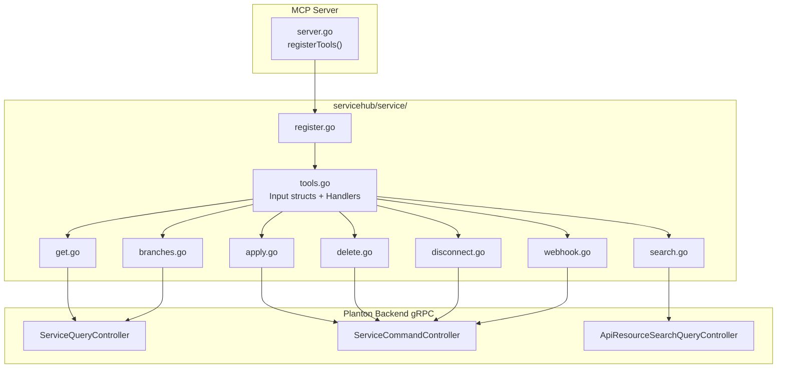

# ServiceHub Service MCP Tools — Tier 1

**Date**: February 28, 2026

## Summary

Added 7 MCP tools for the ServiceHub Service entity, enabling AI agents to search, retrieve, create/update, delete, and manage Git webhooks and branches for services. This is the first ServiceHub bounded context exposed to the MCP server, establishing the foundation for the remaining 28 tools across 6 additional entities (Pipeline, VariablesGroup, SecretsGroup, DnsDomain, TektonPipeline, TektonTask).

## Problem Statement

The MCP server previously only exposed InfraHub domain tools (cloud resources, infra projects, stack jobs, etc.) and ResourceManager tools (organizations, environments). ServiceHub — the CI/CD pipeline and service management domain — had no MCP tools at all. AI agents could not interact with services, pipelines, or deployment configurations.

### Pain Points

- AI agents had no way to discover or inspect services within an organization
- No declarative create-or-update (`apply`) path for services via MCP
- Webhook management (disconnect/reconnect) required manual API calls
- Branch listing for pipeline configuration was unavailable to AI workflows

## Solution

Implemented a new `internal/domains/servicehub/service/` package with 7 MCP tools following the established infrahub patterns exactly. The package is self-contained, uses the same domain utilities (`domains.WithConnection`, `domains.MarshalJSON`, `domains.RPCError`), and is wired into the server via a single `Register` call.

### Architecture



## Implementation Details

### Tool Catalogue

| Tool | RPC | Purpose |
|------|-----|---------|
| `search_services` | `ApiResourceSearchQueryController.SearchByKind` | Free-text search within org |
| `get_service` | `ServiceQueryController.Get` / `GetByOrgBySlug` | Full details by ID or org+slug |
| `apply_service` | `ServiceCommandController.Apply` | Idempotent create-or-update |
| `delete_service` | `ServiceCommandController.Delete` | Remove record (not deployed resources) |
| `disconnect_service_git_repo` | `ServiceCommandController.DisconnectGitRepo` | Remove webhook |
| `configure_service_webhook` | `ServiceCommandController.ConfigureWebhook` | Create/refresh webhook |
| `list_service_branches` | `ServiceQueryController.ListBranches` | List Git branches |

### New Pattern: Generic Search

No dedicated `searchServices` RPC exists in the `ServiceHubSearchQueryController`. We used the generic `ApiResourceSearchQueryController.SearchByKind` with `api_resource_kind = service` (enum value 16). This is the first MCP tool to use this generic search endpoint — all existing infrahub tools use domain-specific search RPCs.

### Thin Client Pattern for Apply

The `apply_service` handler follows the same thin-client pattern as `apply_infra_project`: marshal the raw JSON map to bytes, unmarshal into the typed proto via `protojson.Unmarshal`, and send to the backend. No client-side validation of `cloud_object` in `deployment_targets` — the backend handles business-rule validation. This avoids coupling the servicehub package to infrahub/cloudresource.

### Resolve Pattern

The `get.go` file establishes the resolve pattern used by 5 of the 7 tools:
- `resolveService()` — returns the full `*servicev1.Service` proto
- `resolveServiceID()` — returns just the ID string (short-circuits when ID is provided)
- `describeService()` — human-readable description for error messages

### File Structure

```
internal/domains/servicehub/service/
├── register.go       # Register(srv, serverAddress) — 7 mcp.AddTool calls
├── tools.go          # 7 input structs, 7 Tool/Handler pairs, validateIdentification
├── search.go         # Search() via ApiResourceSearchQueryController
├── get.go            # Get(), resolveService(), resolveServiceID(), describeService()
├── apply.go          # Apply() via protojson round-trip
├── delete.go         # Delete() via resolveServiceID + ApiResourceDeleteInput
├── disconnect.go     # DisconnectGitRepo() via ServiceCommandController
├── webhook.go        # ConfigureWebhook() via ServiceCommandController
└── branches.go       # ListBranches() via ServiceQueryController
```

## Benefits

- **AI agent coverage**: Services are now fully discoverable and manageable via MCP
- **Pattern consistency**: Identical structure to existing infrahub tools — no new patterns to learn
- **Foundation for Tier 2-5**: The servicehub/ directory structure and patterns are established for the remaining 28 tools
- **Clean separation**: Each operation in its own file, easy to review, test, and modify independently

## Impact

- **MCP tool count**: 63 existing tools + 7 new = **70 total MCP tools**
- **Files created**: 9 new files in `internal/domains/servicehub/service/`
- **Files modified**: 1 (`internal/server/server.go` — 2 lines added)
- **New domain**: First ServiceHub bounded context exposed to MCP

## Related Work

- Tier 2 (Pipeline — 9 tools), Tier 3 (VariablesGroup + SecretsGroup — 12 tools), Tier 4 (DnsDomain — 3 tools), Tier 5 (TektonPipeline + TektonTask — 4 tools) are planned as subsequent implementation tiers
- Design decision DD01 (codegen not applicable to ServiceHub) documented in project folder

---

**Status**: Production Ready
**Timeline**: Single session (~1 hour)
