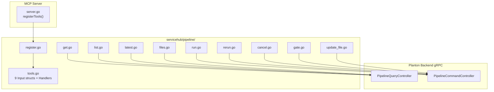

# ServiceHub Pipeline MCP Tools — Tier 2

**Date**: February 28, 2026

## Summary

Added 9 MCP tools for the ServiceHub Pipeline entity, enabling AI agents to list, inspect, trigger, re-run, cancel, and gate-resolve CI/CD pipelines, as well as discover and modify Tekton pipeline files in service repositories. This is the second ServiceHub bounded context, completing the core service-and-pipeline operational surface.

## Problem Statement

After Tier 1 (Service tools), AI agents could manage services but had no way to interact with their CI/CD pipelines. An agent that creates or updates a service via `apply_service` has no way to trigger a deployment, check pipeline status, approve a manual gate, or inspect pipeline configuration files.

### Pain Points

- No way to list or inspect CI/CD pipeline runs for a service
- No way to trigger deployments or re-run failed pipelines via MCP
- Manual gates blocked pipeline execution with no agent-accessible approval mechanism
- Pipeline file discovery and modification required direct Git access outside the MCP surface

## Solution

Implemented a new `internal/domains/servicehub/pipeline/` package with 9 MCP tools covering three operational areas: observability (list, get, get_last), lifecycle control (run, rerun, cancel, gate), and repository pipeline file management (list_files, update_file).

### Architecture



## Implementation Details

### Tool Catalogue

| Tool | RPC | Purpose |
|------|-----|---------|
| `list_pipelines` | `PipelineQueryController.ListByFilters` | Paginated listing with org/service/envs filters |
| `get_pipeline` | `PipelineQueryController.Get` | Full pipeline details by ID |
| `get_last_pipeline` | `PipelineQueryController.GetLastPipelineByServiceId` | Most recent pipeline for a service |
| `run_pipeline` | `PipelineCommandController.RunGitCommit` | Trigger pipeline on branch (optional commit SHA) |
| `rerun_pipeline` | `PipelineCommandController.Rerun` | Re-run with same configuration |
| `cancel_pipeline` | `PipelineCommandController.Cancel` | Graceful signal-based cancellation |
| `resolve_pipeline_gate` | `PipelineCommandController.ResolveManualGate` | Approve/reject deployment task gate |
| `list_pipeline_files` | `PipelineQueryController.ListServiceRepoPipelineFiles` | Discover Tekton pipeline YAMLs |
| `update_pipeline_file` | `PipelineCommandController.UpdateServiceRepoPipelineFile` | Modify pipeline file with optimistic locking |

### Design Decisions

**DD-T2-1: `run_pipeline` requires branch, commit_sha is optional.** The proto field `branch` is `required = true`. Unlike InfraPipeline (which dispatches between chart-source and git-commit), ServiceHub Pipeline is always git-based. The `runGitCommit` RPC returns `google.protobuf.Empty`, so the tool returns a success message directing agents to `get_last_pipeline` to check the result.

**DD-T2-2: Custom bytes-to-string marshaling for pipeline files.** `ServiceRepoPipelineFile.content` is `bytes` (base64 in protojson). Standard `domains.MarshalJSON()` would return unreadable base64 content. For `list_pipeline_files`, we custom-marshal the response, converting `content` bytes to plain UTF-8 strings so agents see actual YAML. For `update_pipeline_file`, agents provide content as a string and we encode to `[]byte`.

**DD-T2-3: Single gate tool.** ServiceHub Pipeline has one `resolveManualGate` RPC with a `deployment_task_name` field, unlike InfraPipeline which has two separate RPCs (env gate + node gate). One tool is cleaner and matches the proto surface.

### Key Differences from InfraPipeline

This package is the ServiceHub analog of `internal/domains/infrahub/infrapipeline/`, but with several important differences discovered during proto analysis:

| Aspect | InfraPipeline | ServiceHub Pipeline |
|--------|---------------|---------------------|
| Run trigger | `commit_sha` presence dispatches between chart-source and git-commit RPCs | Always git-based; `branch` required, `commit_sha` optional |
| Run response | Returns pipeline object | Returns `google.protobuf.Empty` |
| Gate tools | 2 tools (env gate + node gate) | 1 tool (deployment task name) |
| Pipeline files | Not available | 2 new tools (list + update) |
| Environment filter | Not available in list | `envs[]` repeated string filter |

### File Structure

```
internal/domains/servicehub/pipeline/
├── register.go       # Register(srv, serverAddress) — 9 mcp.AddTool calls
├── tools.go          # 9 input structs, 9 Tool/Handler pairs
├── get.go            # Get() via PipelineQueryController
├── list.go           # List() with org/service/envs/pagination filters
├── latest.go         # GetLatest() via GetLastPipelineByServiceId
├── run.go            # Run() via RunGitCommit — success message response
├── rerun.go          # Rerun() via PipelineCommandController
├── cancel.go         # Cancel() — graceful signal-based cancellation
├── gate.go           # ResolveGate() + resolveDecision() helper
├── files.go          # ListFiles() — custom bytes→UTF-8 marshaling
└── update_file.go    # UpdateFile() — string→bytes + optimistic locking
```

## Benefits

- **Complete CI/CD surface**: Agents can now trigger, monitor, retry, cancel, and gate-approve deployments
- **Pipeline file management**: Agents can inspect and modify Tekton pipeline configuration directly
- **Agent-friendly content**: Custom marshaling ensures YAML content is readable, not base64
- **Optimistic locking**: `update_pipeline_file` supports `expected_base_sha` for safe concurrent editing
- **Pattern consistency**: Same structure and conventions as infrapipeline and servicehub/service packages

## Impact

- **MCP tool count**: 70 existing tools + 9 new = **79 total MCP tools**
- **Files created**: 11 new files in `internal/domains/servicehub/pipeline/`
- **Files modified**: 1 (`internal/server/server.go` — 2 lines added)
- **ServiceHub coverage**: 16 of 35 planned tools complete (Tier 1 + Tier 2)

## Related Work

- Tier 1 (Service — 7 tools) completed earlier in the same session
- Tier 3 (VariablesGroup + SecretsGroup — 12 tools) is the next planned tier
- Tier 4 (DnsDomain — 3 tools) and Tier 5 (TektonPipeline + TektonTask — 4 tools) remain

---

**Status**: Production Ready
**Timeline**: Single session
