# ServiceHub VariablesGroup + SecretsGroup MCP Tools

**Date**: February 28, 2026

## Summary

Added 16 MCP tools across two symmetric ServiceHub entities — VariablesGroup and SecretsGroup — covering group-level CRUD, entry-level mutations, value resolution, entry-level search, and batch reference transformation. This brings the total ServiceHub tool count to 32 (of 35 planned) and the overall MCP server to 79+ tools. Four tools were discovered during proto analysis that weren't in the original plan: `search_variables`, `search_secrets`, `transform_variables`, and `transform_secrets`.

## Problem Statement

AI agents managing Planton Cloud services need to inspect and modify shared configuration without risking accidental clobbering. Services reference environment variables and secrets through `$variables-group/` and `$secrets-group/` reference patterns. Without dedicated tools, agents would need to:

### Pain Points

- Fetch entire groups just to read a single variable value
- Replace all entries via `apply` when only one entry needs updating — risking data loss
- Lack visibility into where a specific variable or secret is defined across an organization's groups
- No way to debug whether `$variables-group/` references resolve correctly before deployment
- No guardrails around plaintext secret exposure

## Solution

Two independent Go packages (`variablesgroup` and `secretsgroup`) providing 8 MCP tools each, with a layered API surface: group-level CRUD for bulk operations, entry-level mutations for safe single-entry changes, value resolution for quick lookups, entry-level search for cross-group discovery, and batch transform for reference debugging.

### Architecture

```mermaid
flowchart TB
    subgraph tools [MCP Tools Layer]
        subgraph vg [variablesgroup - 8 tools]
            SearchVar[search_variables]
            GetVG[get_variables_group]
            ApplyVG[apply_variables_group]
            DeleteVG[delete_variables_group]
            UpsertVar[upsert_variable]
            DeleteVar[delete_variable]
            GetVarVal[get_variable_value]
            TransformVar[transform_variables]
        end
        subgraph sg [secretsgroup - 8 tools]
            SearchSec[search_secrets]
            GetSG[get_secrets_group]
            ApplySG[apply_secrets_group]
            DeleteSG[delete_secrets_group]
            UpsertSec[upsert_secret]
            DeleteSec[delete_secret]
            GetSecVal[get_secret_value]
            TransformSec[transform_secrets]
        end
    end

    subgraph backend [Planton gRPC Backend]
        VGCmd[VariablesGroupCommandController]
        VGQuery[VariablesGroupQueryController]
        SGCmd[SecretsGroupCommandController]
        SGQuery[SecretsGroupQueryController]
        SHSearch[ServiceHubSearchQueryController]
    end

    SearchVar --> SHSearch
    GetVG --> VGQuery
    ApplyVG --> VGCmd
    DeleteVG --> VGCmd
    UpsertVar --> VGCmd
    DeleteVar --> VGCmd
    GetVarVal --> VGQuery
    TransformVar --> VGQuery

    SearchSec --> SHSearch
    GetSG --> SGQuery
    ApplySG --> SGCmd
    DeleteSG --> SGCmd
    UpsertSec --> SGCmd
    DeleteSec --> SGCmd
    GetSecVal --> SGQuery
    TransformSec --> SGQuery
```

## Implementation Details

### Tool Layering Strategy

The API surface is intentionally layered to match different agent workflows:

| Layer | Tools | Use Case |
|-------|-------|----------|
| **Group CRUD** | get, apply, delete | Bulk operations on entire groups |
| **Entry mutations** | upsert_entry, delete_entry | Safe single-entry changes without affecting siblings |
| **Value resolution** | get_value | Quick lookup by org + group name + entry name |
| **Search** | search_variables, search_secrets | Cross-group discovery ("find DATABASE_HOST across all groups") |
| **Transform** | transform_variables, transform_secrets | Batch-resolve `$variables-group/` references for debugging |

### Dual-Path Identification

All tools that target a group accept either a system ID or an `org`+`slug` pair. Entry mutation tools (`upsert_variable`, `delete_variable`) accept `group_id` or `org`+`group_slug` — when slug-based, an extra `getByOrgBySlug` round-trip resolves the ID before calling the command RPC.

### Entry Input via Protojson

The `upsert_variable` and `upsert_secret` tools accept the entry as a nested JSON object under the `entry` field. The handler marshals this to JSON bytes and converts to the typed proto via `protojson.Unmarshal`. This handles both literal values (`"value": "..."`) and `value_from` references transparently, consistent with how `apply_service` handles the full Service resource.

### StringValue Unwrapping

The `getValue` RPCs return `google.protobuf.StringValue`. Tools unwrap this and return plain text — not JSON-wrapped — for direct readability. Nil/empty responses produce a clear "no value found" message.

### Security Boundaries

`get_secret_value` and `transform_secrets` include plaintext exposure warnings in their tool descriptions, guiding AI agents to only invoke them when the user explicitly requests secret values.

### Design Decision: No Shared Abstraction

Despite structural similarity, the two packages are fully independent:
- Different proto types (`VariablesGroup` vs `SecretsGroup`)
- Different ubiquitous language (variables vs secrets)
- Different security semantics (secrets need sensitivity warnings)
- Premature abstraction would create coupling where none is warranted

## Benefits

- **Safe entry-level operations**: `upsert_variable`/`upsert_secret` modify a single entry without affecting others — eliminates the risk of accidental clobbering via `apply`
- **Cross-group discovery**: `search_variables`/`search_secrets` find entries across all groups in an org by name or description
- **Reference debugging**: `transform_variables`/`transform_secrets` let agents preview resolved values before deployment, surfacing broken references early
- **Consistent patterns**: Same dual-path identification, same protojson conversion, same error handling as the Service and Pipeline tools

## Impact

- **16 new MCP tools** registered in `server.go`
- **20 new Go files** across 2 packages
- **1 modified file** (`internal/server/server.go`)
- **Project progress**: 28/35 ServiceHub tools complete (80%)
- **Overall server**: 79+ registered MCP tools

## Related Work

- [ServiceHub Service MCP Tools](2026-02-28-213830-servicehub-service-mcp-tools.md) — Tier 1 (7 tools)
- [ServiceHub Pipeline MCP Tools](2026-02-28-222502-servicehub-pipeline-mcp-tools.md) — Tier 2 (9 tools)
- Remaining: Tier 4+5 — DnsDomain, TektonPipeline, TektonTask (7 tools)

---

**Status**: ✅ Production Ready
**Verification**: `go build ./...` ✅ | `go vet ./...` ✅ | `go test ./...` ✅
