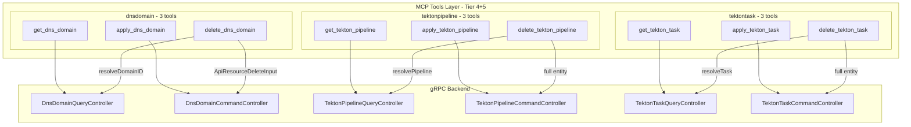

# ServiceHub DnsDomain + TektonPipeline + TektonTask MCP Tools

**Date**: March 1, 2026

## Summary

Added 9 MCP tools across three ServiceHub entities — DnsDomain, TektonPipeline, and TektonTask — completing the ServiceHub MCP tools project. This final tier brings the total ServiceHub tool count to 37 (from an original plan of 35, with 2 delete tools added during planning for TektonPipeline and TektonTask) and the overall MCP server to 100 tools. All three entities follow established patterns from Tiers 1-3 with two notable variations: TektonPipeline/TektonTask use `GetByOrgAndNameInput` (name mapped from slug) and entity-based delete (get-then-delete pattern).

## Problem Statement

AI agents managing Planton Cloud services needed tooling for three remaining ServiceHub entities to complete the domain surface:

### Pain Points

- No way to register or manage DNS domains for service ingress configuration
- No access to Tekton pipeline templates that define CI/CD orchestration
- No access to Tekton task templates that define individual build steps
- Incomplete CRUD surface — agents could read but not manage these reference data entities

## Solution

Three independent Go packages providing 3 MCP tools each, completing the ServiceHub domain with consistent patterns established in earlier tiers.

### Architecture

## Implementation Details

### DnsDomain (3 tools)

Follows the Service pattern exactly — the most straightforward entity in the tier:
- **get_dns_domain**: Dual-path lookup via `DnsDomainId` or `ApiResourceByOrgBySlugRequest`
- **apply_dns_domain**: protojson unmarshal + `DnsDomainCommandController.Apply`
- **delete_dns_domain**: Resolve ID + `ApiResourceDeleteInput` (same as Service delete)

### TektonPipeline (3 tools)

Introduces two pattern variations from DnsDomain/Service:
- **get_tekton_pipeline**: Uses `ApiResourceId` (generic, not entity-specific) and `GetByOrgAndNameInput` where the slug value is passed as the `Name` field (server converts name to slug internally)
- **apply_tekton_pipeline**: Standard protojson unmarshal + `TektonPipelineCommandController.Apply`
- **delete_tekton_pipeline**: **Get-then-delete pattern** — the RPC takes the full `TektonPipeline` entity as input (not just an ID), so the tool first resolves the entity via the query controller, then passes it to delete

### TektonTask (3 tools)

Structurally identical to TektonPipeline with entity-specific naming. Maintained as a separate package per DD-T4-4 (and DD-T3-7 precedent): no shared abstraction between bounded contexts.

### Design Decisions

| ID | Decision | Rationale |
|----|----------|-----------|
| DD-T4-1 | Slug normalization | All tools use `slug` field for consistency with Service/VariablesGroup/SecretsGroup, even though TektonPipeline/TektonTask proto uses `name` |
| DD-T4-2 | Tekton delete | Added delete tools for complete CRUD surface; uses get-then-delete since RPC takes full entity |
| DD-T4-3 | No search tools | No search RPCs exist in `ServiceHubSearchQueryController` for these entities |
| DD-T4-4 | Separate packages | TektonPipeline and TektonTask remain independent despite near-identical structure |

## Benefits

- **Complete domain coverage**: All 7 ServiceHub entities now have full MCP tool support
- **100 total tools**: The MCP server now exposes 100 tools across all domains
- **Consistent UX**: All tools follow the same dual-path identification pattern (ID or org+slug)
- **Clean CRUD**: Every entity that has CRUD RPCs now has matching CRUD tools

## Impact

### Files Created (15 new files)
- `internal/domains/servicehub/dnsdomain/` — 5 files (register, tools, get, apply, delete)
- `internal/domains/servicehub/tektonpipeline/` — 5 files (register, tools, get, apply, delete)
- `internal/domains/servicehub/tektontask/` — 5 files (register, tools, get, apply, delete)

### Files Modified (1 file)
- `internal/server/server.go` — 3 new imports + 3 Register calls

### Verification
- `go build ./...` — clean
- `go vet ./...` — clean
- `go test ./...` — all pass

## Related Work

- [ServiceHub Service MCP Tools](../2026-02/2026-02-28-213830-servicehub-service-mcp-tools.md) — Tier 1 (7 tools)
- [ServiceHub Pipeline MCP Tools](../2026-02/2026-02-28-222502-servicehub-pipeline-mcp-tools.md) — Tier 2 (9 tools)
- [ServiceHub VariablesGroup + SecretsGroup MCP Tools](../2026-02/2026-02-28-234956-servicehub-variablesgroup-secretsgroup-mcp-tools.md) — Tier 3 (16 tools)

## Project Completion Summary

The ServiceHub MCP tools project (20260228.01) is now complete:

| Tier | Entity | Tools | Session |
|------|--------|-------|---------|
| 1 | Service | 7 | 2026-02-28 |
| 2 | Pipeline | 9 | 2026-02-28 |
| 3a | VariablesGroup | 8 | 2026-02-28 |
| 3b | SecretsGroup | 8 | 2026-02-28 |
| 4 | DnsDomain | 3 | 2026-03-01 |
| 5a | TektonPipeline | 3 | 2026-03-01 |
| 5b | TektonTask | 3 | 2026-03-01 |
| | **Total** | **37** | |

---

**Status**: ✅ Production Ready
**Timeline**: 4 sessions across 2 days (2026-02-28 to 2026-03-01)
