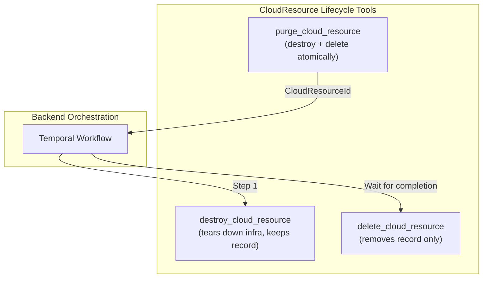

# CloudResource Lifecycle Completion: purge_cloud_resource Tool

**Date**: March 1, 2026

## Summary

Added the `purge_cloud_resource` MCP tool to complete the CloudResource lifecycle operations. Purge is the "nuke everything" operation -- it destroys IaC-managed cloud infrastructure and then deletes the resource record, orchestrated as a single Temporal workflow on the backend. This brings the CloudResource domain from 11 to 12 tools.

## Problem Statement

The CloudResource domain already exposed `destroy_cloud_resource` (tear down infra, keep record) and `delete_cloud_resource` (remove record only) as separate tools. However, the most common real-world intent -- "I want this resource completely gone" -- required two sequential tool calls with coordination logic. The backend's `purge` RPC handles this atomically, but had no MCP tool counterpart.

### Pain Points

- Users wanting to fully remove a cloud resource had to call `destroy` then `delete` manually
- No guarantee the delete would happen after destroy completed (the user or LLM could forget)
- The backend already solves this with a Temporal workflow (`purge`), but it wasn't exposed

## Solution

Added `purge_cloud_resource` as a single MCP tool that maps to the `CloudResourceCommandController.purge` RPC. The tool follows the same identification pattern as all other single-resource CloudResource tools (ID or kind+org+env+slug).

### CloudResource Lifecycle Tool Architecture

### Design Decision: cleanup excluded

The `CloudResourceCommandController` also exposes a `cleanup` RPC, but it requires `platform/operator` authorization -- it's an emergency operation for removing broken records from the database, search index, and auth system. The codebase has a consistent pattern of NOT exposing platform-operator RPCs as MCP tools (`updateOutputs`, `pipelineApply`, `pipelineDestroy` are all excluded). `cleanup` follows the same exclusion pattern.

## Implementation Details

Three files touched, one new file created. The implementation follows the established `delete.go` pattern exactly:

**`purge.go`** (new): Domain function using `domains.WithConnection` -> `resolveResourceID` -> `cmdClient.Purge`. Takes `ResourceIdentifier`, resolves slug-path to ID if needed, calls the command RPC with `CloudResourceId{Value: resourceID}`.

**`tools.go`** (modified): Added `PurgeCloudResourceInput` struct, `PurgeTool()` definition, and `PurgeHandler()`. The tool description clearly communicates: atomic destroy+delete workflow, irreversible, use `get_latest_stack_job` to monitor. Package doc updated from 11 to 12 tools.

**`register.go`** (modified): Registered `purge_cloud_resource` after `destroy_cloud_resource`, maintaining logical lifecycle grouping.

## Benefits

- **Single-action full removal**: LLM agents can fully remove a cloud resource in one tool call instead of coordinating two
- **Atomic guarantee**: Backend Temporal workflow ensures destroy completes before delete runs -- no orphaned records
- **Consistent patterns**: Follows the exact same `ResourceIdentifier` / `validateIdentifier` / `resolveResourceID` pattern as every other single-resource tool
- **Zero new abstractions**: No new utilities, types, or patterns introduced -- pure reuse of existing building blocks

## Impact

- CloudResource domain: 11 -> 12 tools
- Total MCP server tools: ~101 -> ~102
- Completes T07 in the gap completion project

## Related Work

- **T02 (DD-01)**: Connect domain architecture decision (same session)
- **CloudResource domain**: Existing tools in `internal/domains/infrahub/cloudresource/`
- **Gap analysis**: T07 identified as Tier 1 critical gap

---

**Status**: Production Ready
**Timeline**: ~30 minutes implementation
