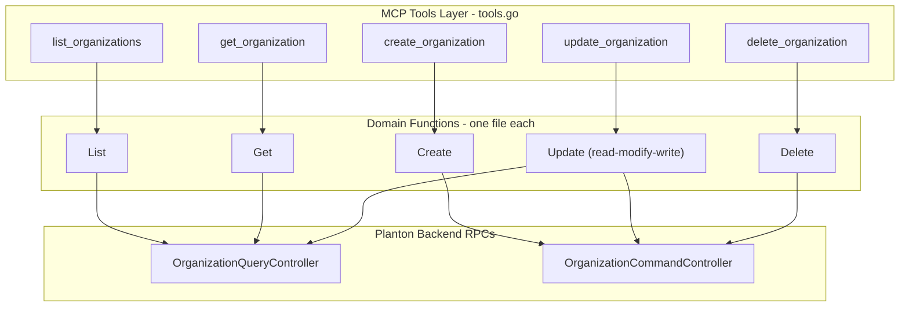

# Organization Full CRUD MCP Tools

**Date**: March 1, 2026

## Summary

Added 4 new MCP tools (get, create, update, delete) to the Organization domain, expanding it from 1 tool to 5 and completing the full CRUD lifecycle for organization management. This enables AI clients to fully manage organizations through the MCP server rather than only listing them.

## Problem Statement

The Organization domain only exposed `list_organizations`, meaning an MCP client could discover which organizations exist but could not create new ones, inspect details, modify settings, or remove them. This forced users to fall back to the web console or CLI for any org management beyond listing.

### Pain Points

- No way to create an organization from an MCP client
- No way to inspect full organization details (metadata, spec, status) by ID
- No way to update organization fields (name, description, contact email, logo)
- No way to delete an organization programmatically

## Solution

Added 4 new tools following the established domain patterns in the codebase. A key design decision was made to use **separate create and update tools** rather than a single `apply` tool (which the CloudResource domain uses), because:

- The `create` RPC skips authorization (any authenticated user can create an org) while `update` requires org update permission -- different auth models
- The input shapes are fundamentally different: create needs a slug, update needs an org_id plus optional field overrides
- Separate tools give the LLM clearer intent signals for each operation
- Organization is a single, simple type -- not polymorphic like CloudResource's 150+ kinds

### Architecture

## Implementation Details

### New Files

- `get.go` -- Calls `OrganizationQueryController.Get(OrganizationId)`. Straightforward single-RPC pattern.
- `create.go` -- Constructs a full `Organization` proto internally (setting `api_version`, `kind`, metadata, spec) from user-provided fields, then calls `OrganizationCommandController.Create`.
- `update.go` -- Defines `UpdateFields` struct. Performs a read-modify-write: GETs the current org, applies non-empty field overrides, then calls `OrganizationCommandController.Update`. Both RPCs share a single gRPC connection within one `WithConnection` callback.
- `delete.go` -- Calls `OrganizationCommandController.Delete(OrganizationId)`. Uses `OrganizationId` (not `ApiResourceDeleteInput` like CloudResource).

### Modified Files

- `tools.go` -- Added 4 input structs, tool definitions, and handler functions. Updated package doc from "One tool" to "Five tools".
- `register.go` -- Added 4 `mcp.AddTool` registrations.

### RPCs Intentionally Excluded

- `repairFgaTuples` -- platform operator only
- `toggleGettingStartedTasks` / `toggleGettingStartedTask` -- UI onboarding concern
- `find` -- platform operator paginated search
- `checkSlugAvailability` -- useful but not core CRUD; deferred to follow-up

### Trade-off: Empty String Semantics in Update

The update tool treats empty strings as "no change" via `omitempty` JSON tags. This means a field cannot be explicitly cleared to empty string through this tool. Acceptable for v1; can be addressed with explicit `clear_*` booleans if the need arises.

## Benefits

- **Complete org lifecycle via MCP**: AI clients can now create, read, update, and delete organizations without falling back to other interfaces
- **Pattern consistency**: Follows the exact same domain patterns as CloudResource, StackJob, and other established domains
- **Clean separation**: Each CRUD operation in its own file; tools.go contains only tool definitions and handlers
- **Foundation for T04**: The Organization CRUD pattern will be directly reused for Environment Full CRUD

## Impact

- Organization domain: 1 tool -> 5 tools
- Total MCP server tool count increases by 4
- No changes to shared utilities, server registration, or other domains

## Related Work

- T07: CloudResource `purge_cloud_resource` (same session, established the precedent for this work)
- T02: Architecture Decision DD-01 for Connect domain tool design
- T04: Environment Full CRUD (next task, will follow the same patterns)

---

**Status**: Completed
**Commit**: `feat(organization): add full CRUD tools (get, create, update, delete)`
