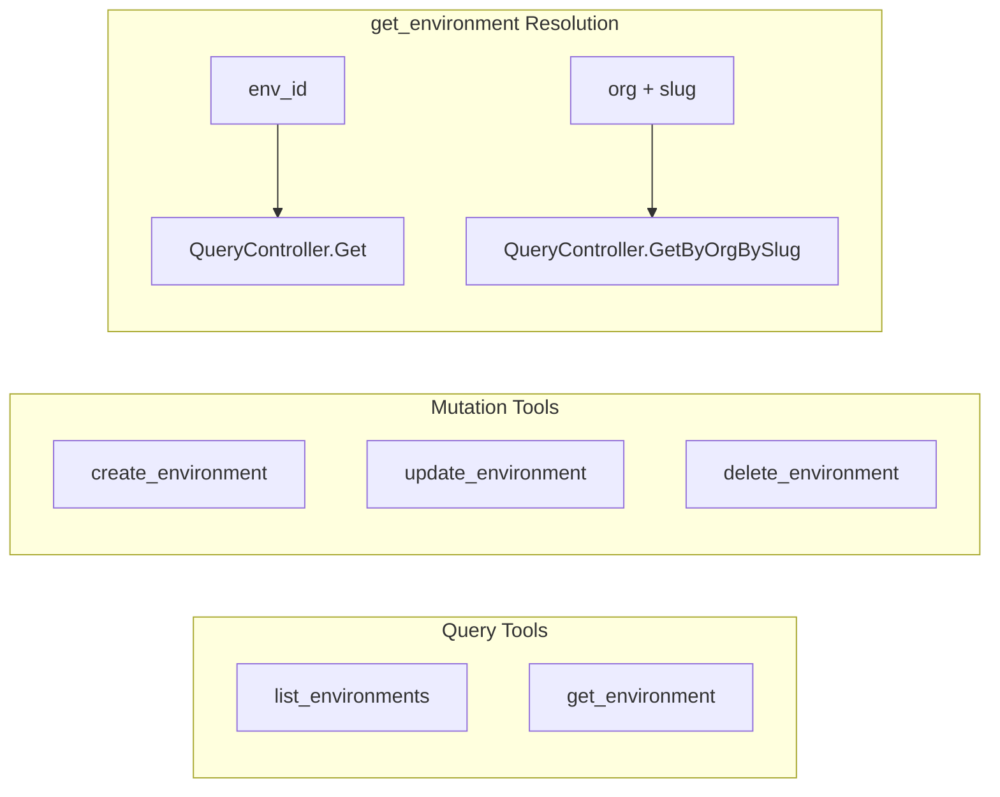

# Environment Full CRUD MCP Tools

**Date**: March 1, 2026

## Summary

Added 4 new MCP tools to the Environment domain (`get_environment`, `create_environment`, `update_environment`, `delete_environment`), completing the full CRUD lifecycle. The Environment domain now has 5 tools (up from 1). The `get_environment` tool introduces a dual-resolution pattern — lookup by ID or by org+slug — which is a deliberate deviation from the Organization domain's ID-only approach, motivated by how environments are naturally referenced as child resources within an organization.

## Problem Statement

The Environment domain in the MCP server only exposed a single `list_environments` tool. Users could discover which environments existed in an organization but couldn't inspect, create, modify, or remove individual environments through the MCP interface.

### Pain Points

- No way to retrieve a specific environment's full details (metadata, spec, status)
- No programmatic creation of environments — users had to use the web console
- No way to update environment properties (name, description) via MCP
- No environment deletion capability, blocking full lifecycle management
- LLMs had to make extra round-trips: `list_environments` to get IDs, then no `get` to follow up with

## Solution

Implemented 4 tools following the established Organization CRUD pattern (T03), with one deliberate architectural enhancement: dual-resolution `get_environment` that accepts either an environment ID or an org+slug pair.

### Agent Workflow

The dual-resolution `get_environment` enables two natural workflows:

**Workflow A (ID-based):** `list_organizations` -> `list_environments` -> `get_environment(env_id)`

**Workflow B (slug-based, fewer steps):** `get_environment(org="acme", slug="staging")` — skips the list step entirely when the user says "get the staging environment in acme."

## Implementation Details

### Tools Added

| Tool | Input | Backend RPC | Auth |
|------|-------|-------------|------|
| `get_environment` | `env_id` OR `org`+`slug` | `QueryController.Get` / `QueryController.GetByOrgBySlug` | env-level get |
| `create_environment` | `org`, `slug`, `name`?, `description`? | `CommandController.Create` | org-level `environment_create` |
| `update_environment` | `env_id`, `name`?, `description`? | `QueryController.Get` then `CommandController.Update` | env-level update |
| `delete_environment` | `env_id` | `CommandController.Delete` | env-level delete |

### File Structure

All files in `internal/domains/resourcemanager/environment/`:

| File | Purpose |
|------|---------|
| `get.go` (new) | `Get()` and `GetByOrgBySlug()` domain functions |
| `create.go` (new) | `Create()` — assembles Environment proto, calls Create RPC |
| `update.go` (new) | `UpdateFields` struct + `Update()` — read-modify-write pattern |
| `delete.go` (new) | `Delete()` — calls Delete RPC |
| `tools.go` (modified) | 4 new input structs, tool definitions, handlers; package doc updated |
| `register.go` (modified) | 4 new `mcp.AddTool` registrations |

### Key Design Decisions

**Dual-resolution get**: The `get_environment` handler uses a `switch` to dispatch:
- If `env_id` is provided, calls `Get()`
- If `org` and `slug` are both provided, calls `GetByOrgBySlug()`
- Otherwise returns a validation error

This is a deliberate deviation from Organization's ID-only `get_organization`. The rationale: environments are child resources whose slug is meaningful within an org context, and the proto API explicitly provides `getByOrgBySlug` for this use case.

**Separate create + update (not apply)**: Consistent with Organization (T03). The Environment proto has an `apply` upsert RPC, but we chose separate tools because create and update have different authorization models (`environment_create` on org vs `update` on env) and different input shapes (create requires org+slug, update requires env_id).

**Cascading delete warning**: The `delete_environment` tool description explicitly warns that deletion triggers cleanup of all stack-modules, microservices, secrets, and clusters deployed to that environment.

**RPCs excluded**: `apply` (use create/update), `find` (platform operator), `findByOrg` (inferior to existing `findAuthorized`), `checkSlugAvailability` (deferred).

## Benefits

- **Complete lifecycle**: Environment CRUD joins Organization CRUD to fully cover the ResourceManager bounded context
- **Fewer round-trips**: Dual-resolution get eliminates a `list_environments` call in the most natural query pattern
- **Consistent patterns**: Follows the same file structure, handler shape, and domain function conventions as Organization
- **Safe delete UX**: Explicit warning about cascading cleanup prevents accidental data loss

## Impact

- Environment domain: 1 tool -> 5 tools
- Total MCP server tools: ~109 -> ~113
- ResourceManager bounded context: now fully covered (Organization + Environment)
- Unblocks T05 (Connect) and T06 (StackJob) as the next parallel tasks

## Related Work

- **T03: Organization Full CRUD** — The reference pattern this implementation follows
- **T02: Connect Domain Architecture Decision (DD-01)** — Establishes the generic tool pattern that will be used for credentials
- **T07: CloudResource Purge** — Completed the CloudResource lifecycle; T04 completes the Environment lifecycle

---

**Status**: Production Ready
