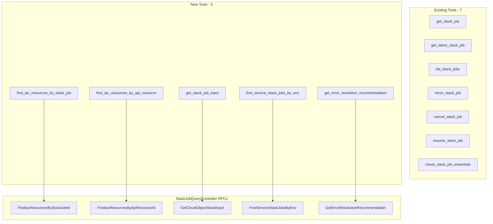

# StackJob AI-Native Tools: Error Resolution, IaC Inspection, and Cross-Environment Deployment Status

**Date**: March 1, 2026

## Summary

Added 5 new AI-native and diagnostic MCP tools to the StackJob domain, expanding it from 7 to 12 tools. These tools unlock capabilities that were previously unavailable to AI agents: inspecting infrastructure state, debugging stack job inputs, comparing deployment status across environments, and getting AI-powered error resolution recommendations. All tools are read-only Query RPCs following established domain patterns.

## Problem Statement

The StackJob domain had 7 tools covering basic lifecycle operations (get, list, rerun, cancel, resume, check essentials), but lacked the diagnostic and introspection capabilities that make AI agents truly useful for infrastructure operations.

### Pain Points

- **No IaC state visibility**: Agents couldn't inspect what Pulumi/Terraform resources a stack job managed — they could only see the job metadata, not the actual infrastructure it touched.
- **No debugging capability**: When a stack job produced unexpected results, there was no way for an agent to inspect the exact inputs that were fed to the IaC engine.
- **No cross-environment view**: Agents had no tool to compare a service's deployment status across staging, production, and other environments in a single call.
- **No error resolution assistance**: Failed stack jobs left agents with raw error messages and no structured way to get resolution recommendations.

## Solution

Five new tools, each backed by an existing `StackJobQueryController` Query RPC:



## Implementation Details

### Tool Inventory

| Tool | Input | Response | Use Case |
|------|-------|----------|----------|
| `find_iac_resources_by_stack_job` | `stack_job_id` | `IacResources` (address, type, provider, logical name, external ID) | Post-deployment verification |
| `find_iac_resources_by_api_resource` | `api_resource_id` | `IacResources` (same) | Current IaC state without knowing the stack job ID |
| `get_stack_job_input` | `stack_job_id` | `CloudObjectStackInput` (Struct) | Debug unexpected stack job behavior |
| `find_service_stack_jobs_by_env` | `service_id` | `ServiceEnvStackJobs` (map: env -> StackJob) | Cross-environment deployment overview |
| `get_error_resolution_recommendation` | `stack_job_id` + `error_message` | Plain text recommendation | AI-assisted error diagnosis |

### Architecture Decisions

- **Dropped duplicate tool**: `get_last_stack_job_by_cloud_resource` was in the original plan but already existed as `get_latest_stack_job`. Identified during planning and dropped.
- **Added `get_stack_job_input`**: Not in the original gap analysis but discovered during proto exploration. Returns credential-free stack input (`CloudObjectStackInput`) — valuable for debugging without exposing secrets.
- **Plain text for error recommendations**: `get_error_resolution_recommendation` returns `resp.GetValue()` directly instead of `domains.MarshalJSON()`. The backend returns an AI-generated plain-text recommendation (via `google.protobuf.StringValue`), not a structured proto message.
- **Cross-domain import**: `find_service_stack_jobs_by_env` is the first tool in the stackjob package that imports `servicev1.ServiceId` from the servicehub domain. This mirrors the proto API design where the RPC lives on `StackJobQueryController` but takes a `ServiceId` input.

### File Structure

```
internal/domains/infrahub/stackjob/
├── error_recommendation.go   # NEW - GetErrorRecommendation()
├── iac_resources.go           # NEW - FindIacResourcesByStackJob(), FindIacResourcesByApiResource()
├── service_stack_jobs.go      # NEW - FindServiceStackJobsByEnv()
├── stack_input.go             # NEW - GetStackInput()
├── tools.go                   # MODIFIED - 5 input structs, 5 Tool() funcs, 5 Handler() funcs
├── register.go                # MODIFIED - 5 new mcp.AddTool registrations
├── get.go                     # (existing)
├── latest.go                  # (existing)
├── list.go                    # (existing)
├── rerun.go                   # (existing)
├── cancel.go                  # (existing)
├── resume.go                  # (existing)
├── essentials.go              # (existing)
└── enum.go                    # (existing)
```

### RPCs Explicitly Excluded

| RPC | Reason |
|-----|--------|
| `getProgressEventStream` | Streaming — not supported by MCP transport |
| `getStackJobStatusStream` | Streaming — not supported by MCP transport |
| `streamStackJobsByOrg` | Platform operator + streaming |
| `find` | Platform operator only |
| `getCloudResourceStackExecuteInput` | Platform operator — contains credentials |
| `pipelineCancel` | Internal pipeline use only |

## Benefits

- **AI agents can now diagnose failures end-to-end**: Get the failed job, inspect its IaC resources, examine the exact inputs, and get an AI-generated fix recommendation — all without leaving the MCP tool surface.
- **Cross-environment visibility**: A single `find_service_stack_jobs_by_env` call replaces what would otherwise require multiple list + filter operations.
- **Credential-safe debugging**: `get_stack_job_input` gives full inspection capability without exposing platform-level backend credentials.
- **Consistent patterns**: All 5 tools follow the established domain function shape (`WithConnection` -> client -> RPC -> MarshalJSON/TextResult), keeping the codebase uniform.

## Impact

- **StackJob domain**: 7 → 12 tools (71% increase)
- **MCP server total**: Continues the gap completion effort toward ~130+ tools
- **Part of**: T06 in the MCP Server Gap Completion project (20260301.01)

## Related Work

- **T07**: CloudResource Lifecycle Completion (purge tool) — same session
- **T03/T04**: Organization and Environment Full CRUD — same project
- **T02**: DD-01 Connect Domain Architecture Decision — same project
- **Next**: T05 Connect Domain Credential Management (25-30 tools)

---

**Status**: Production Ready
**Timeline**: Single session implementation
