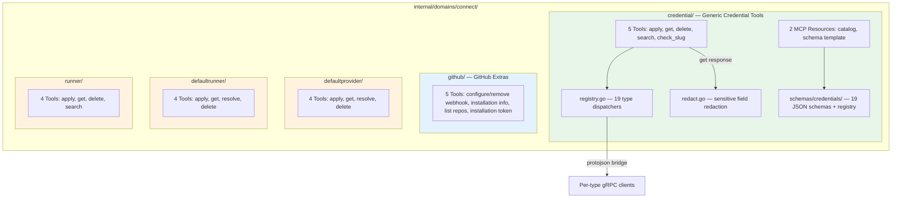

# Connect Domain: Credential Management — 22 Tools + 2 MCP Resources

**Date**: March 1, 2026

## Summary

Implemented the entire Connect bounded context for the MCP server: 22 tools and 2 MCP resources across 5 sub-packages, covering 19 credential types with a generic dispatcher architecture, 5 GitHub-specific integration tools, and 12 platform connection tools across 3 resource types. This was the largest single task (T05) in the MCP Server Gap Completion project, adding the second major bounded context after InfraHub's CloudResource domain. The implementation follows the architecture established in DD-01 and includes defense-in-depth secret redaction per OWASP MCP01:2025 guidance.

## Problem Statement

The MCP server had zero coverage of the Connect domain — the bounded context responsible for managing credentials (API keys, service account keys, tokens, certificates) and platform connection bindings. This was the biggest gap in the server's tool surface, affecting every workflow that requires infrastructure provisioning, CI/CD, or third-party service integration.

### Pain Points

- 19 credential types with identical CRUD semantics but different spec fields — needed a scalable pattern, not 95 individual tools
- Credential specs contain secrets (AWS access keys, GCP service account JSON, GitHub private keys, database passwords) that must never leak into the LLM context window
- Server-side APIs use per-type gRPC services (unlike CloudResource's single generic service), requiring a dispatch layer
- GitHub has 5 non-CRUD operations (webhook management, installation info, repo listing, token generation) that don't fit any generic pattern
- Platform connection resources (DefaultProviderConnection, DefaultRunnerBinding, RunnerRegistration) have unique semantics (`resolve` for defaults, `search` for runners) that differ from credential CRUD
- No JSON schema infrastructure existed for credential types — agents had no way to discover what fields each credential type requires

## Solution

A five-sub-package architecture under `internal/domains/connect/`, with three distinct tool patterns matched to each category's characteristics:



### Architecture Highlights

- **Dispatcher pattern**: A single `credentialDispatcher` struct per type, binding `apply`, `get`, `getByOrgBySlug`, and `delete` functions plus a `sensitiveFields` list. The dispatcher table maps PascalCase kind names (e.g., `"AwsCredential"`) to their dispatcher. Each dispatcher function is ~15 lines, constructing the typed gRPC client and calling the appropriate RPC.

- **Protojson bridge**: Generic tools accept a JSON `object` field. The dispatcher marshals it to bytes, then `protojson.Unmarshal`s into the typed proto message. This correctly handles enums, nested messages, and all protobuf field types without manual field mapping.

- **Secret redaction**: Each credential type declares its sensitive field paths (e.g., `spec.access_key_secret` for AWS, `spec.service_account_key_base64` for GCP). After `get_credential` retrieves a response, `redactFields` walks the JSON and replaces values at known paths with `"[REDACTED]"`. This is defense-in-depth per OWASP MCP01:2025 — the server may also strip secrets, but the MCP layer does not rely on it.

- **Schema embedding**: 19 hand-crafted JSON schemas under `schemas/credentials/`, each with explicit `sensitive: true` annotations on secret fields. A `registry.json` maps kinds to schema files and metadata. The `schemas.CredentialFS` embed directive makes these available at compile time, mirroring the CloudResource schema pattern.

## Implementation Details

### Phase 1: Credential Core (5 tools + 2 resources)

Validated the full architecture end-to-end with 5 representative credential types: AWS, GCP, GitHub, Azure, Kubernetes.

**Package structure:**

```
internal/domains/connect/
├── doc.go
└── credential/
    ├── doc.go          # Package documentation
    ├── register.go     # Tool + resource registration
    ├── tools.go        # 5 input structs, 5 tool defs, 5 handlers
    ├── apply.go        # apply_credential domain function
    ├── get.go          # get_credential (by ID or org+slug) + redaction
    ├── delete.go       # delete_credential domain function
    ├── search.go       # search_credentials via ConnectSearchQueryController
    ├── slug.go         # check_credential_slug via ConnectSearchQueryController
    ├── registry.go     # kind -> dispatcher map (protojson bridge per type)
    ├── redact.go       # Sensitive field redaction (JSON walk)
    ├── resources.go    # MCP resource + resource template definitions
    └── schema.go       # Embedded schema loading + catalog builder
```

**MCP resources:**

| Resource | Type | Purpose |
|----------|------|---------|
| `credential-types://catalog` | Static resource | Lists all 19 credential types with kind, provider, description |
| `credential-schema://{kind}` | Resource template | Returns the JSON schema for a specific credential type |

**Tool summary:**

| Tool | Input | Behavior |
|------|-------|----------|
| `apply_credential` | `kind` + `object` (JSON) | Dispatches to type-specific CommandController.Apply via protojson |
| `get_credential` | `credential_id` OR `org_id` + `slug` + `kind` | Retrieves credential, applies sensitive field redaction |
| `delete_credential` | `credential_id` + `kind` | Dispatches to type-specific CommandController.Delete |
| `search_credentials` | `org_id` + `kind` (optional) | Uses ConnectSearchQueryController with ApiResourceKind enum mapping |
| `check_credential_slug` | `org_id` + `kind` + `slug` | Validates slug availability via ConnectSearchQueryController |

### Phase 2: Remaining Credential Types (14 types)

Mechanical expansion — for each type:
1. Read its `spec.proto` for field names, types, and sensitivity
2. Hand-craft a JSON schema with `sensitive` annotations
3. Add registry entry in `registry.json`
4. Add dispatcher entry in `registry.go` with import and sensitive fields list
5. Add `ApiResourceKind` mapping in `search.go`

**All 19 supported credential types:**

| Kind | Provider | Sensitive Fields |
|------|----------|-----------------|
| AwsCredential | AWS | `spec.access_key_secret` |
| GcpCredential | GCP | `spec.service_account_key_base64` |
| GithubCredential | GitHub | `spec.app_private_key` |
| AzureCredential | Azure | `spec.client_secret`, `spec.subscription_id`, `spec.tenant_id` |
| KubernetesClusterCredential | Kubernetes | `spec.kube_config_base64` |
| Auth0Credential | Auth0 | `spec.client_secret` |
| CivoCredential | Civo | `spec.api_key` |
| CloudflareCredential | Cloudflare | `spec.api_key` |
| ConfluentCredential | Confluent | `spec.api_secret` |
| DigitalOceanCredential | DigitalOcean | `spec.token` |
| DockerCredential | Docker | `spec.password` |
| GitlabCredential | GitLab | `spec.token` |
| MavenCredential | Maven | `spec.password` |
| MongoDBAtlasCredential | MongoDBAtlas | `spec.private_key` |
| NpmCredential | NPM | `spec.access_token` |
| OpenFGACredential | OpenFGA | `spec.api_token` |
| PulumiBackendCredential | Pulumi | `spec.access_token` |
| SnowflakeCredential | Snowflake | `spec.password`, `spec.private_key` |
| TerraformBackendCredential | Terraform | `spec.token` |

### Phase 3: GitHub Extras (5 dedicated tools)

New sub-package `internal/domains/connect/github/` with tools that go beyond CRUD:

| Tool | RPC | Purpose |
|------|-----|---------|
| `configure_github_webhook` | GithubCommandController.ConfigureWebhook | Set up Planton webhook on a GitHub repo |
| `remove_github_webhook` | GithubCommandController.RemoveWebhook | Remove Planton webhook from a GitHub repo |
| `get_github_installation_info` | GithubQueryController.GetInstallationInfo | Retrieve GitHub App installation details |
| `list_github_repositories` | GithubQueryController.ListRepositories | List repos accessible to a GitHub credential |
| `get_github_installation_token` | GithubQueryController.GetInstallationToken | Generate a short-lived installation token |

### Phase 4: Platform Connections (12 tools)

Three new sub-packages with standard CRUD + unique operations:

**DefaultProviderConnection** (`defaultprovider/`):

| Tool | RPC | Purpose |
|------|-----|---------|
| `apply_default_provider_connection` | CommandController.Apply | Set the default credential for a provider in an org |
| `get_default_provider_connection` | QueryController.Get | Retrieve by ID |
| `resolve_default_provider_connection` | QueryController.Resolve | Resolve the effective default for an org+provider |
| `delete_default_provider_connection` | CommandController.Delete | Remove a default binding |

**DefaultRunnerBinding** (`defaultrunner/`):

| Tool | RPC | Purpose |
|------|-----|---------|
| `apply_default_runner_binding` | CommandController.Apply | Set the default runner for a provider in an org |
| `get_default_runner_binding` | QueryController.Get | Retrieve by ID |
| `resolve_default_runner_binding` | QueryController.Resolve | Resolve the effective default for an org+provider |
| `delete_default_runner_binding` | CommandController.Delete | Remove a default binding |

**RunnerRegistration** (`runner/`):

| Tool | RPC | Purpose |
|------|-----|---------|
| `apply_runner_registration` | CommandController.Apply | Register a new runner |
| `get_runner_registration` | QueryController.Get | Retrieve by ID |
| `delete_runner_registration` | CommandController.Delete | Remove a runner registration |
| `search_runner_registrations` | ConnectSearchQueryController.SearchRunnerRegistrationsByOrgContext | Search runners in an org |

## Benefits

- **Tool count discipline**: 22 tools instead of 95+ with a per-type approach — keeps the tool surface navigable for LLMs
- **Zero-touch extensibility**: Adding a new credential type requires only a JSON schema file + dispatcher entry (~15 lines) — no new tools, handlers, or registrations
- **Consistent agent UX**: Credential workflow mirrors the proven CloudResource `catalog -> schema -> apply` pattern, reducing cognitive load for the LLM
- **Defense-in-depth security**: MCP-side secret redaction ensures sensitive fields never enter the LLM context window, regardless of server-side behavior
- **Full Connect coverage**: Every user-accessible RPC in the Connect domain is now surfaced (OAuth/CloudFormation browser flows correctly excluded)

## Impact

### Tool Count Growth

| Before T05 | After T05 | Growth |
|------------|-----------|--------|
| ~107 tools, 2 MCP resources | 129 tools, 4 MCP resources | +22 tools, +2 resources |

### Domain Coverage

The Connect domain goes from 0% to ~100% of user-accessible RPCs:
- 19/19 credential types covered
- 5/5 GitHub extra operations covered
- 3/3 platform connection types covered
- OAuth/CloudFormation controllers correctly excluded (browser/infra flows)
- ProviderConnectionAuthorization deferred to T08 (IAM concern)

### File Metrics

| Category | Count |
|----------|-------|
| New Go files | 25 |
| New JSON schema files | 20 (19 types + 1 registry) |
| Modified files | 2 (server.go, embed.go) |
| New packages | 5 (connect, credential, github, defaultprovider, defaultrunner, runner) |

## Design Decisions

| Decision | Rationale |
|----------|-----------|
| Hand-crafted JSON schemas over codegen | 19 simple types, explicit `sensitive` annotations, no new tooling overhead |
| Protojson bridge over manual field mapping | Correct enum/nested-message handling, ~15 lines per type, leverages proto ecosystem |
| Per-type sensitive field lists over generic heuristics | Precision over recall — only redact what is truly sensitive, no false positives |
| Separate sub-packages for GitHub/platform connections | Different tool signatures and semantics; clean package boundaries, independent testability |
| `ApiResourceKind` enum mapping in search.go | Backend search uses enum values, not string names; explicit map is auditable and compile-time safe |

## Related Work

- **DD-01 Architecture Decision** (`design-decisions/DD01-connect-domain-tool-architecture.md`) — Foundation for this implementation
- **T02 Architecture Decision** — Preceded T05, established the generic vs per-type decision
- **CloudResource domain** — Reference implementation for catalog/schema/dispatcher patterns
- **T08 IAM Domain** — Will implement ProviderConnectionAuthorization (deferred from T05)

---

**Status**: ✅ Production Ready
**Timeline**: Single session — 4 phases executed sequentially
**Verification**: `go build`, `go vet`, `go test` all pass
