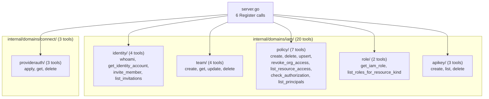

# IAM Domain + ProviderConnectionAuthorization: 23 New MCP Tools

**Date**: March 1, 2026

## Summary

Implemented the entire IAM bounded context (20 MCP tools across 5 sub-packages) and ProviderConnectionAuthorization (3 MCP tools in `connect/providerauth`), completing the largest single-task delivery in the gap-completion project. These 23 tools give the AI agent full access to identity management, team administration, fine-grained access control via IAM Policy v2, API key lifecycle, and provider connection authorization sharing — capabilities that were previously inaccessible through the MCP server.

## Problem Statement

The MCP server had zero coverage of the IAM domain — one of the most critical areas of the Planton platform. An AI agent could create organizations, deploy infrastructure, and manage credentials, but could not:

- Look up who it was authenticated as
- Invite users to an organization
- Create or manage teams
- Grant or revoke access to resources
- Manage API keys for programmatic access
- Share provider connections with environments

### Pain Points

- No way for the agent to introspect its own identity (`whoami`)
- Team management required the web console
- Access control changes (granting roles, checking permissions) were entirely manual
- API key creation/rotation required the web console
- Provider connection authorization (sharing credentials with environments) was deferred from T05 and remained unimplemented

## Solution

Delivered 23 MCP tools organized into 6 sub-packages following the project's established domain-driven package structure. Each sub-package follows the proven pattern: `doc.go` → `register.go` → `tools.go` → per-operation `.go` files.

### Architecture

## Implementation Details

### Phase 1: Identity (4 tools)

- **`whoami`** — Calls `IdentityAccountQueryController.WhoAmI(Empty)` to return the authenticated user's profile
- **`get_identity_account`** — Dual-resolution: looks up a user by ID via `Query.Get` or by email via `Query.GetByEmail`, with handler validation ensuring exactly one input is provided
- **`invite_member`** — Uses `UserInvitationCommandController.Create` (not the deprecated v1 IamPolicy invite), accepting org, email, and IAM role IDs
- **`list_invitations`** — Queries `UserInvitationQueryController.FindByOrgByStatus` with enum-mapped status filter using `domains.NewEnumResolver` for `UserInvitationStatusType`

### Phase 2: IAM Role (2 tools, read-only)

- **`get_iam_role`** / **`list_iam_roles_for_resource_kind`** — Read-only lookups via `IamRoleQueryController`
- CRUD operations deliberately excluded: they require `back_office_admin` permission (platform-operator only), consistent with the project's pattern of not exposing platform-operator RPCs

### Phase 3: Team (4 tools)

- **`create_team`** — Assembles the full `Team` proto internally (api_version, kind, metadata with org+name, spec with description and members)
- **`update_team`** — Uses the read-modify-write pattern: GET current team → merge non-empty fields → UPDATE
- **`list_teams` deliberately skipped** — Team discovery is handled by `list_principals(principal_kind=team)` in the policy sub-package, avoiding a redundant tool

### Phase 4: IAM Policy v2 (7 tools)

The largest sub-package, implementing the full IAM Policy v2 surface:

- **`create_iam_policy` / `delete_iam_policy`** — Single policy grant/revoke by principal + resource + relation
- **`upsert_iam_policies`** — Declarative state sync: specify all relations a principal should have on a resource
- **`revoke_org_access`** — Nuclear revocation: removes ALL access for an identity account within an organization
- **`list_resource_access`** — Answers "who has access to resource X?" with optional inherited-access inclusion
- **`check_authorization`** — Permission check: "can principal X do Y on resource Z?"
- **`list_principals`** — Paginated listing of users or teams in an org/env, replacing four separate v1 RPCs

IAM Policy v1 is entirely excluded (deprecated).

### Phase 5: API Key (3 tools)

- **`create_api_key`** — Creates a key with optional `expires_at` (RFC3339) or `never_expires` flag; tool description warns that the key value is shown only once
- **`list_api_keys`** / **`delete_api_key`** — Standard lifecycle operations

### Phase 6: ProviderConnectionAuthorization (3 tools)

Placed at `internal/domains/connect/providerauth/` per the Connect bounded-context decision:

- **`apply_provider_connection_authorization`** — Uses the protojson bridge pattern (OpenMCF envelope as `map[string]any` → proto) established by `defaultprovider/tools.go`
- **`get_provider_connection_authorization`** — Dual-resolution: by ID or by semantic key (org + provider + connection), with `provider` field mapped via `domains.ResolveProvider`
- **`delete_provider_connection_authorization`** — Standard delete by ID

### Phase 7: Server Registration

Added 6 imports and 6 `Register()` calls to `internal/server/server.go`. Build verification passed on first attempt.

### Patterns and Utilities Reused

- `domains.WithConnection` — gRPC connection lifecycle management with auth
- `domains.MarshalJSON` — Protobuf → human-friendly JSON serialization
- `domains.RPCError` — gRPC error → user-friendly message translation
- `domains.TextResult` — Plain text → `CallToolResult` wrapping
- `domains.NewEnumResolver` — String-to-protobuf-enum mapping (used for `UserInvitationStatusType`, `ApiResourceKind`, `CloudResourceProvider`)
- `domains.ResolveProvider` / `domains.ResolveKind` — Pre-built enum resolvers
- Protojson bridge — `map[string]any` envelope → proto message for `apply` operations

## Benefits

- **Full IAM coverage**: The MCP server now covers identity, teams, access control, API keys, and provider authorization — the last major domain gap
- **Consistent patterns**: All 6 sub-packages follow the same structural conventions, making the codebase predictable and maintainable
- **Enum safety**: String-to-enum mapping via `domains.NewEnumResolver` prevents invalid enum values from reaching the gRPC layer
- **Dual-resolution**: `get_identity_account` and `get_provider_connection_authorization` accept multiple identification strategies, improving agent flexibility
- **Read-modify-write safety**: `update_team` follows the established pattern, preventing accidental field erasure

## Impact

- **23 new MCP tools** registered in `server.go`
- **38 new Go files** across 6 sub-packages
- **1 modified file** (`server.go`: 12 new lines — 6 imports + 6 Register calls)
- **MCP server total**: Estimated 120+ tools after this delivery (from ~100 before T08)

### Code Metrics

| Sub-Package | Tools | Files | Key Pattern |
|-------------|-------|-------|-------------|
| `iam/identity` | 4 | 7 | Dual-resolution, enum resolver |
| `iam/role` | 2 | 4 | Read-only lookups |
| `iam/team` | 4 | 7 | Read-modify-write, proto assembly |
| `iam/policy` | 7 | 10 | v2-only, declarative upsert, nuclear revoke |
| `iam/apikey` | 3 | 6 | RFC3339 parsing, one-time key visibility |
| `connect/providerauth` | 3 | 3 | Protojson bridge, dual-resolution |
| **Total** | **23** | **38** (+1 modified) | |

## Design Decisions

1. **IAM Policy v2 only** — v1 is deprecated; no tools expose v1 RPCs
2. **Skip `list_teams`** — Team discovery via `list_principals(principal_kind=team)` avoids a redundant tool and leverages v2's unified principal listing
3. **User invitations via `UserInvitationCommandController`** — Not the deprecated v1 `IamPolicyCommandController.inviteMember`
4. **IAM Role is read-only** — CRUD requires `back_office_admin`; consistent with the project's platform-operator exclusion pattern
5. **ProviderConnectionAuthorization in `connect/providerauth/`** — Follows the proto path and Connect bounded context, even though it has IAM-adjacent semantics

## Related Work

- **T05 Connect Domain** (`2026-03-01-connect-domain-credential-management`) — ProviderConnectionAuthorization was deferred from T05 and delivered here as Phase 6
- **T03 Organization CRUD** / **T04 Environment CRUD** — Established the read-modify-write and dual-resolution patterns reused throughout T08
- **DD-01 Connect Tool Architecture** — Protojson bridge pattern used by `apply_provider_connection_authorization`

---

**Status**: ✅ Production Ready
**Timeline**: Single session (T08, 7 phases)
