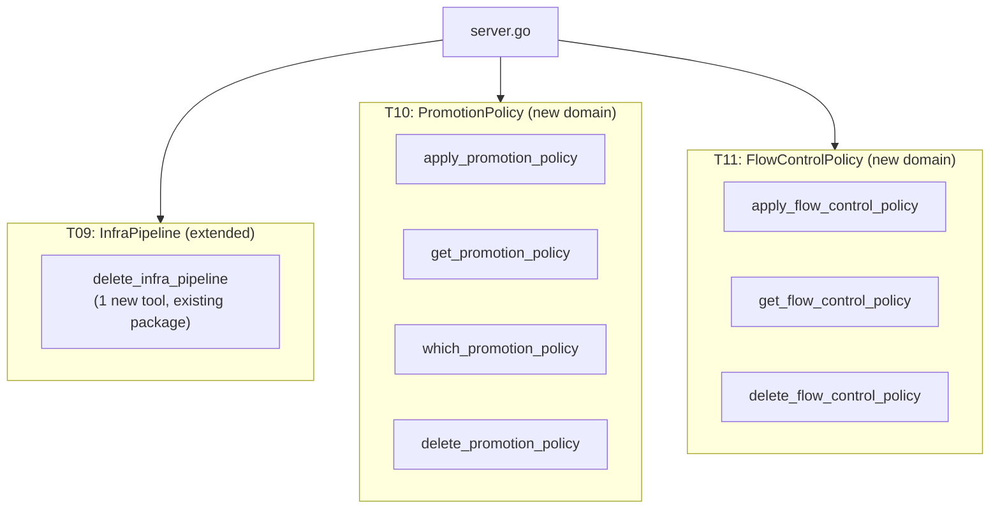
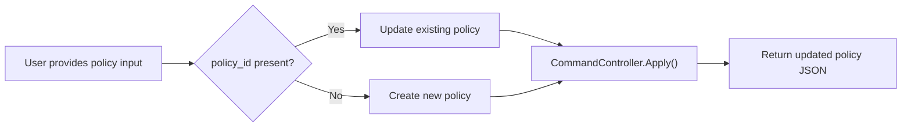

# Tier 2 Complete: InfraPipeline Cleanup + PromotionPolicy + FlowControlPolicy (8 Tools)

**Date**: March 1, 2026

## Summary

Completed all remaining Tier 2 tasks (T09, T10, T11) in the MCP Server Gap Completion project, delivering 8 new tools across 3 domains. This session added pipeline record deletion, cross-environment promotion governance, and stack job flow control — capabilities that give the AI agent full lifecycle control over deployment policies and infrastructure pipeline management.

## Problem Statement

After T08 (IAM), the MCP server had comprehensive resource management, credential handling, and access control — but lacked governance tools. An AI agent could deploy infrastructure but could not:

- Clean up pipeline records after they were no longer needed
- Define or inspect promotion policies that govern how deployments flow across environments (dev → staging → production)
- Configure flow control settings that determine whether stack jobs require manual approval, preview steps, or lifecycle event handling

### Pain Points

- No `delete` operation for InfraPipeline — stale pipeline records accumulated with no cleanup path
- PromotionPolicy was entirely unmanaged — the directed acyclic graph of environment promotions could only be configured through the web console
- FlowControlPolicy settings (manual approval, preview-before-update, etc.) required the web console for any changes
- Gap analysis overestimated T09 scope (claimed 2 missing triggers that were already covered)

## Solution

Delivered 8 MCP tools organized into 3 domains following the project's established domain-driven package structure.

### Architecture



### Policy Apply Pattern

Both PromotionPolicy and FlowControlPolicy use a unified `apply` (create-or-update) tool instead of separate `create` and `update` tools. This was a deliberate architectural decision:



**Rationale**: Both policies are **selector-scoped singletons** — there is at most one promotion policy or flow control policy per selector (e.g., per organization, per environment). Their create and update input shapes are identical. This matches the `connect_credential` pattern already established in the codebase, rather than the Org/Env pattern where create and update have distinct field sets.

## Implementation Details

### T09: delete_infra_pipeline

Extended the existing `internal/domains/infrahub/infrapipeline/` package with a single new file (`delete.go`) and minimal updates to `tools.go` and `register.go`. Follows the same pattern as `cancel.go` — single ID input, command controller call, marshal response.

The gap analysis originally listed T09 as "Missing Trigger Variants (2 tools)", but upon thorough analysis of `InfraPipelineCommandController`, all explicit trigger RPCs (`RunByStackId`, `RunByStackInputId`, `RunByStackInputModuleInstanceId`) were already covered by the existing `run_infra_pipeline` tool. The only genuinely missing operation was `Delete`.

### T10: PromotionPolicy (4 tools)

New domain at `internal/domains/resourcemanager/promotionpolicy/` with 7 Go files.

**`apply_promotion_policy`** accepts a typed graph input — environment nodes and promotion edges with optional `manual_approval` flags — and constructs the full `PromotionPolicy` proto internally:

```go
type ApplyPromotionPolicyInput struct {
    PolicyID     string                 `json:"policy_id,omitempty"`
    Name         string                 `json:"name,omitempty"`
    SelectorKind string                 `json:"selector_kind"`
    SelectorID   string                 `json:"selector_id"`
    Strict       bool                   `json:"strict,omitempty"`
    Nodes        []EnvironmentNodeInput `json:"nodes"`
    Edges        []PromotionEdgeInput   `json:"edges"`
}
```

**`get_promotion_policy`** provides dual-resolution — by `policy_id` (direct lookup) or by `selector_kind + selector_id` (scoped lookup). This mirrors the established dual-resolution pattern from Environment's `get_environment`.

**`which_promotion_policy`** resolves the *effective* policy with inheritance: if an org-specific policy exists, it returns that; otherwise it falls back to the platform default. This uses `PromotionPolicyQueryController.WhichPolicy(ApiResourceSelector)`.

### T11: FlowControlPolicy (3 tools)

New domain at `internal/domains/infrahub/flowcontrolpolicy/` with 6 Go files. Structurally mirrors T10 but with flat boolean flags instead of a graph:

```go
type ApplyFlowControlPolicyInput struct {
    PolicyID                              string `json:"policy_id,omitempty"`
    Name                                  string `json:"name,omitempty"`
    SelectorKind                          string `json:"selector_kind"`
    SelectorID                            string `json:"selector_id"`
    IsManual                              bool   `json:"is_manual,omitempty"`
    DisableOnLifecycleEvents              bool   `json:"disable_on_lifecycle_events,omitempty"`
    SkipRefresh                           bool   `json:"skip_refresh,omitempty"`
    PreviewBeforeUpdateOrDestroy          bool   `json:"preview_before_update_or_destroy,omitempty"`
    PauseBetweenPreviewAndUpdateOrDestroy bool   `json:"pause_between_preview_and_update_or_destroy,omitempty"`
}
```

**`whichFlowControlPolicy` deliberately excluded** — this RPC lives in `StackJobEssentialsQueryController` (not the FlowControlPolicy controllers), returns a composite meta-response rather than the policy itself, and overlaps with the existing `check_stack_job_essentials` tool.

### Selector Kind Resolution

Both policy domains use `domains.NewEnumResolver[ApiResourceKind]` for mapping user-friendly strings (e.g., `"organization"`, `"environment"`, `"platform"`) to the `ApiResourceKind` protobuf enum. This is the same resolver pattern established in IAM policy's `list_principals` tool.

## Benefits

- **Complete Tier 2 coverage** — All 11 Tier 2 tasks are now finished
- **Pipeline hygiene** — Agents can clean up stale InfraPipeline records
- **Deployment governance** — Promotion policies can be defined, queried, and managed programmatically
- **Execution control** — Flow control settings (manual gates, preview steps, lifecycle event handling) are now fully manageable through the MCP server
- **Consistent patterns** — Both new domains follow identical structural patterns (doc.go → register.go → tools.go → per-operation files) with consistent apply/get/delete semantics

## Impact

- **MCP server tool count**: +8 tools (from ~68 to ~76 total)
- **New packages**: 2 (`resourcemanager/promotionpolicy`, `infrahub/flowcontrolpolicy`)
- **Files created**: 14 new Go files
- **Files modified**: 3 existing Go files
- **Build status**: Clean (`go build ./...` passes, zero linter errors)

## Related Work

- Follows patterns established in [T05: Connect Domain](2026-03-01-173404-connect-domain-credential-management.md) (apply pattern for singletons)
- Extends [InfraPipeline domain](../../_changelog/2026-02/2026-02-28-012036-phase1c-infrapipeline-mcp-tools.md) with delete capability
- Uses enum resolver pattern from [T08: IAM Domain](2026-03-01-182753-iam-domain-and-provider-connection-authorization.md)
- Completes all Tier 2 tasks from the [gap completion project](_projects/2026-03/20260301.01.mcp-server-gap-completion/)

---

**Status**: ✅ Production Ready
**Timeline**: Single session (~1 hour)
