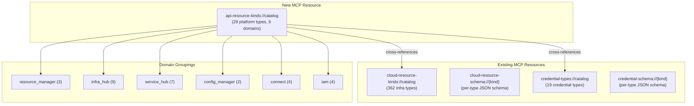

# API Resource Kinds Catalog — Platform Navigation for Agents

**Date**: March 1, 2026

## Summary

Added the `api-resource-kinds://catalog` MCP resource, a curated static catalog of all 29 platform API resource types grouped by 6 bounded contexts. This resource serves as the agent's navigational index of the entire Planton platform, complementing the existing domain-specific catalogs for cloud resource kinds and credential types.

## Problem Statement

Agents interacting with the MCP server had no way to discover the full breadth of the platform's resource type system. The existing catalogs (`cloud-resource-kinds://catalog` and `credential-types://catalog`) covered cloud infrastructure and credentials, but there was no unified index showing all platform resource types — organizations, environments, services, IAM resources, policies, pipelines, and more — or how they're organized across bounded contexts.

### Pain Points

- Agents had to discover platform capabilities through trial-and-error tool exploration
- No single resource provided a "table of contents" of the entire platform
- Domain groupings (ResourceManager, InfraHub, ServiceHub, etc.) were implicit in code but not exposed to agents
- The original T12 plan proposed 5 new resources, but investigation revealed 4 were already covered or redundant

## Solution

A single, well-curated MCP resource that provides the platform's resource type taxonomy. Follows the exact static-embedded pattern established by the two existing catalog resources.

### Architecture

### Scope Reduction

The original plan proposed 5 resources. Investigation during planning revealed:

| Proposed Resource | Outcome | Reason |
|---|---|---|
| `api-resource-kinds://catalog` | **Built** | Genuinely missing — no tool or resource covers this |
| `credential-types://catalog` | Dropped | Already delivered in T05 |
| `cloud-object-presets://{kind}` | Dropped | `search_cloud_object_presets` tool already exists |
| `deployment-components://catalog` | Dropped | `search_deployment_components` tool already exists |
| `iac-modules://catalog` | Dropped | `search_iac_modules` tool already exists |

The last three are dynamic database records, not static type-system metadata. Adding static MCP resources would be stale or redundant. The existing `RegisterResources(srv)` signature takes no `serverAddress` — all resources are static/embedded. Introducing runtime-backed resources would break this established pattern.

## Implementation Details

### New Package: `internal/domains/discovery/`

A cross-cutting domain package for platform-wide discovery resources. Three files:

- `doc.go` — Package documentation
- `resources.go` — `CatalogResource()` returns the MCP resource definition; `CatalogHandler()` reads the embedded JSON
- `register.go` — `RegisterResources(srv)` wires it into the server

The handler reads directly from the embedded filesystem — no `sync.Once` catalog builder needed (unlike cloudresource and credential which assemble catalogs from registry files). The catalog is a single pre-built JSON file.

### Catalog Data: `schemas/apiresourcekinds/catalog.json`

Hand-crafted JSON containing 29 curated kinds across 6 domains, with cross-references to the credential and cloud resource catalogs. Internal/system kinds (unspecified, test_api_resource, platform, session, execution, chat, billing_account, etc.) are excluded.

### Embedding: `schemas/embed.go`

New `ApiResourceKindFS` embed directive for the `apiresourcekinds/` directory, following the same pattern as `FS` (providers) and `CredentialFS` (credentials).

## Benefits

- Agents can discover the full platform taxonomy in a single resource read
- Domain groupings make it clear how resource types relate to bounded contexts
- Cross-references to existing catalogs avoid duplication
- Static embedding means zero runtime cost and no gRPC dependencies

## Impact

- **MCP resource count**: 4 → 5
- **Files created**: 4 (catalog JSON + 3 Go files)
- **Files modified**: 2 (embed.go, server.go)
- **New package**: `internal/domains/discovery/`

## Related Work

- [Connect Domain Credential Management](2026-03-01-173404-connect-domain-credential-management.md) — delivered `credential-types://catalog` and `credential-schema://{kind}` resources (T05)
- [Cloud Resource Kinds Catalog](../2026-02/2026-02-26-233158-cloud-resource-kinds-catalog-resource.md) — original `cloud-resource-kinds://catalog` resource

---

**Status**: ✅ Production Ready
