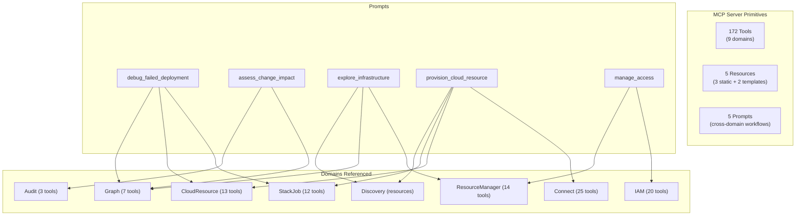

# MCP Prompts — Cross-Domain Workflow Templates

**Date**: March 1, 2026

## Summary

Added 5 MCP prompts to the Planton Cloud MCP server, implementing the third and final MCP primitive alongside the existing 172 tools and 5 resources. Each prompt encodes a cross-domain workflow that an LLM couldn't easily discover from tool descriptions alone — from debugging failed deployments (5+ tools across stackjob, cloudresource, and graph) to guided cloud resource provisioning (4+ domains, 7-step workflow).

## Problem Statement

With 172 tools spread across 9 domains, the MCP server has comprehensive API coverage but no way to guide agents through complex multi-step workflows. The MCP specification defines three primitives — tools, resources, and prompts — but only the first two were implemented.

### Pain Points

- Agents must discover tool sequences through trial-and-error or by reading descriptions of all 172 tools
- Non-obvious tools like `get_error_resolution_recommendation` and `get_impact_analysis` are rarely discovered organically
- Cross-domain workflows (debug a deployment, provision infrastructure, manage IAM) require knowledge of tools in 2-4 separate bounded contexts
- New users have no guided "entry points" into the platform's capabilities
- The MCP server advertised only tools and resources, leaving the third primitive unused

## Solution

Five carefully crafted MCP prompts that serve as conversation starters for the platform's highest-value cross-domain workflows. Each prompt uses a hybrid content style: states the goal clearly, then provides a recommended tool sequence as guidance rather than a rigid script.

### Architecture



### Key Design Properties

- **Cross-cutting package**: Prompts span multiple bounded contexts, so they live in `internal/domains/prompts/` (following the `discovery` precedent) rather than inside any single domain
- **Purely static handlers**: No gRPC calls, no dynamic data, no failure modes. Handlers interpolate string arguments into pre-written text, making them fast, testable, and reliable
- **Hybrid content style**: Goal-oriented framing with a recommended tool sequence — prescriptive enough to surface non-obvious tools, flexible enough for the LLM to adapt
- **Shared helpers**: `PromptResult` and `UserMessage` added to `internal/domains/toolresult.go` alongside existing `TextResult` and `ResourceResult`

## Implementation Details

### Per-File Pattern

Each prompt file contains three cleanly separated concerns:

1. **Prompt definition** (`XxxPrompt() *mcp.Prompt`): Name, description, and typed arguments
2. **Handler** (`XxxHandler() mcp.PromptHandler`): Thin adapter that calls the text builder
3. **Text builder** (`buildXxxText(args...) string`): Pure function that constructs the prompt message, independently testable

### The 5 Prompts

| Prompt | Arguments | Domains Spanned | Key Non-Obvious Tools Surfaced |
|--------|-----------|-----------------|-------------------------------|
| `debug_failed_deployment` | `resource_id`, `stack_job_id` | stackjob, cloudresource, graph | `get_error_resolution_recommendation`, `find_iac_resources_by_stack_job`, `get_stack_job_input` |
| `assess_change_impact` | `resource_id` (required), `change_type` | graph, audit | `get_impact_analysis`, `get_dependents`, `list_resource_versions` |
| `explore_infrastructure` | `org_id` | resourcemanager, graph, discovery | `get_organization_graph`, `get_environment_graph`, `api-resource-kinds://catalog` |
| `provision_cloud_resource` | `kind`, `org_id`, `env_id` | connect, cloudresource, stackjob, discovery | `resolve_default_provider_connection`, `search_cloud_object_presets`, `cloud-resource-schema://{kind}` |
| `manage_access` | `org_id`, `resource_id` | IAM (all 5 sub-packages) | `list_principals`, `check_authorization`, `revoke_org_access` (with nuclear-option warning) |

### Server Registration

Registration follows the established three-tier pattern:

```
server.New()
  ├── registerTools(srv, serverAddress)     // 172 tools across 32 packages
  ├── registerResources(srv)                // 5 resources across 3 packages
  └── registerPrompts(srv)                  // 5 prompts from 1 cross-cutting package (NEW)
```

### Prompt Content Example

The `debug_failed_deployment` prompt adapts based on provided arguments:

- With both `resource_id` and `stack_job_id`: skips discovery steps, goes straight to diagnosis
- With only `resource_id`: uses `get_latest_stack_job` to find the relevant job
- With neither: asks the user to identify the resource or uses `list_stack_jobs` to find recent failures

## Benefits

- **Discoverability**: Users can browse available workflows without knowing tool names — prompts serve as a menu of the platform's most valuable capabilities
- **Best practices encoded**: The recommended tool sequences represent platform expertise that would otherwise require documentation or training
- **Safety guardrails**: The `assess_change_impact` prompt ensures users check blast radius before destructive operations
- **Onboarding acceleration**: `explore_infrastructure` gives new users a structured entry point into a 172-tool platform
- **Complete MCP surface**: All three MCP primitives (tools, resources, prompts) are now implemented

## Impact

- **MCP server**: Now implements all three MCP primitives — 172 tools, 5 resources, 5 prompts
- **Agent experience**: Agents in MCP-compatible clients (Cursor, Claude Desktop) can now browse and select workflows
- **Maintenance**: Prompt text references tool names as stable identifiers; if tools are renamed, prompts are updated alongside
- **Extensibility**: Adding new prompts follows the same three-function pattern — copy a prompt file, implement the three functions, add one line to `register.go`

## Files Changed

**Created (7 files):**
- `internal/domains/prompts/doc.go` — Package documentation
- `internal/domains/prompts/register.go` — Prompt registration (5 `AddPrompt` calls)
- `internal/domains/prompts/debug_deployment.go` — `debug_failed_deployment` prompt
- `internal/domains/prompts/assess_impact.go` — `assess_change_impact` prompt
- `internal/domains/prompts/explore_infrastructure.go` — `explore_infrastructure` prompt
- `internal/domains/prompts/provision_resource.go` — `provision_cloud_resource` prompt
- `internal/domains/prompts/manage_access.go` — `manage_access` prompt

**Modified (2 files):**
- `internal/domains/toolresult.go` — Added `PromptResult` and `UserMessage` helpers
- `internal/server/server.go` — Added `registerPrompts(srv)` call and `prompts` import

## Related Work

- **T05 Connect Domain** (2026-03-01): Established `credential-types://catalog` MCP resource — prompts reference this via `provision_cloud_resource`
- **T06 StackJob AI-Native Tools** (2026-03-01): Added `get_error_resolution_recommendation` — surfaced by `debug_failed_deployment` prompt
- **T08 IAM Domain** (2026-03-01): Added 20 IAM tools — the `manage_access` prompt guides users through this complex domain
- **T12 API Resource Kinds Catalog** (2026-03-01): Added `api-resource-kinds://catalog` — referenced by `explore_infrastructure` prompt

---

**Status**: Experimental
**Timeline**: Single session
