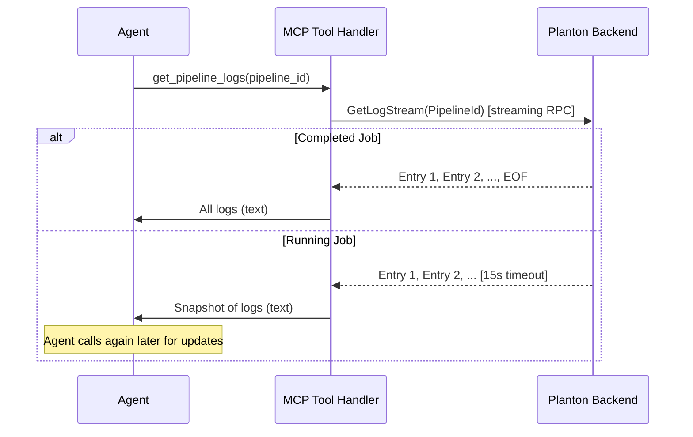

# Pipeline Log Retrieval: Stream-Collect-Return Tools

**Date**: March 2, 2026

## Summary

Added two new MCP tools (`get_pipeline_logs`, `get_infra_pipeline_logs`) that give AI agents access to raw Tekton task logs from CI/CD pipelines. The tools internally call gRPC server-streaming RPCs, collect all entries until EOF or a bounded timeout, and return them as a single text response — bridging the gap between streaming-only backend APIs and MCP's request-response protocol. A generic `DrainStream[T]` utility was introduced as shared infrastructure for any future streaming-to-unary bridges.

## Problem Statement

The MCP server had no way to retrieve raw pipeline logs. While `get_pipeline` and `get_infra_pipeline` return rich structured status (errors, diagnostics, per-task state), the actual stdout/stderr output from build and deployment pods was only available via server-streaming `getLogStream` RPCs — incompatible with MCP's unary tool model.

### Pain Points

- Agents debugging build failures could see *that* a task failed and the error summary, but not *what the build actually printed* (test output, compiler errors, npm install logs)
- No unary log-retrieval RPCs exist anywhere in the Planton API — all 5 log endpoints are server-streaming
- A previous attempt at log tools was abandoned due to streaming complexity

## Solution

Introduced a **stream-collect-return** pattern: MCP tools that internally consume a streaming RPC, buffer entries in memory, and return the batch as plain text. From the MCP protocol perspective, the tool is strictly request-response.

### Architecture



### Two Behaviors Based on Job State

- **Completed/failed job**: Server replays all historical logs, sends EOF. Tool returns complete logs instantly (seconds).
- **Running job**: Server replays history, then emits new logs in real-time. Tool collects for up to 15 seconds, then returns the snapshot. Agent calls again later for updates — identical to how agents already poll terminal commands.

## Implementation Details

### Generic `DrainStream[T]` Utility

The core infrastructure is a generic function that works with any `grpc.ServerStreamingClient[T]`:

```go
func DrainStream[T any](
    stream grpc.ServerStreamingClient[T],
    maxEntries int,
    format func(*T) string,
) (text string, count int, err error)
```

Key properties:
- Reads until `io.EOF` (stream complete) or context error (timeout)
- Caps at `maxEntries` (1000) to prevent massive responses
- Caller provides a `format` function — keeps proto imports out of the shared package
- Returns partial results on timeout (not an error — expected for running jobs)

### Timeout Strategy

A `StreamCollectTimeout = 15s` constant sits alongside the existing `DefaultRPCTimeout = 30s`. Each log tool creates a derived context with the shorter timeout inside the standard `WithConnection` callback — no changes to the shared connection infrastructure.

### Output Format

Plain text with task-name prefixes (not JSON — logs are inherently textual, fewer tokens for the agent):

```
Collected 42 log entries.

[build-step] Downloading dependencies...
[build-step] npm install completed
[test-step] Running tests...
[test-step] FAIL: test_auth.go:42 - expected 200, got 401
```

### Tools Delivered

| Tool | Domain | RPC | Input |
|------|--------|-----|-------|
| `get_pipeline_logs` | ServiceHub Pipeline | `PipelineQueryController.GetLogStream` | `pipeline_id` |
| `get_infra_pipeline_logs` | InfraPipeline | `InfraPipelineQueryController.GetLogStream` | `infra_pipeline_id` |

### Not for StackJob

StackJob has no `getLogStream` RPC. Its structured progress events (errors, IaC diagnostics, resource diffs, prelude messages) are already fully surfaced via `get_stack_job` and `get_error_resolution_recommendation`.

## Benefits

- **Agents can now see raw build output** — test results, compiler errors, npm logs, Terraform CLI output
- **No backend changes required** — uses existing streaming RPCs in a novel way
- **Reusable infrastructure** — `DrainStream[T]` works for any future streaming-to-unary bridge
- **Bounded resource usage** — 15s timeout + 1000 entry cap prevent runaway memory or response sizes
- **Natural polling model** — for running jobs, agents call the tool repeatedly, matching the pattern they already use for terminal commands

## Impact

- ServiceHub Pipeline: 9 → 10 tools
- InfraPipeline: 8 → 9 tools
- 3 new files, 5 modified files
- Establishes the stream-collect-return pattern as a precedent for the MCP server

## Related Work

- **T14 Investigation** (`t14-pipeline-log-retrieval.plan.md`) — full analysis of status vs logs, streaming API audit, and architectural options
- **Previous log attempt** (Dec 2025) — earlier implementation abandoned due to streaming complexity; this approach avoids those issues by treating the stream as an internal implementation detail
- **T06 StackJob AI-Native Tools** — complementary: stack job debugging via structured diagnostics rather than raw logs

---

**Status**: ✅ Production Ready
**Timeline**: ~1 hour (investigation + implementation)
