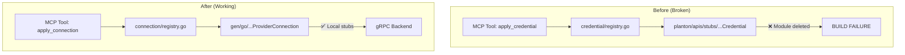
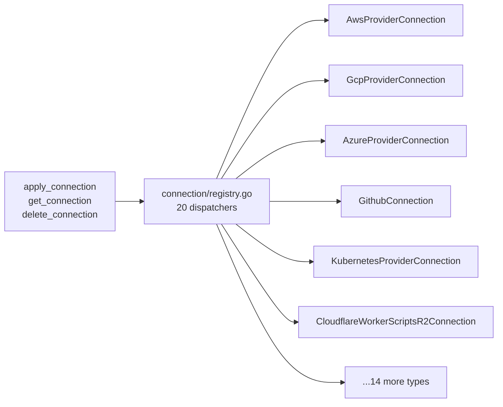

# Proto Contract Sync: Credential-to-Connection Migration

**Date**: March 8, 2026

## Summary

Migrated the entire MCP server codebase from the deprecated `planton/apis/stubs` proto module to locally generated `gen/go` stubs, and renamed the connect domain from "credential" to "connection" to match the restructured protobuf contracts. This fixes the broken build, aligns 20 connection type dispatchers with the new proto definitions, removes unnecessary secret field redaction, and updates 180 files across all domains.

## Problem Statement

The proto definitions were restructured upstream: all `*Credential` types became `*ProviderConnection` or `*Connection`, the import module changed from `plantonhq/planton/apis/stubs` to locally generated code under `gen/go`, and a new connection type (`CloudflareWorkerScriptsR2Connection`) was added. The MCP server build was completely broken.

### Pain Points

- `go build ./...` failed — `credential/registry.go` and `github/tools.go` imported from the deleted `planton/apis/stubs` module
- 150+ files across all domains still referenced `planton/apis/stubs` for commons/apiresource and other shared types
- MCP tool names (`apply_credential`, `get_credential`) and resource URIs (`credential-types://catalog`) were out of sync with the backend terminology
- The redaction logic in `redact.go` was designed for plaintext secrets, but the new proto contracts use `ConnectionFieldSecretRef` slug references that aren't sensitive
- 19 JSON schemas in `schemas/credentials/` referenced old type names and field structures

## Solution

A phased migration executed in a single session:

1. **Package rename**: `internal/domains/connect/credential/` → `internal/domains/connect/connection/`
2. **Proto import sync**: All 150+ domain files updated to use `gen/go` import paths
3. **Type and API rename**: 20 connection dispatchers rewritten with new proto types and gRPC controller constructors
4. **Schema migration**: `schemas/credentials/` → `schemas/connections/`, all 21 files renamed and rewritten
5. **Redaction removal**: `redact.go` deleted, `sensitiveFields` removed from registry — secret slugs are not sensitive

### Architecture

### Connection Dispatcher Pattern

## Implementation Details

### Package Migration (11 Go files)

The `connect/credential` package was renamed to `connect/connection` with these key changes across every file:

- **`registry.go`**: 20 connection dispatchers (up from 19), each with `apply`, `get`, `getByOrgBySlug`, and `del` functions. All import paths switched from `planton/apis/stubs/.../v1` to `gen/go/ai/planton/connect/.../v1`. The `sensitiveFields` map was removed entirely.

- **`tools.go`**: MCP tool definitions renamed — `apply_credential` → `apply_connection`, `get_credential` → `get_connection`, `delete_credential` → `delete_connection`, `search_credentials` → `search_connections`, `check_credential_slug` → `check_connection_slug`. Input struct fields renamed accordingly.

- **`resources.go`**: MCP resources renamed — `credential-types://catalog` → `connection-types://catalog`, `credential-schema://{kind}` → `connection-schema://{kind}`.

- **`search.go`**: The `connectionKindToAPIResourceKind` map rebuilt with 20 entries using new `ApiResourceKind_..._connection` enum values, and the RPC call updated to `SearchConnectionApiResourcesByContext`.

- **`get.go`**: Removed the `redactFields` call and related imports. The response now returns the full connection object including secret slug references.

- **`redact.go`**: Deleted. Secret slugs in `ConnectionFieldSecretRef` are identifiers, not sensitive data.

### Schema Migration (21 JSON files)

- Renamed directory: `schemas/credentials/` → `schemas/connections/`
- Renamed 19 existing files (e.g., `awscredential.json` → `awsproviderconnection.json`)
- Created `cloudflareworkerscriptsr2connection.json` for the new 20th type
- Rewrote `registry.json` with 20 entries pointing to new filenames
- Updated `schemas/embed.go`: embed path to `connections`, `CredentialFS` → `ConnectionFS`

### Cross-Domain Import Path Update (150+ files)

Every domain package (audit, configmanager, graph, iam, infrahub, resourcemanager, servicehub) had its proto imports updated from `plantonhq/planton/apis/stubs/...` to `plantonhq/mcp-server-planton/gen/go/...`. These were small, mechanical changes (1-8 lines per file) but touched the majority of the codebase.

## Benefits

- **Build is green**: `go build ./...` and `go vet ./...` pass cleanly
- **Terminology alignment**: MCP tool surface matches the proto definitions — no more credential/connection naming drift
- **Simplified codebase**: Removed 67 lines of redaction logic that was unnecessary under the new secret slug model
- **Future-proof**: Local `gen/go` stubs mean no dependency on external proto module publication
- **20 connection types**: Added CloudflareWorkerScriptsR2Connection, bringing the total to 20

## Impact

- **MCP tool consumers**: Tool names changed from `*_credential` to `*_connection`. Resource URIs changed from `credential-*` to `connection-*`. This is a breaking change for any clients referencing old tool names.
- **Developers**: All proto imports now use `gen/go` — consistent, local, and version-controlled.
- **Security model**: No functional change. Secret slugs were never sensitive; removing redaction just makes the response more useful.

## Code Metrics

| Metric | Value |
|--------|-------|
| Files changed | 180 |
| Lines added | ~326 |
| Lines removed | ~1,784 |
| Net reduction | ~1,458 lines |
| Connection types | 20 (was 19) |
| Domains updated | 10 |
| JSON schemas migrated | 21 |

## Related Work

- [Rename "Planton Cloud" to "Planton"](2026-03-07-035140-rename-planton-cloud-to-planton.md) — preceding codebase-wide rename
- [Connect Domain Credential Management](2026-03-01-173404-connect-domain-credential-management.md) — original credential dispatcher implementation
- [Connect Domain Tool Architecture Decision](2026-03-01-042952-connect-domain-tool-architecture-decision.md) — architectural foundation for the connect domain

---

**Status**: ✅ Production Ready
**Timeline**: Single session (~3 hours)
