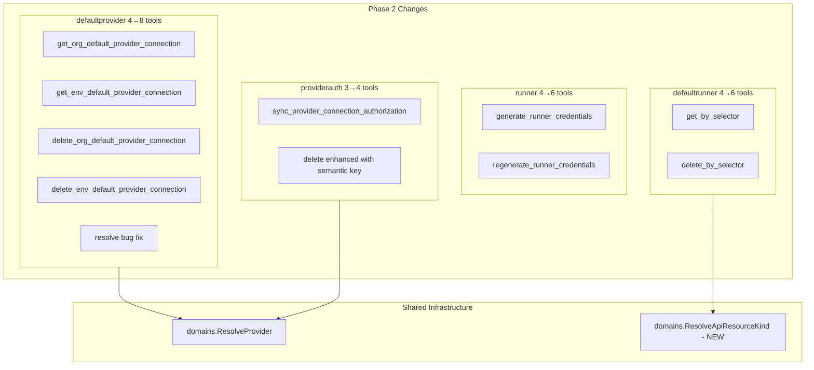

# Phase 2: Enrich Existing Connect Tools

**Date**: March 8, 2026

## Summary

Wired 9 new MCP tools and enhanced 1 existing tool across 4 connect domain sub-packages, exposing previously unavailable gRPC methods to LLM agents. Also fixed a confirmed bug where the `resolve_default_provider_connection` handler silently dropped the `Provider` field, sending `UNSPECIFIED` to the server.

## Problem Statement

After Phase 1 (credential-to-connection migration), the MCP server's connect domain had a working build but only exposed a subset of the available gRPC surface. Several useful methods — org/env-level default lookups, runner credential generation, authorization sync, and selector-based operations — existed in the proto definitions but had no MCP tool wiring.

### Pain Points

- `defaultprovider` had 4 tools but the proto surface offered 12 methods (6 query + 6 command)
- `runner` had no way to generate or rotate runner authentication credentials via MCP
- `providerauth` delete only worked by ID, while the proto also supported semantic key deletion
- `defaultrunner` had no selector-based operations for indirect resource lookups
- The existing `resolve_default_provider_connection` had a silent bug — Provider was required by the user but never sent to the server

## Solution

Added tools methodically, following established codebase patterns (Tool+Handler pairs, `domains.WithConnection`, `domains.ResolveProvider`), while making deliberate design choices about what NOT to wire.

### Architecture



## Implementation Details

### Bug Fix: Resolve Handler Missing Provider

The `ResolveDefaultProviderConnectionRequest` proto has three fields: `Org`, `Provider` (required, buf-validated non-zero), and `Environment`. The handler collected `Provider` from the user but only set `Org` and `Environment`:

```go
// Before (broken — Provider sent as 0/UNSPECIFIED):
client.Resolve(ctx, &ResolveDefaultProviderConnectionRequest{
    Org:         input.Org,
    Environment: input.Environment,
})

// After (fixed — Provider correctly resolved and passed):
providerEnum, _ := domains.ResolveProvider(input.Provider)
client.Resolve(ctx, &ResolveDefaultProviderConnectionRequest{
    Org:         input.Org,
    Provider:    providerEnum,
    Environment: input.Environment,
})
```

### T02.1: defaultprovider — Explicit Level Lookups

Added 4 tools for direct org-level and env-level default operations. These are semantically distinct from the existing `resolve` (which applies env→org fallback) and `get` (which takes an ID):

| Tool | Semantics |
|------|-----------|
| `get_org_default_provider_connection` | Org-level only, no fallback |
| `get_env_default_provider_connection` | Env-level only, no fallback |
| `delete_org_default_provider_connection` | Delete by org+provider |
| `delete_env_default_provider_connection` | Delete by org+provider+env |

### T02.2: runner — Credential Generation

Two tools for generating and rotating runner authentication material. Both call Command controller methods and return `RunnerCredentials` containing private keys, certificates, and API keys. Tool descriptions include explicit security warnings since the response contains sensitive cryptographic material.

### T02.3: defaultrunner — Selector-Based Operations

Added `get_default_runner_binding_by_selector` and `delete_default_runner_binding_by_selector` using `ApiResourceSelector{Kind, Id}`. Required a new `ResolveApiResourceKind` enum resolver in `internal/domains/kind.go`, following the established `EnumResolver` pattern.

### T02.4: providerauth — Sync + Enhanced Delete

Added `sync_provider_connection_authorization` for reconciling authorization state. Enhanced the existing `delete_provider_connection_authorization` to accept either an ID or a semantic key (org + provider + connection), mirroring the dual-resolution pattern already used by the Get tool.

### What We Deliberately Skipped

- **`Find` methods** — Proto docs say "restricted to platform operators only". Wiring as MCP tools would violate the intended access model.
- **`Create`/`Update`** — Already covered by `Apply` (idempotent create-or-update).
- **OAuth callback handlers** — Browser redirect endpoints, not agent-callable.
- **`GetBySelectorBySlug`** on runner — Niche internal reference pattern with low MCP value.

## Benefits

- **9 new tools** expose operations that were previously only available through the web console or direct gRPC
- **Bug fix** ensures `resolve_default_provider_connection` actually filters by provider
- **Semantic key delete** on providerauth eliminates the need to look up an ID before deleting
- **Credential generation** enables full runner lifecycle management through MCP
- **Zero new packages** — all tools added to existing, already-registered packages
- **No server.go changes** — registration was already in place from Phase 1

## Impact

- **LLM agents** gain fine-grained control over default provider connections at org and env levels
- **Runner management** is now complete (CRUD + credentials) through MCP
- **Authorization management** has parity between Get and Delete (both support dual resolution)
- **Build remains clean** — `go build ./...` and `go vet ./...` pass

## Related Work

- Phase 1: Proto contract sync (credential→connection migration) — `2026-03-08-001701`
- T02.5 (provider-specific controllers) deferred to next session — design decision needed on OAuth initiation scope

---

**Status**: ✅ Production Ready (T02.1–T02.4), 🟡 T02.5 Pending Decision
**Timeline**: Single session (~1 hour)
