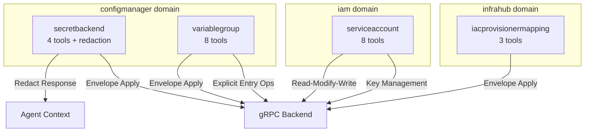
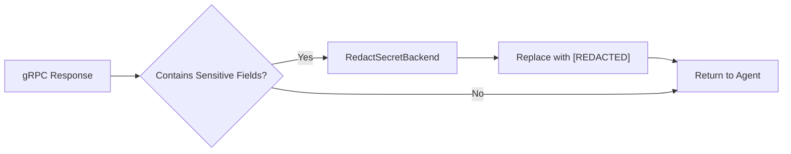

# Phase 3: New Resource Tools — SecretBackend, VariableGroup, ServiceAccount, IacProvisionerMapping

**Date**: March 8, 2026

## Summary

Added 23 MCP tools across 4 new domain packages for resources introduced in the latest protobuf contract sync. This covers secret backend lifecycle with credential redaction, variable group management with entry-level operations, service account CRUD with API key management, and IaC provisioner mapping overrides. All tools follow established patterns and pass `go build` and `go vet` clean.

## Problem Statement

The restructured protobuf contracts introduced 4 new resources (`SecretBackend`, `VariableGroup`, `ServiceAccount`, `IacProvisionerMapping`) that had generated Go stubs but no MCP tool implementations. Agents had no way to manage these resources through the MCP server.

### Pain Points

- No agent access to secret backend configuration (where encrypted data is stored)
- No way to manage grouped configuration variables or resolve individual entries
- Service accounts (machine identities for programmatic access) had no management tools
- IaC provisioner assignments could not be overridden per resource

## Solution

Implemented 4 new tool packages following the established domain patterns, with targeted architectural decisions for each resource's unique characteristics.

### Architecture

### Key Components

**SecretBackend** (`configmanager/secretbackend/`) — Manages where encrypted secret data is stored. Supports 6 backend types (platform OpenBAO, external OpenBAO, AWS Secrets Manager, HashiCorp Vault, GCP Secret Manager, Azure Key Vault). A dedicated `redact.go` module replaces 10 sensitive fields (tokens, access keys, client secrets, service account key JSON) with `[REDACTED]` in all responses. This is defense-in-depth — the backend already applies mask-on-write for query responses, but command responses may contain unmasked data.

**VariableGroup** (`configmanager/variablegroup/`) — Bundles related configuration variables into named, scoped groups. The hybrid API design uses Envelope Apply for full-group operations (complex nested entries with optional source references) and explicit parameters for entry-level operations (upsert, delete, refresh) — the high-frequency agent operations where discoverability matters. Includes a dedicated resolve tool that returns just the plain string value for quick lookups.

**ServiceAccount** (`iam/serviceaccount/`) — Machine identities for programmatic API access. Uses the read-modify-write pattern for updates (same as `iam/team`) since the proto has no Apply RPC. Key management tools include a sensitive-output warning on key creation (raw key shown once, never stored).

**IacProvisionerMapping** (`infrahub/iacprovisionermapping/`) — Simple binding that overrides the platform default IaC provisioner for a specific resource. Three tools: apply, get, delete.

## Implementation Details

### Apply Patterns

Two Apply patterns were used, matching the complexity of each resource's spec:

| Resource | Apply Style | Rationale |
|----------|------------|-----------|
| SecretBackend | Envelope (`map[string]any` → `protojson`) | 6 mutually exclusive config blocks, ~30 fields, 80% irrelevant per backend type |
| VariableGroup | Envelope | Nested repeated entries with optional source references |
| IacProvisionerMapping | Envelope | Consistent with other infrahub resources |
| ServiceAccount | Explicit params (Create) | Simple spec: just display_name + description. No Apply in proto. |

### Identification Patterns

Dual-path identification (ID vs semantic key) was implemented for resources that support it:

| Resource | ID Path | Semantic Key Path |
|----------|---------|-------------------|
| SecretBackend | `SecretBackendId` | `org + slug` |
| VariableGroup | `VariableGroupId` | `org + scope + slug` |
| ServiceAccount | `ServiceAccountId` | N/A (ID only) |
| IacProvisionerMapping | `ApiResourceId` | N/A (ID only) |

### Security Boundary: SecretBackend Redaction

Redacted fields (10 total across 8 config blocks):
- Backend configs: OpenBAO token, AWS access key + secret, HashiCorp Vault token, GCP SA key JSON, Azure client secret
- Encryption configs: AWS KMS access key + secret, GCP KMS SA key JSON, Azure Key Vault client secret

### File Structure Per Package

Each package follows the established pattern:
- `doc.go` — Package documentation listing all tools
- `register.go` — `Register(srv, serverAddress)` with `mcp.AddTool` calls
- `tools.go` — Input structs, Tool/Handler functions, shared validation
- `{operation}.go` — Business logic per operation (get, apply, delete, etc.)

## Benefits

- **23 new agent capabilities** covering 4 resource types
- **Security enforcement** — agents never see raw cloud credentials
- **Consistent patterns** — every package follows the same structure established in Phases 1 and 2
- **Dual-path identification** — agents can use either system IDs or human-readable semantic keys
- **Zero new shared utilities** — all existing helpers (`WithConnection`, `MarshalJSON`, `RPCError`, `TextResult`, `NewEnumResolver`) were sufficient

## Impact

- **configmanager domain**: 3 → 6 sub-packages, 11 → 23 tools
- **iam domain**: 5 → 6 sub-packages, added 8 service account tools
- **infrahub domain**: 8 → 9 sub-packages, added 3 IaC provisioner mapping tools
- **Total MCP server tools**: +23 new tools

## Related Work

- **Phase 1** (`2026-03-07`): Fixed the build — credential→connection migration, proto import sync
- **Phase 2** (`2026-03-08`): Enriched connect tools — 9 new tools + 1 enhanced + 1 bug fix
- **Phase 3** (this): New resources in existing domains — 23 new tools across 4 packages
- **Next**: Phase 4 (evaluate 7 new domains) or T02.5 (provider-specific controllers)

---

**Status**: ✅ Production Ready
**Timeline**: Single session
