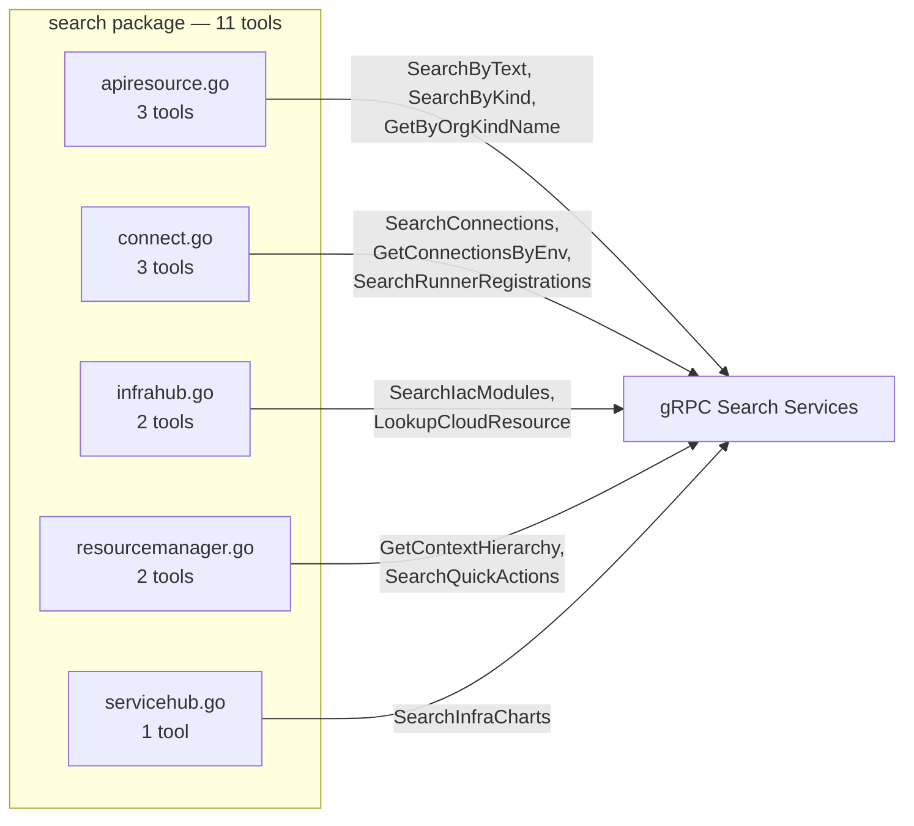
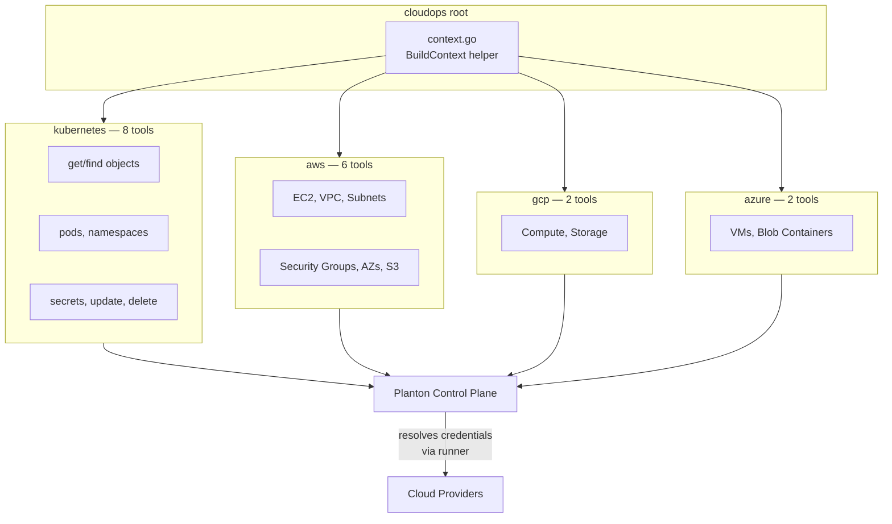
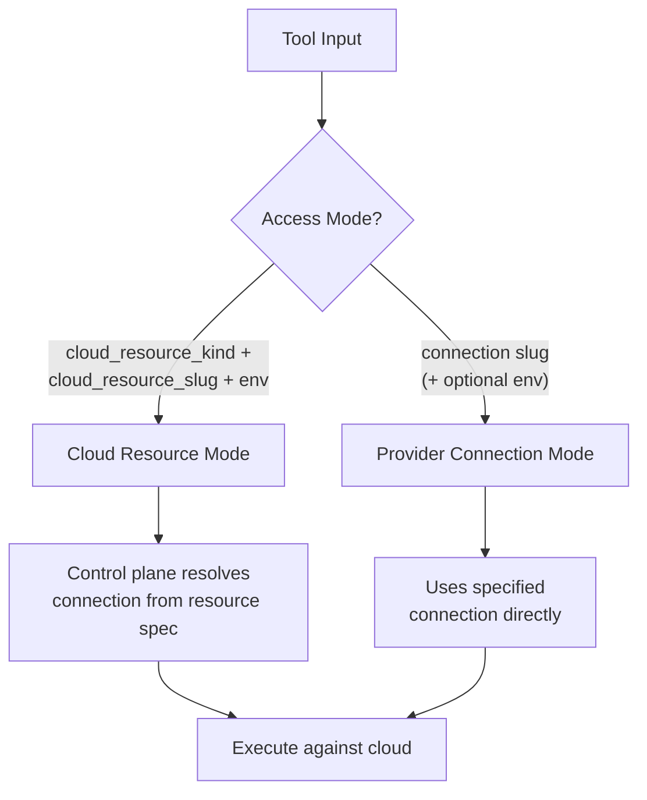

# Phase 4: Search + CloudOps MCP Tools

**Date**: March 8, 2026

## Summary

Added 29 MCP tools across 2 new domain packages — a cross-domain **Search** package (11 query-only tools) and a multi-provider **CloudOps** package (18 live infrastructure tools across Kubernetes, AWS, GCP, and Azure). All tools route through the Planton control plane; CloudOps tools use the `CloudOpsRequestContext` mechanism so no raw cloud credentials are exposed to the MCP client.

## Problem Statement

After Phase 3 completed new resource tools, two significant capability gaps remained:

1. **No cross-domain search** — Agents had no way to discover resources by text, kind, or context. Each domain had its own `Find` methods, but there was no unified search surface.
2. **No live cloud operations** — Agents could manage infrastructure definitions but couldn't inspect running resources (pods, EC2 instances, storage buckets, etc.).

### Pain Points

- Agents needed multiple tool calls to locate resources across domains
- No way to look up a cloud resource by org + kind + name in a single call
- Debugging live infrastructure required leaving the MCP context entirely
- Kubernetes object inspection, pod listing, and secret lookups were unavailable
- No visibility into AWS, GCP, or Azure resources through the agent

## Solution

### Search Domain (`internal/domains/search/`)

A single package consolidating query-only tools from 5 gRPC search services into a flat, domain-prefixed tool namespace.

### CloudOps Domain (`internal/domains/cloudops/`)

Four provider sub-packages sharing a common `BuildContext` helper that constructs the `CloudOpsRequestContext` with two mutually exclusive access modes.

### CloudOps Access Modes

## Implementation Details

### Search Tools (11)

| Tool | gRPC Service | Purpose |
|------|-------------|---------|
| `search_api_resources_by_text` | `ApiResourceSearchQueryController.SearchByText` | Free-text cross-domain search |
| `search_api_resources_by_kind` | `ApiResourceSearchQueryController.SearchByKind` | Filter by resource kind with pagination |
| `get_api_resource_by_org_kind_name` | `ApiResourceSearchQueryController.GetByOrgByKindByName` | Exact lookup by org + kind + name |
| `search_connections_by_context` | `ConnectSearchQueryController.SearchConnectionApiResourcesByContext` | Find connections by org/env context |
| `get_connections_by_env` | `ConnectSearchQueryController.GetConnectionsByEnv` | Get all connections for an environment |
| `search_runner_registrations_by_org` | `ConnectSearchQueryController.SearchRunnerRegistrationsByOrgContext` | Find runner registrations by org |
| `search_iac_modules_by_org` | `InfraHubSearchQueryController.SearchIacModulesByOrgContext` | Search IaC modules in an org |
| `lookup_cloud_resource` | `CloudResourceSearchQueryController.LookupCloudResource` | Lookup cloud resource by org + env + kind + slug |
| `get_context_hierarchy` | `ResourceManagerSearchQueryController.GetContextHierarchy` | Get full org → env → resource hierarchy |
| `search_quick_actions` | `ResourceManagerSearchQueryController.SearchQuickActions` | Search platform quick actions |
| `search_infra_charts_by_org` | `ServiceHubSearchQueryController.SearchInfraChartsByOrgContext` | Search infra charts in an org |

**Design decision**: `search_infra_projects` was intentionally skipped — it already exists in `infraproject/tools.go`. Including it would cause tool name collision.

### CloudOps Tools (18)

**Kubernetes (8)**:
- `get_kubernetes_object` — fetch any K8s object by namespace/apiVersion/kind/name
- `find_kubernetes_objects_by_kind` — list all objects of a kind in a namespace
- `find_kubernetes_namespaces` — list accessible namespaces (optional label selector)
- `find_kubernetes_pods` — find pods, optionally filtered by pod manager
- `get_kubernetes_pod` — get details of a specific pod
- `lookup_kubernetes_secret_key_value` — decode a specific key from a K8s Secret
- `update_kubernetes_object` — update from base64-encoded YAML manifest
- `delete_kubernetes_object` — delete by namespace/apiVersion/kind/name

**AWS (6)**: `list_ec2_instances`, `list_vpcs`, `list_subnets`, `list_security_groups`, `list_availability_zones`, `list_s3_buckets`

**GCP (2)**: `list_gcp_compute_instances`, `list_gcp_storage_buckets`

**Azure (2)**: `list_azure_virtual_machines`, `list_azure_blob_containers`

**Skipped (streaming)**: `StreamByNamespace`, `StreamNamespaceGraph`, `StreamPodLogs`, `Exec`, `BrowserExec` — MCP does not support server streaming or bidirectional streaming.

### Shared `BuildContext` Helper

The `cloudops/context.go` module validates inputs and constructs `CloudOpsRequestContext` with proper `oneof` wrapping:

- Validates `org` is always present
- Validates mutual exclusivity of cloud resource vs. provider connection mode
- Resolves `CloudResourceKind` enum from PascalCase string via `domains.ResolveKind`
- Returns clear error messages for missing or conflicting parameters

### Pagination Helper

Search tools share a `buildPageInfo` helper that converts 1-based `page_num` / `page_size` from tool input to 0-based `PageInfo.Num` / `PageInfo.Size` for the gRPC layer, with sensible defaults (page 1, size 20).

## Benefits

- **29 new agent capabilities** spanning resource discovery and live infrastructure inspection
- **Zero credential exposure** — CloudOps routes through the control plane, agents never handle cloud credentials
- **Unified search surface** — 5 gRPC search services consolidated into one package with consistent pagination
- **Multi-cloud coverage** — Kubernetes, AWS, GCP, and Azure from a single tool namespace
- **Two access modes** — developers use cloud resource mode (scoped to their deployment), infra admins use provider connection mode (cluster/account-wide)

## Impact

- **New domains**: 2 new top-level domain packages (`search/`, `cloudops/`)
- **New sub-packages**: `cloudops/kubernetes/`, `cloudops/aws/`, `cloudops/gcp/`, `cloudops/azure/`
- **Files created**: 17 new Go files
- **Files modified**: `internal/server/server.go` (5 new imports + Register calls)
- **Total new MCP tools**: +29

## Related Work

- **Phase 1** (`2026-03-07`): Fix the build — credential→connection migration, proto import sync
- **Phase 2** (`2026-03-08`): Enrich connect tools — 9 new tools + 1 enhanced + 1 bug fix
- **Phase 3** (`2026-03-08`): New resources — 23 tools across 4 packages
- **Phase 4** (this): Search + CloudOps — 29 tools across 2 domains
- **Next**: T02.5 (provider-specific controllers) or Phase 5 (enrich existing stable domains)

---

**Status**: ✅ Production Ready
**Timeline**: Single session
