# Phase 2 Stage 2: schema2go Generator

## Architectural Foundation

### Key difference from Stigmer

In Stigmer, each resource has its own gRPC endpoint with compiled proto stubs, so `ToProto()` returns typed proto messages (e.g., `*apikeyv1.ApiKey`). In mcp-server-planton, **ALL 362 providers funnel through a single `CloudResource` RPC** where `cloud_object` is a `google.protobuf.Struct`. This means:

- **No per-provider proto imports** in generated code
- Instead of `ToProto()`, generate `toMap()` which builds `map[string]any`
- The handler uses `structpb.NewStruct()` to convert the map to a Struct
- Generated code is simpler (no proto stub dependencies) but there are 20x more providers

### Field naming decision (RESOLVED)

Use **proto field names (snake_case)** everywhere --- in JSON struct tags, in output map keys, and in MCP resource template schemas. Evidence:

- Java backend uses `JsonFormat.printer().preservingProtoFieldNames()` --- all existing cloud_objects in MongoDB use snake_case
- Go runner's `structToProtoMessage()` preserves Struct keys as-is; `protojson.Unmarshal` accepts snake_case
- Stigmer generated code uses snake_case JSON tags: `json:"idp_id"`, `json:"key_hash"`
- This means no translation layer between input and output --- agent sends snake_case, we validate, output snake_case

### Data flow

```mermaid
flowchart LR
    Agent["Agent (LLM)"] -->|"JSON with snake_case keys"| MCP["MCP Tool Handler"]
    MCP -->|"map[string]any"| Parse["Parse{Kind}()"]
    Parse -->|"unmarshal"| Struct["Typed Go Struct"]
    Struct -->|"validate()"| V["Validated"]
    V -->|"applyDefaults()"| D["Defaulted"]
    D -->|"toMap()"| Map["map with snake_case keys"]
    Map -->|"structpb.NewStruct()"| Proto["structpb.Struct"]
    Proto -->|"CloudResource.Spec.CloudObject"| GRPC["gRPC apply()"]
```




## Generator Tool Design

**Location**: `[tools/codegen/generator/](tools/codegen/generator/)`

### Source files

- `main.go` --- CLI entry point, schema loading (registry + provider schemas + metadata), orchestration, file writing
- `codegen.go` --- All Go code generation: struct definitions, JSON/jsonschema tags, `validate()`, `applyDefaults()`, `toMap()`, `Parse{Kind}()`
- `registry.go` --- Generated registry file emission

### Schema loading

The generator reads:

- `[tools/codegen/schemas/providers/registry.json](tools/codegen/schemas/providers/registry.json)` --- provider index (kind -> schema file path)
- `tools/codegen/schemas/providers/{cloud}/{kind}.json` --- per-provider schemas (362 files)
- `[tools/codegen/schemas/shared/metadata.json](tools/codegen/schemas/shared/metadata.json)` --- shared metadata type

Schema types are defined locally in the generator (matching the JSON structure from `[tools/codegen/proto2schema/schema.go](tools/codegen/proto2schema/schema.go)`). No shared package --- the two tools are independently maintainable.

## Generated Output Design

### Package structure

```
gen/
  parse/                         --- hand-written shared utilities (NOT generated)
    helpers.go                   --- ValidateHeader(), ExtractSpecMap(), RebuildCloudObject()
  cloudresource/                 --- all generated code below this point
    registry_gen.go              --- ParseFunc type, GetParser(), imports all 17 cloud packages
    aws/
      awsekscluster_gen.go       --- AwsEksClusterSpecInput + nested types + Parse
      awsvpc_gen.go
      ...                        --- (68 files)
      types_gen.go               --- shared types within AWS (if any, deduplicated by protoType)
    gcp/
      gcpgkecluster_gen.go
      ...                        --- (44 files)
    kubernetes/
      kubernetesdeployment_gen.go
      ...                        --- (53 files)
      types_gen.go               --- shared types: ContainerInput, ProbeInput, VolumeMountInput, etc.
    ... (14 more cloud provider packages)
```

**Rationale for 17 packages (one per cloud provider) over a single package:**

- Clean namespace per cloud --- no need to prefix every nested type with the provider kind
- Types shared across providers within a cloud (e.g., `ContainerInput` used by KubernetesDeployment, KubernetesStatefulSet, KubernetesDaemonSet) are naturally deduplicated within the package
- Registry imports 17 packages --- manageable and generated
- No circular imports: cloud packages import `gen/parse` (shared utilities); `gen/cloudresource` imports cloud packages (for registry)

### Deduplication within a cloud package

Multiple providers in the same cloud may reference the same proto type (e.g., `org.openmcf.provider.kubernetes.Container`). The generator:

1. Collects all nested types from all providers in that cloud
2. Groups by `protoType` --- same protoType means identical structure
3. Generates each unique type once in `types_gen.go`
4. Per-provider files reference the shared type

### Per-provider generated file contents

Example: `gen/cloudresource/gcp/gcpgkecluster_gen.go`

```go
// Code generated by schema2go. DO NOT EDIT.
package gcp

import (
    "encoding/json"
    "fmt"
    "github.com/plantoncloud/mcp-server-planton/gen/parse"
    "google.golang.org/protobuf/types/known/structpb"
)

type GcpGkeClusterSpecInput struct {
    ProjectId       string `json:"project_id" jsonschema:"required,GCP project ID"`
    NetworkSelfLink string `json:"network_self_link" jsonschema:"required,VPC Network self link"`
    Location        string `json:"location" jsonschema:"required,pattern=^[a-z]+-[a-z]+[0-9](-[a-z])?$,Cluster location"`
    ReleaseChannel  string `json:"release_channel,omitempty" jsonschema:"enum=RAPID|REGULAR|STABLE|NONE,GKE release channel"`
    ClusterName     string `json:"cluster_name" jsonschema:"required,Cluster name"`
    // ...
}

func (s *GcpGkeClusterSpecInput) validate() error {
    if s.ProjectId == "" { return fmt.Errorf("project_id is required") }
    if s.Location == "" { return fmt.Errorf("location is required") }
    switch s.ReleaseChannel {
    case "", "RAPID", "REGULAR", "STABLE", "NONE":
    default: return fmt.Errorf("invalid release_channel: %q", s.ReleaseChannel)
    }
    return nil
}

func (s *GcpGkeClusterSpecInput) applyDefaults() {
    if s.ReleaseChannel == "" { s.ReleaseChannel = "REGULAR" }
}

func (s *GcpGkeClusterSpecInput) toMap() map[string]any {
    m := make(map[string]any)
    if s.ProjectId != "" { m["project_id"] = s.ProjectId }
    if s.NetworkSelfLink != "" { m["network_self_link"] = s.NetworkSelfLink }
    if s.ReleaseChannel != "" { m["release_channel"] = s.ReleaseChannel }
    // ... nested types call their own toMap()
    return m
}

func ParseGcpGkeCluster(cloudObject map[string]any) (*structpb.Struct, error) {
    if err := parse.ValidateHeader(cloudObject, "gcp.openmcf.org/v1", "GcpGkeCluster"); err != nil {
        return nil, err
    }
    specMap, err := parse.ExtractSpecMap(cloudObject)
    if err != nil { return nil, err }

    specBytes, _ := json.Marshal(specMap)
    var spec GcpGkeClusterSpecInput
    if err := json.Unmarshal(specBytes, &spec); err != nil {
        return nil, fmt.Errorf("invalid spec: %w", err)
    }
    if err := spec.validate(); err != nil { return nil, err }
    spec.applyDefaults()

    return parse.RebuildCloudObject(cloudObject, spec.toMap())
}
```

### Registry

`gen/cloudresource/registry_gen.go` provides dispatch:

```go
package cloudresource

import (
    "github.com/plantoncloud/mcp-server-planton/gen/cloudresource/aws"
    "github.com/plantoncloud/mcp-server-planton/gen/cloudresource/gcp"
    // ... 17 imports
    "google.golang.org/protobuf/types/known/structpb"
)

type ParseFunc func(cloudObject map[string]any) (*structpb.Struct, error)

var registry = map[string]ParseFunc{
    "AwsEksCluster": aws.ParseAwsEksCluster,
    "GcpGkeCluster": gcp.ParseGcpGkeCluster,
    // ... 362 entries
}

func GetParser(kind string) (ParseFunc, bool) {
    fn, ok := registry[kind]
    return fn, ok
}
```

### Shared parse utilities (hand-written)

`gen/parse/helpers.go` --- small, stable, not generated:

- `ValidateHeader(cloudObject, expectedAPIVersion, expectedKind)` --- validates `api_version` and `kind` fields
- `ExtractSpecMap(cloudObject)` --- extracts the `spec` sub-map
- `RebuildCloudObject(original, normalizedSpec)` --- rebuilds the full cloud_object map with the normalized spec, returns `*structpb.Struct`

### What the generator handles per field type


| Schema type          | Go type                   | JSON tag                      | toMap() output                          | validate()                         |
| -------------------- | ------------------------- | ----------------------------- | --------------------------------------- | ---------------------------------- |
| `string`             | `string`                  | `json:"field_name,omitempty"` | `m["field_name"] = s.FieldName`         | required check, minLength, pattern |
| `bool`               | `bool`                    | `json:"field_name,omitempty"` | `m["field_name"] = s.FieldName`         | ---                                |
| `int32`              | `int32`                   | `json:"field_name,omitempty"` | `m["field_name"] = s.FieldName`         | min, max                           |
| `double`             | `float64`                 | `json:"field_name,omitempty"` | `m["field_name"] = s.FieldName`         | ---                                |
| `enum`               | `string`                  | `json:"field_name,omitempty"` | `m["field_name"] = s.FieldName`         | switch on valid values             |
| `message`            | `*NestedInput`            | `json:"field_name,omitempty"` | `m["field_name"] = s.FieldName.toMap()` | nil check if required              |
| `array[string]`      | `[]string`                | `json:"field_name,omitempty"` | `m["field_name"] = s.FieldName`         | minItems                           |
| `array[message]`     | `[]*NestedInput`          | `json:"field_name,omitempty"` | loop: `items[i] = v.toMap()`            | ---                                |
| `map[string]string`  | `map[string]string`       | `json:"field_name,omitempty"` | `m["field_name"] = s.FieldName`         | ---                                |
| `map[string]message` | `map[string]*NestedInput` | `json:"field_name,omitempty"` | loop: `result[k] = v.toMap()`           | ---                                |


### Scope: all 362 providers

Decision 8 mentioned starting with a subset (~10-20). However, since the generator handles all providers uniformly and the marginal cost per provider is zero (same generator code, just more output files), I recommend generating ALL 362 providers. The generated code has no external dependencies (no proto imports), so binary size impact is minimal. We can always prune the registry later if needed.

## Makefile Integration

- `codegen-schemas` --- existing Stage 1 target (proto2schema)
- `codegen-types` --- new target, runs the Stage 2 generator
- `codegen` --- full pipeline: `codegen-schemas` then `codegen-types`

## Implementation Tasks

Ordered by dependency. Each task is a natural commit point.