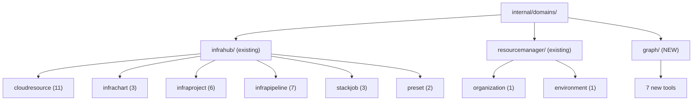

# Phase 2A: Graph / Dependency Intelligence (7 Tools)

## Domain Analysis

The Graph domain (`ai.planton.graph.v1`) is the **first domain outside the infrahub bounded context** to be added to the MCP server. All existing tools live under `internal/domains/infrahub/` or `internal/domains/resourcemanager/`. The graph domain gets its own top-level directory: `internal/domains/graph/`.

This is architecturally significant: it validates that the `internal/domains/` structure can scale to multiple bounded contexts without polluting the infrahub namespace.

### Bounded Context Mapping

### Proto surface

All 7 RPCs are on a single gRPC service: `GraphQueryControllerClient` from package `graphv1` ([query_grpc.pb.go](apis/stubs/go/ai/planton/graph/v1/query_grpc.pb.go)). All are **read-only** — no command controller involvement.

---

## Tool Specification (7 tools)

### Category 1: Topology Views (4 tools)

**1. `get_organization_graph`** — Full resource topology for an org

- Input: `org` (required), `envs` (optional string array), `node_types` (optional string array), `include_topological_order` (optional bool), `max_depth` (optional int)
- RPC: `GetOrganizationGraph(GetOrganizationGraphInput) -> OrganizationGraph`
- File: `organization.go`
- Notes: `node_types` accepts strings like `"organization"`, `"cloud_resource"`, `"credential"` etc. mapped via `GraphNode_Type_value`. `envs` filters the graph to specific environments.

**2. `get_environment_graph`** — Everything deployed in a specific environment

- Input: `env_id` (required), `node_types` (optional string array), `include_topological_order` (optional bool)
- RPC: `GetEnvironmentGraph(GetEnvironmentGraphInput) -> EnvironmentGraph`
- File: `environment.go`

**3. `get_service_graph`** — Service-centric subgraph with deployments

- Input: `service_id` (required), `envs` (optional string array), `include_upstream` (optional bool), `include_downstream` (optional bool), `max_depth` (optional int)
- RPC: `GetServiceGraph(GetServiceGraphInput) -> ServiceGraph`
- File: `service.go`

**4. `get_cloud_resource_graph`** — Resource-centric dependency view

- Input: `cloud_resource_id` (required), `include_upstream` (optional bool), `include_downstream` (optional bool), `max_depth` (optional int)
- RPC: `GetCloudResourceGraph(GetCloudResourceGraphInput) -> CloudResourceGraph`
- File: `cloudresource.go`

### Category 2: Dependency Queries (2 tools)

**5. `get_dependencies`** — "What does this resource depend on?" (upstream)

- Input: `resource_id` (required), `max_depth` (optional int), `relationship_types` (optional string array)
- RPC: `GetDependencies(GetDependenciesInput) -> DependencyListResponse`
- File: `dependency.go` (shared with get_dependents)

**6. `get_dependents`** — "What depends on this resource?" (downstream)

- Input: `resource_id` (required), `max_depth` (optional int), `relationship_types` (optional string array)
- RPC: `GetDependents(GetDependentsInput) -> DependencyListResponse`
- File: `dependency.go` (shared with get_dependencies — same response type, complementary direction)

### Category 3: Analysis (1 tool)

**7. `get_impact_analysis`** — "If I change/delete this, what breaks?"

- Input: `resource_id` (required), `change_type` (optional: `"delete"` or `"update"`)
- RPC: `GetImpactAnalysis(GetImpactAnalysisInput) -> ImpactAnalysisResponse`
- File: `impact.go`
- Notes: `change_type` maps to the nested `GetImpactAnalysisInput.ChangeType` enum. Returns direct impacts, transitive impacts, total affected count, and affected-by-type breakdown.

---

## Enum Handling Strategy

Following the `stackjob/enum.go` pattern — use the proto's `_value` maps for resolution, with `joinEnumValues()` for user-friendly error messages.

Two enum resolvers needed in `enum.go`:

- **`resolveNodeTypes`**: Maps `[]string` to `[]GraphNode_Type`. Accepts: `"organization"`, `"environment"`, `"service"`, `"cloud_resource"`, `"credential"`, `"infra_project"`.
- **`resolveRelationshipTypes`**: Maps `[]string` to `[]GraphRelationship_Type`. Accepts: `"belongs_to_org"`, `"belongs_to_env"`, `"deployed_as"`, `"uses_credential"`, `"depends_on"`, `"runs_on"`, `"managed_by"`, `"uses"`, `"service_depends_on"`, `"owned_by"`.
- **`resolveChangeType`**: Maps `string` to `GetImpactAnalysisInput_ChangeType`. Accepts: `"delete"`, `"update"`.

---

## Files to Create

All under `internal/domains/graph/`:

| File | Contents | Approx Lines |
|------|----------|------|
| `doc.go` | Package documentation | ~10 |
| `enum.go` | 3 enum resolvers + joinEnumValues helper | ~60 |
| `tools.go` | 7 input structs, 7 tool defs, 7 handlers | ~300 |
| `organization.go` | `GetOrganizationGraph` RPC wrapper | ~25 |
| `environment.go` | `GetEnvironmentGraph` RPC wrapper | ~25 |
| `service.go` | `GetServiceGraph` RPC wrapper | ~25 |
| `cloudresource.go` | `GetCloudResourceGraph` RPC wrapper | ~25 |
| `dependency.go` | `GetDependencies` + `GetDependents` RPC wrappers | ~45 |
| `impact.go` | `GetImpactAnalysis` RPC wrapper | ~25 |

## Files to Modify

- [internal/server/server.go](internal/server/server.go) — Add `graph` import, register 7 tools, update count from 34 to 41, add tool names to the log list

---

## Patterns to Follow (from existing code)

- **RPC wrapper**: `domains.WithConnection` + `graphv1.NewGraphQueryControllerClient(conn)` + `domains.MarshalJSON(resp)` — see [infrapipeline/get.go](internal/domains/infrahub/infrapipeline/get.go)
- **Tool registration**: `XxxTool()` returns `*mcp.Tool`, `XxxHandler(serverAddress)` returns typed handler — see [infrapipeline/tools.go](internal/domains/infrahub/infrapipeline/tools.go)
- **Error handling**: `domains.RPCError(err, resourceDesc)` — see [domains/rpcerr.go](internal/domains/rpcerr.go)
- **Enum resolution**: Proto `_value` map lookup with `joinEnumValues` for error messages — see [stackjob/enum.go](internal/domains/infrahub/stackjob/enum.go)
- **Input validation**: Explicit nil/empty checks in handler before calling RPC function — see infrapipeline handlers

---

## Execution Order

Strict sequential order to ensure clean builds at each step:

1. Create `doc.go` — establishes the package
2. Create `enum.go` — enum resolvers (no external deps beyond proto stubs)
3. Create RPC wrapper files (organization, environment, service, cloudresource, dependency, impact)
4. Create `tools.go` — input structs, tool definitions, handlers that call the RPC wrappers
5. Modify `server.go` — import, register, update count
6. Verify: `go build ./...`, `go vet ./...`, `go test ./...`

---

## Risk: Proto Stub Import Path

The Go stubs live at `github.com/plantonhq/planton/apis/stubs/go/ai/planton/graph/v1`. This is a **new import path** not yet used in the MCP server. If the `go.mod` doesn't already pull in the right version of the planton module that includes graph stubs, we may need a `go get` update. This will be verified during the build step.
