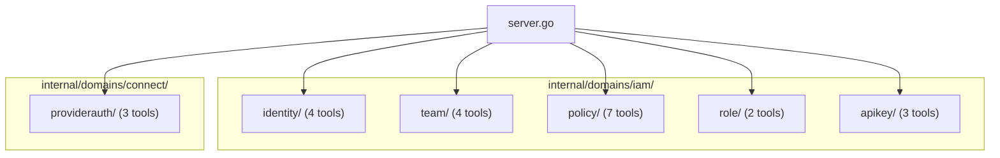

# T08: IAM Domain + ProviderConnectionAuthorization

## Decisions (locked in)

- Skip `list_teams` -- team discovery via `list_principals(principal_kind=team)` covers this
- IAM Policy v2 only -- v1 is deprecated
- ProviderConnectionAuthorization lives at `internal/domains/connect/providerauth/` (proto path, Connect bounded context)
- User Invitations use `UserInvitationCommandController.create` from identityaccount/v1
- IAM Role is read-only (CRUD is back_office_admin only)
- Tool count expanded to 23 (approved)

## Architecture




## Proto Import Paths

- `identityaccount/v1` -> `github.com/plantonhq/planton/apis/stubs/go/ai/planton/iam/identityaccount/v1`
- `team/v1` -> `github.com/plantonhq/planton/apis/stubs/go/ai/planton/iam/team/v1`
- `iampolicy/v2` -> `github.com/plantonhq/planton/apis/stubs/go/ai/planton/iam/iampolicy/v2`
- `iamrole/v1` -> `github.com/plantonhq/planton/apis/stubs/go/ai/planton/iam/iamrole/v1`
- `apikey/v1` -> `github.com/plantonhq/planton/apis/stubs/go/ai/planton/iam/apikey/v1`
- `providerconnectionauthorization/v1` -> `github.com/plantonhq/planton/apis/stubs/go/ai/planton/connect/providerconnectionauthorization/v1`

## Reference Implementation Pattern

Every sub-package follows the established pattern from [internal/domains/resourcemanager/organization/](internal/domains/resourcemanager/organization/):

- **doc.go**: Package doc with tool count and list
- **register.go**: `Register(srv, serverAddress)` calling `mcp.AddTool()` per tool
- **tools.go**: Input structs (json+jsonschema tags), `*Tool()` + `*Handler(serverAddress)` per tool
- **Per-operation .go files**: Pure domain functions using `domains.WithConnection`, `domains.MarshalJSON`, `domains.RPCError`
- Handlers return `domains.TextResult(text)`

## Phase 1: Foundation + Identity (4 tools)

**Files to create:**

- `internal/domains/iam/doc.go` -- bounded context documentation
- `internal/domains/iam/identity/doc.go`
- `internal/domains/iam/identity/register.go`
- `internal/domains/iam/identity/tools.go`
- `internal/domains/iam/identity/whoami.go`
- `internal/domains/iam/identity/get.go`
- `internal/domains/iam/identity/invite.go`
- `internal/domains/iam/identity/invitations.go`

**Tool details:**

- `**whoami`**: `IdentityAccountQueryController.whoAmI(Empty) -> IdentityAccount`. No input. Returns authenticated user info. Import `identityaccountv1`, use `NewIdentityAccountQueryControllerClient`, call `WhoAmI` with `&emptypb.Empty{}`.
- `**get_identity_account**`: Dual-resolution by `id` OR `email`. If `id` is provided, call `Query.Get(IdentityAccountId)`. If `email` is provided, call `Query.GetByEmail(IdentityAccountEmail)`. Exactly one must be set (validate in handler).
- `**invite_member**`: `UserInvitationCommandController.Create(CreateUserInvitationInput)`. Input: `org` (required), `email` (required), `iam_role_ids` (required, string array). Uses `NewUserInvitationCommandControllerClient(conn)`.
- `**list_invitations**`: `UserInvitationQueryController.FindByOrgByStatus(FindUserInvitationsByOrgByStatusInput)`. Input: `org` (required), `status` (optional, defaults to "pending"). Uses `NewUserInvitationQueryControllerClient(conn)`. Note: `status` is an enum (`UserInvitationStatusType`) -- map string to enum value in handler.

## Phase 2: IAM Role (2 tools, read-only)

**Files to create:**

- `internal/domains/iam/role/doc.go`
- `internal/domains/iam/role/register.go`
- `internal/domains/iam/role/tools.go`
- `internal/domains/iam/role/get.go`

**Tool details:**

- `**get_iam_role`**: `IamRoleQueryController.Get(IamRoleId) -> IamRole`. Input: `role_id` (required). Straightforward single-RPC lookup.
- `**list_iam_roles_for_resource_kind**`: `IamRoleQueryController.FindByApiResourceKindAndPrincipalType(ApiResourceKindAndPrincipalTypeInput) -> IamRoles`. Input: `resource_kind` (required, e.g. "organization"), `principal_type` (required, e.g. "identity_account"). Returns available roles for granting access.

## Phase 3: Team (4 tools)

**Files to create:**

- `internal/domains/iam/team/doc.go`
- `internal/domains/iam/team/register.go`
- `internal/domains/iam/team/tools.go`
- `internal/domains/iam/team/create.go`
- `internal/domains/iam/team/get.go`
- `internal/domains/iam/team/update.go`
- `internal/domains/iam/team/delete.go`

**Tool details:**

- `**create_team`**: Assemble full `Team` proto internally (api_version=`iam.planton.ai/v1`, kind=`Team`, metadata with org+name, spec with description+members). Input: `org` (required), `name` (required), `description` (optional), `members` (optional, array of `{member_type, member_id}`). Call `TeamCommandController.Create(Team)`.
- `**get_team**`: `TeamQueryController.Get(TeamId) -> Team`. Input: `team_id` (required).
- `**update_team**`: Read-modify-write pattern (same as Organization). GET current team, merge non-empty fields (name, description, members), call `TeamCommandController.Update(Team)`. Both RPCs share one `WithConnection`. Input: `team_id` (required), `name` (optional), `description` (optional), `members` (optional).
- `**delete_team**`: `TeamCommandController.Delete(TeamId) -> Team`. Input: `team_id` (required).

## Phase 4: IAM Policy v2 (7 tools)

**Files to create:**

- `internal/domains/iam/policy/doc.go`
- `internal/domains/iam/policy/register.go`
- `internal/domains/iam/policy/tools.go`
- `internal/domains/iam/policy/create.go`
- `internal/domains/iam/policy/delete.go`
- `internal/domains/iam/policy/upsert.go`
- `internal/domains/iam/policy/revoke_org.go`
- `internal/domains/iam/policy/list_access.go`
- `internal/domains/iam/policy/check.go`
- `internal/domains/iam/policy/list_principals.go`

**Tool details:**

- `**create_iam_policy`**: `IamPolicyV2CommandController.Create(IamPolicySpec) -> IamPolicy`. Input: `principal_kind` (required), `principal_id` (required), `resource_kind` (required), `resource_id` (required), `relation` (required). Handler assembles `IamPolicySpec{Principal: &ApiResourceRef{...}, Resource: &ApiResourceRef{...}, Relation: ...}`.
- `**delete_iam_policy**`: `IamPolicyV2CommandController.Delete(IamPolicySpec) -> IamPolicy`. Same input shape as create. Idempotent.
- `**upsert_iam_policies**`: `IamPolicyV2CommandController.Upsert(UpsertIamPoliciesInput) -> IamPoliciesList`. Input: `principal_kind`, `principal_id`, `resource_kind`, `resource_id`, `relations` (required, string array). Declarative state sync.
- `**revoke_org_access**`: `IamPolicyV2CommandController.RevokeOrgAccess(RevokeOrgAccessInput) -> IamPoliciesList`. Input: `identity_account_id` (required), `organization_id` (required). Nuclear revocation -- removes ALL access.
- `**list_resource_access**`: `IamPolicyV2QueryController.ListResourceAccessByPrincipal(ListResourceAccessInput) -> ResourceAccessByPrincipalList`. Input: `resource_kind` (required), `resource_id` (required), `include_inherited` (optional bool). Answers "who has access to X?"
- `**check_authorization**`: `IamPolicyV2QueryController.CheckAuthorization(CheckAuthorizationInput) -> CheckAuthorizationResult`. Input: `principal_kind`, `principal_id`, `resource_kind`, `resource_id`, `relation` (all required). Returns `{is_authorized: true/false}`. Note: `skip_authorization` on proto -- any authenticated user can check.
- `**list_principals**`: `IamPolicyV2QueryController.ListPrincipals(ListPrincipalsInput) -> PrincipalAccessList`. Input: `org_id` (required), `env` (optional env slug), `principal_kind` (required -- use string "identity_account" or "team", map to `ApiResourceKind` enum), `page_number` (optional), `page_size` (optional). Replaces v1's findMembersByOrg/findTeamsByOrg/findMembersByEnv/findTeamsByEnv.

## Phase 5: API Key (3 tools)

**Files to create:**

- `internal/domains/iam/apikey/doc.go`
- `internal/domains/iam/apikey/register.go`
- `internal/domains/iam/apikey/tools.go`
- `internal/domains/iam/apikey/create.go`
- `internal/domains/iam/apikey/list.go`
- `internal/domains/iam/apikey/delete.go`

**Tool details:**

- `**create_api_key`**: Assemble `ApiKey` proto (api_version=`iam.planton.ai/v1`, kind=`ApiKey`, metadata with name, spec with optional `never_expires`/`expires_at`). Call `ApiKeyCommandController.Create(ApiKey)`. The response contains the actual key value in `spec.key_hash` on first return only -- tool description must warn that the key is shown once.
- `**list_api_keys**`: `ApiKeyQueryController.FindAll(Empty) -> ApiKeys`. No input. Returns caller's own keys.
- `**delete_api_key**`: `ApiKeyCommandController.Delete(ApiKeyId) -> ApiKey`. Input: `api_key_id` (required).

## Phase 6: ProviderConnectionAuthorization (3 tools)

**Files to create:**

- `internal/domains/connect/providerauth/doc.go`
- `internal/domains/connect/providerauth/register.go`
- `internal/domains/connect/providerauth/tools.go`

Follows the inline-handler pattern from [internal/domains/connect/defaultprovider/tools.go](internal/domains/connect/defaultprovider/tools.go) since there are only 3 tools.

**Tool details:**

- `**apply_provider_connection_authorization`**: `Command.Apply(ProviderConnectionAuthorization)`. Input: `authorization_object` (required, OpenMCF envelope as `map[string]any`). Use protojson bridge pattern from `defaultprovider/tools.go` ApplyHandler.
- `**get_provider_connection_authorization**`: Dual-resolution: by `id` via `Query.Get(ApiResourceId)` OR by semantic key (`org` + `provider` + `connection`) via `Query.GetBySemanticKey(GetBySemanticKeyRequest)`. Validate exactly one resolution path. Note: `provider` field is a `CloudResourceProvider` enum -- map string to enum value.
- `**delete_provider_connection_authorization**`: `Command.Delete(ApiResourceId)`. Input: `id` (required).

## Phase 7: Server Registration

**File to modify:** [internal/server/server.go](internal/server/server.go)

Add 6 new import aliases and `Register` calls:

```go
iamidentity    "github.com/plantonhq/mcp-server-planton/internal/domains/iam/identity"
iamteam        "github.com/plantonhq/mcp-server-planton/internal/domains/iam/team"
iampolicy      "github.com/plantonhq/mcp-server-planton/internal/domains/iam/policy"
iamrole        "github.com/plantonhq/mcp-server-planton/internal/domains/iam/role"
iamapikey      "github.com/plantonhq/mcp-server-planton/internal/domains/iam/apikey"
connectproviderauth "github.com/plantonhq/mcp-server-planton/internal/domains/connect/providerauth"
```

Add to `registerTools()`:

```go
iamidentity.Register(srv, serverAddress)
iamteam.Register(srv, serverAddress)
iampolicy.Register(srv, serverAddress)
iamrole.Register(srv, serverAddress)
iamapikey.Register(srv, serverAddress)
connectproviderauth.Register(srv, serverAddress)
```

## Excluded RPCs (rationale)

- **Platform-operator only**: iamrole CRUD, iampolicy v2 grantOwnership/registerWithPlatform/grantPlatformPermission/cleanupResourcePolicies/migrateFromV1/createFromUserInvitation, identityaccount find/getActorInfo, providerconnectionauth find
- **Bulk ops (deferred)**: iampolicy v2 createBulk/deleteBulk/grantMemberAccess -- covered by single create/delete + upsert
- **Internal/testing**: simulateSignupWebhook, identityaccount delete, isBackOfficeUser, apikey getByKeyHash
- **Niche**: team revokeMemberAccessOnTeams, invitation updateStatus/findByToken/findByEmail

## Enum Mapping Notes

Two tools require string-to-enum mapping in handlers:

- `**list_invitations`**: `status` string ("pending"/"accepted"/"removed") to `UserInvitationStatusType` enum
- `**list_principals**`: `principal_kind` string ("identity_account"/"team") to `ApiResourceKind` enum
- `**get_provider_connection_authorization**`: `provider` string to `CloudResourceProvider` enum

Check if `internal/domains/` already has enum mapping utilities (the `enum.go` file found in the domains package). If so, reuse. If not, add minimal helpers.

## Build Verification

After each phase, run `go build ./...` to verify compilation. After Phase 7, verify the full tool count matches expectations.