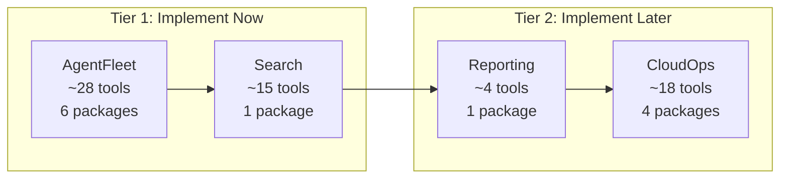

# Phase 4: Evaluate New Domains for MCP Tool Coverage

## Context

After completing Phases 1-3 (build fix, connect tool enrichment, new resources), 7 new domains appeared in the proto definitions and 1 existing domain (cloudops) still has no MCP tools. This phase evaluates all 8 and produces a prioritized implementation plan.

**Proto source:** `[buf.gen.go.yaml](mcp-server-planton/buf.gen.go.yaml)` pulls from `github.com/plantonhq/planton.git` (main branch)  
**Generated stubs:** `[gen/go/ai/planton/](mcp-server-planton/gen/go/ai/planton/)` -- 764 Go files, 18 top-level domains  
**Existing tool pattern:** `[internal/domains/infrahub/iacprovisionermapping/](mcp-server-planton/internal/domains/infrahub/iacprovisionermapping/)` -- register.go + tools.go + handler files

---

## Domain Evaluation Summary

### Tier 1 -- Implement Now (High Value, Agent-Essential)

#### 1. AGENTFLEET -- Recommended

- **Proto location:** `gen/go/ai/planton/agentfleet/`
- **6 sub-resources:** Agent, Skill, McpServer, Session, Execution, AgentTestSuite
- **11 gRPC services**, ~30 unary methods + 1 server-streaming (SubscribeExecution)

**Why:** This is the core domain -- agents managing agents, skills, MCP server configs, sessions, and executions. If you're building an AI platform, this is the centerpiece. Every agent should be able to CRUD agents, skills, and MCP servers, create sessions, run executions, and execute test suites.

**Proposed tools (~28):**

- **Agent (5):** `apply_agent`, `get_agent`, `delete_agent`, `search_agents` (Find), skip Create/Update (Apply is idempotent)
- **Skill (5):** `apply_skill`, `get_skill`, `delete_skill`, `search_skills` (Find), skip Create/Update
- **McpServer (7):** `apply_mcp_server`, `get_mcp_server`, `delete_mcp_server`, `search_mcp_servers` (Find), `list_mcp_server_tools`, `resolve_mcp_server_variables`, skip Create/Update
- **Session (4):** `create_session`, `get_session`, `delete_session`, `list_sessions`
- **Execution (3):** `create_execution`, `get_execution`, `list_executions_by_session`
- **AgentTestSuite (5+):** `apply_agent_test_suite`, `get_agent_test_suite`, `delete_agent_test_suite`, `list_agent_test_suites_by_agent`, `execute_test_case`, `execute_test_suite`

**Design decisions needed:**

- **DD-09: SubscribeExecution (server streaming)** -- MCP does not support streaming. Options: (A) Skip entirely; (B) Implement as a poll-based `get_execution` that returns current state including progress_events; (C) Defer for future MCP streaming support. Recommendation: Option A (skip), Option B is free since `get_execution` already returns full state with progress_events.
- **DD-10: Execution Delete** -- Should agents be able to delete execution records? Proto exposes it, but executions are audit trails. Recommendation: expose it but document the irreversibility.
- **DD-11: Session vs Agent-scoped tools** -- Session is a runtime concept (langgraph_thread_id, sandbox_id). Confirm sessions are agent-facing, not internal-only.

---

#### 2. SEARCH -- Recommended

- **Proto location:** `gen/go/ai/planton/search/`
- **9 sub-packages**, 14 gRPC services, ~52 methods

**Why:** Cross-domain resource discovery is essential for agent workflows. An agent needs to find connections, cloud resources, infra projects, other agents, and more. Search is how agents orient themselves in the platform.

**Proposed tools (~15, query-only focus):**

- **Core search (3):** `search_api_resources_by_text`, `search_api_resources_by_kind`, `get_api_resource_by_org_kind_name`
- **Connect search (3):** `search_connections_by_context`, `get_connections_by_env`, `search_runner_registrations_by_org`
- **AgentFleet search (3):** `search_agents_by_org`, `search_mcp_servers_by_org`, `search_skills_by_org`
- **InfraHub search (3):** `search_infra_projects`, `search_iac_modules_by_org`, `lookup_cloud_resource`
- **ResourceManager search (2):** `get_context_hierarchy`, `search_quick_actions`
- **ServiceHub search (1):** `search_infra_charts_by_org`

**Skip (internal/admin operations):**

- AddRecord, DeleteByQuery, Reindex*, ReindexPlatform, IndexApiDocs -- internal indexing
- IndexIdentityAccount -- internal IAM indexing
- QuickAction CRUD -- admin-only (agents consume quick actions, they don't manage them)
- GetHelpTextFieldMap, GetSearchableFields -- UI-specific metadata
- SearchOfficialAgents, SearchOfficialSkills, SearchOfficialIacModules, SearchOfficialCloudObjectPresets -- "official" (public marketplace) search may not be agent-relevant initially
- GetCloudResourceCountsGroupedByKind* -- overlaps with reporting; revisit later

**Design decisions needed:**

- **DD-12: Search tool naming convention** -- Use domain-prefixed names (`search_agents_by_org`) vs. generic (`search_resources` with kind parameter). Recommendation: domain-prefixed for discoverability; agents can scan tool names and understand what's available.
- **DD-13: SearchByText scope** -- Should `search_api_resources_by_text` be one tool or split by domain? Recommendation: one tool (it's cross-domain by nature).

---

### Tier 2 -- Implement Later (Moderate Value)

#### 3. REPORTING -- Small Scope, Quick Win

- **Proto location:** `gen/go/ai/planton/reporting/iac/v1/`
- **1 service**, 6 query-only methods

**Why:** IaC resource count reporting is useful for monitoring agents and dashboard queries. Very small implementation scope -- likely 3-4 tools in a single file.

**Proposed tools (4):**

- `get_iac_resource_count_summary` -- total count by context (org/env/project)
- `get_iac_resource_count_detailed` -- per-resource-kind breakdown
- `get_iac_resource_count_time_series` -- trend over time by context
- `get_iac_resource_count_time_series_by_resource` -- trend for specific resource

**Implementation effort:** Low (~1 file, follows standard pattern)

---

#### 4. CLOUDOPS -- Large Scope, Useful for Operations

- **Proto location:** `gen/go/ai/planton/cloudops/`
- **19 gRPC services** across AWS, Azure, GCP, Kubernetes providers

**Why:** Agents debugging live infrastructure need to list VMs, pods, namespaces, objects, S3 buckets, etc. This is the control-plane-facing version (cloudops routes through runners -- the runner domain is the runner-side mirror).

**Proposed tools (~18 unary-only):**

- **Kubernetes (7):** `get_kubernetes_object`, `find_kubernetes_objects_by_kind`, `find_kubernetes_namespaces`, `find_kubernetes_pods`, `get_kubernetes_pod`, `lookup_kubernetes_secret_key_value`, `update_kubernetes_object`, `delete_kubernetes_object`
- **AWS (6):** `list_ec2_instances`, `list_vpcs`, `list_subnets`, `list_security_groups`, `list_availability_zones`, `list_s3_buckets`
- **GCP (2):** `list_gcp_compute_instances`, `list_gcp_storage_buckets`
- **Azure (2):** `list_azure_virtual_machines`, `list_azure_blob_containers`

**Skip (streaming):** StreamByNamespace, StreamNamespaceGraph, StreamPodLogs, Exec/BrowserExec -- all require streaming which MCP does not support.

**Design decision needed:**

- **DD-14: CloudOps auth routing** -- These requests route through runners. How does the MCP server specify which runner/connection to use? Need to inspect the request types to understand the auth model.

---

### Tier 3 -- Skip (Low Value or Wrong Abstraction)

#### 5. BILLING -- Skip

- **Proto location:** `gen/go/ai/planton/billing/billingaccount/v1/`
- **6 services**, 21 methods

**Why skip:** Most billing operations are admin or redirect-based:

- `InitiateBillingPortalSession` returns a Stripe portal URL -- browser redirect, not agent-callable
- `InitiateCheckoutSession` returns a Stripe checkout URL -- same issue
- `Subscribe`, `Cancel`, `SyncAllSubscriptions` -- admin operations
- `ReportAutomationRunnerUsage`, `ReportSeatUsage` -- internal metering

**Possible exception:** `GetByOrg` (get billing account) and `CheckBilling` (check billing status) could be useful read-only tools. But the value is marginal -- agents rarely need billing info. **Defer to Phase 5 if needed.**

---

#### 6. COPILOT -- Skip

- **Proto location:** `gen/go/ai/planton/copilot/`
- **9 services**, 24 methods

**Why skip:**

- **Legacy domain** -- the agentfleet domain supersedes this. CopilotAgent is the old conversational AI; AgentFleet is the new multi-agent system.
- **Bidirectional streaming** -- `Chat` and `DevChat` are bidi streams. MCP cannot support this.
- **Chat CRUD** -- Managing chat history is a UI concern, not an agent concern.
- `TroubleshootImageBuild` and `DraftVersionMessage` are narrow helpers that could be individual tools, but they belong to a superseded domain.

---

#### 7. INTEGRATION -- Skip

- **Proto location:** `gen/go/ai/planton/integration/`
- **7 services**, 22 methods

**Why skip:**

- **Git operations** (CreateBranch, UpdateFile, OpenPullRequest, ListBranches, etc.) overlap with dedicated Git MCP servers that agents already use (GitHub MCP, GitLab MCP). Duplicating this creates confusion about which tool to call.
- **Kubernetes operations** overlap with cloudops (different auth model -- integration uses raw kubeconfig, cloudops routes through runners).
- **GCP AuthorizeCloudAccount** -- one-time admin setup.
- **Cost allocation** -- niche reporting that could go in reporting domain later.
- **Tekton/VCS** -- internal pipeline plumbing (no gRPC services, just types).

---

#### 8. RUNNER -- Skip

- **Proto location:** `gen/go/ai/planton/runner/cloudapis/`
- **17 services**, 25 methods

**Why skip:** These are runner-side APIs. The MCP server talks to the Planton control plane, not to runners directly. The cloudops domain is the control-plane-facing mirror of these same operations. Exposing both would be confusing and architecturally wrong.

---

## Proposed Implementation Order

**Recommended sequence:**

1. **AgentFleet** -- Highest value. 6 new packages under `internal/domains/agentfleet/`. Establishes patterns for multi-resource domains. ~28 tools.
2. **Search** -- High value. 1 new package `internal/domains/search/` with sub-grouped tools. ~15 tools.
3. **Reporting** -- Quick win. 1 small package `internal/domains/reporting/`. ~4 tools.
4. **CloudOps** -- Large scope. 4+ packages under `internal/domains/cloudops/`. ~18 tools. Could be its own phase.

---

## Open Design Decisions to Resolve Before Implementation

| ID    | Topic                        | Options                       | Recommendation                                  |
| ----- | ---------------------------- | ----------------------------- | ----------------------------------------------- |
| DD-09 | SubscribeExecution streaming | Skip / Poll-based get / Defer | Skip (get_execution already returns full state) |
| DD-10 | Execution Delete             | Expose / Hide                 | Expose with irreversibility warning             |
| DD-11 | Session scope                | Agent-facing / Internal-only  | Need user input                                 |
| DD-12 | Search tool naming           | Domain-prefixed / Generic     | Domain-prefixed                                 |
| DD-13 | SearchByText scope           | One tool / Split by domain    | One cross-domain tool                           |
| DD-14 | CloudOps auth routing        | Inspect request types         | Defer until Tier 2                              |

---

## Files to Create (Tier 1 scope)

**AgentFleet (~36 files):**

- `internal/domains/agentfleet/doc.go`
- `internal/domains/agentfleet/agent/` -- doc.go, register.go, tools.go (Apply/Get/Delete/Search)
- `internal/domains/agentfleet/skill/` -- doc.go, register.go, tools.go
- `internal/domains/agentfleet/mcpserver/` -- doc.go, register.go, tools.go (7 tools, may need split files)
- `internal/domains/agentfleet/session/` -- doc.go, register.go, tools.go
- `internal/domains/agentfleet/execution/` -- doc.go, register.go, tools.go
- `internal/domains/agentfleet/agenttestsuite/` -- doc.go, register.go, tools.go (may need execute.go)

**Search (~6 files):**

- `internal/domains/search/` -- doc.go, register.go, tools.go (core), connect.go, agentfleet.go, infrahub.go, resourcemanager.go

**Server wiring:**

- `internal/server/server.go` -- add imports and Register calls

