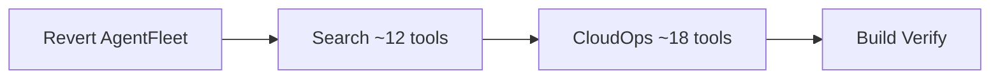

# Phase 4 Revised: Search + CloudOps

## Scope Change from Original Plan

- **AgentFleet** -- REMOVED (will be deprecated; user will remove the domain entirely)
- **Reporting** -- REMOVED (not needed)
- **Billing / Copilot / Integration / Runner** -- SKIP (unchanged)
- **Search** -- KEEP, implement ~12 tools (no agentfleet search tools)
- **CloudOps** -- KEEP, implement ~18 tools (investigation confirmed RPCs are control-plane-callable)

---

## Step 0: Revert AgentFleet Code

The previous conversation already created 13 agentfleet files and wired them into `server.go`. These must be removed before proceeding.

**Delete 13 files:**

- `internal/domains/agentfleet/doc.go`
- `internal/domains/agentfleet/agent/register.go`, `tools.go`
- `internal/domains/agentfleet/skill/register.go`, `tools.go`
- `internal/domains/agentfleet/mcpserver/register.go`, `tools.go`
- `internal/domains/agentfleet/session/register.go`, `tools.go`
- `internal/domains/agentfleet/execution/register.go`, `tools.go`
- `internal/domains/agentfleet/agenttestsuite/register.go`, `tools.go`

**Unwire from `[internal/server/server.go](mcp-server-planton/internal/server/server.go)`:**

- Remove 6 import lines (lines 58-63)
- Remove 6 Register calls (lines 134-139)

**Verify:** `go build ./...` and `go vet ./...` pass clean.

---

## Step 1: Search Domain (~12 tools)

**Package:** `internal/domains/search/`

All search tools are query-only (read-side). They call various `*SearchQueryController` gRPC services under `gen/go/ai/planton/search/`.

### Tools to implement

**Core search (3 tools):**

- `search_api_resources_by_text` -- `ApiResourceSearchQueryController.SearchByText` -- free-text cross-domain search
- `search_api_resources_by_kind` -- `ApiResourceSearchQueryController.SearchByKind` -- filter by resource kind with pagination
- `get_api_resource_by_org_kind_name` -- `ApiResourceSearchQueryController.GetByOrgByKindByName` -- exact lookup

**Connect search (3 tools):**

- `search_connections_by_context` -- `ConnectSearchQueryController.SearchConnectionApiResourcesByContext`
- `get_connections_by_env` -- `ConnectSearchQueryController.GetConnectionsByEnv`
- `search_runner_registrations_by_org` -- `ConnectSearchQueryController.SearchRunnerRegistrationsByOrgContext`

**InfraHub search (3 tools):**

- `search_infra_projects` -- `InfraHubSearchQueryController.SearchInfraProjects`
- `search_iac_modules_by_org` -- `InfraHubSearchQueryController.SearchIacModulesByOrgContext`
- `lookup_cloud_resource` -- `CloudResourceSearchQueryController.LookupCloudResource`

**ResourceManager search (2 tools):**

- `get_context_hierarchy` -- `ResourceManagerSearchQueryController.GetContextHierarchy`
- `search_quick_actions` -- `ResourceManagerSearchQueryController.SearchQuickActions`

**ServiceHub search (1 tool):**

- `search_infra_charts_by_org` -- `ServiceHubSearchQueryController.SearchInfraChartsByOrgContext`

### Skip (internal/admin)

- AddRecord, DeleteByQuery, Reindex*, IndexApiDocs, IndexIdentityAccount, QuickAction CRUD
- GetHelpTextFieldMap, GetSearchableFields (UI metadata)
- SearchOfficial* (marketplace -- revisit later)
- GetCloudResourceCountsGroupedByKind* (reporting overlap)

### File structure

- `internal/domains/search/doc.go`
- `internal/domains/search/register.go`
- `internal/domains/search/apiresource.go` -- 3 core search tools
- `internal/domains/search/connect.go` -- 3 connect search tools
- `internal/domains/search/infrahub.go` -- 3 infrahub search tools
- `internal/domains/search/resourcemanager.go` -- 2 resource manager search tools
- `internal/domains/search/servicehub.go` -- 1 servicehub search tool

---

## Step 2: CloudOps Domain (~18 tools)

**Key finding:** All CloudOps RPCs take a `CloudOpsRequestContext` with:

- `org` (required)
- Access mode (oneof):
  - `cloud_resource`: env + kind + slug (control plane resolves connection from the resource)
  - `provider_connection`: env + connection slug (explicit connection)

No raw credentials are needed. The control plane resolves connections, credentials, and runner routing.

### Tools to implement

**Kubernetes (8 tools):**

- `get_kubernetes_object` -- GetKubernetesObjectRequest(context, namespace, api_version, kind, name)
- `find_kubernetes_objects_by_kind` -- FindKubernetesObjectsByKindRequest(context, namespace, kind)
- `find_kubernetes_namespaces` -- FindKubernetesNamespacesRequest(context)
- `find_kubernetes_pods` -- FindKubernetesPodsRequest(context, namespace, pod_manager, pod_manager_kind)
- `get_kubernetes_pod` -- GetKubernetesPodRequest(context, namespace, name)
- `lookup_kubernetes_secret_key_value` -- LookupKubernetesSecretKeyValueRequest(context, namespace, secret_name, key)
- `update_kubernetes_object` -- UpdateKubernetesObjectRequest(context, namespace, yaml_base64)
- `delete_kubernetes_object` -- DeleteKubernetesObjectRequest(context, namespace, api_version, kind, name)

**AWS (6 tools):**

- `list_ec2_instances` -- ListEc2InstancesRequest(context, region, instance_ids, filters)
- `list_vpcs` -- ListVpcsRequest(context, region)
- `list_subnets` -- ListSubnetsRequest(context, region, vpc_id)
- `list_security_groups` -- ListSecurityGroupsRequest(context, region, vpc_id)
- `list_availability_zones` -- ListAvailabilityZonesRequest(context, region)
- `list_s3_buckets` -- ListS3BucketsRequest(context, region)

**GCP (2 tools):**

- `list_gcp_compute_instances` -- ListComputeInstancesRequest(context, project, zone, filter)
- `list_gcp_storage_buckets` -- ListStorageBucketsRequest(context, project)

**Azure (2 tools):**

- `list_azure_virtual_machines` -- ListVirtualMachinesRequest(context, resource_group)
- `list_azure_blob_containers` -- ListBlobContainersRequest(context, storage_account)

### Skip (streaming -- MCP does not support)

- StreamByNamespace, StreamNamespaceGraph, StreamPodLogs, Exec, BrowserExec

### File structure

- `internal/domains/cloudops/doc.go`
- `internal/domains/cloudops/context.go` -- shared `CloudOpsRequestContext` builder
- `internal/domains/cloudops/kubernetes/register.go`, `tools.go` (8 tools)
- `internal/domains/cloudops/aws/register.go`, `tools.go` (6 tools)
- `internal/domains/cloudops/gcp/register.go`, `tools.go` (2 tools)
- `internal/domains/cloudops/azure/register.go`, `tools.go` (2 tools)

### Shared context helper

All CloudOps tools need to construct a `CloudOpsRequestContext`. A shared helper in `context.go` avoids duplication:

```go
// BuildContext constructs a CloudOpsRequestContext from tool input params.
// Callers provide org (required) and one of:
//   - cloud_resource mode: env, kind, slug
//   - provider_connection mode: env, connection
```

---

## Server Wiring

In `[internal/server/server.go](mcp-server-planton/internal/server/server.go)`:

- Add search import + Register call
- Add 4 cloudops sub-package imports + Register calls

---

## Implementation Order




